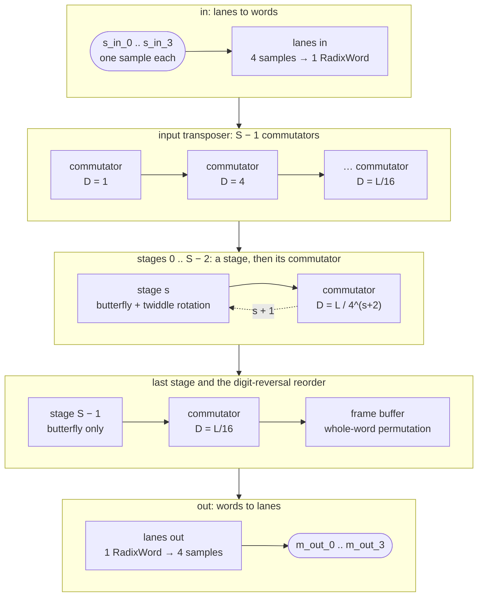

# Architecture



A radix-4 decimation-in-frequency FFT has `S = log4 L` **stages**; each applies one radix-4
**butterfly** to four samples and, for all but the last stage, **rotates** each output by a twiddle
factor. The hard part is not the arithmetic but getting each butterfly's four inputs onto one word:

- **The input transposer.** Stage 0's butterfly `m` needs `x[m]`, `x[m + L/4]`, `x[m + 2L/4]`,
  `x[m + 3L/4]` -- samples a quarter-frame apart, which arrive on different words. `S − 1`
  commutators regroup them so that word `m` carries exactly those four, one per lane.
- **The stages.** Each word is one butterfly: lane `p` is its input `p`, and lane `q` of the output
  is its output `q`. The butterfly multiplies by `±1, ±j` only, so it is exact; the twiddle rotation
  after it is the only lossy step.
- **The stage commutators.** Stage `s+1` needs inputs `L/4^(s+2)` apart, so a commutator follows
  every stage but the last.
- **The reorder.** The last stage leaves the bins in digit-reversed order. Turning that into natural
  order takes one more commutator and a frame buffer -- see [the digit reversal](#the-digit-reversal).

Every box is one `hls::task`; every arrow is a stream of one `RadixWord` a cycle. At `L = 1024`
(`S = 5`) that unrolls to: lanes in, the transposer's commutators at `D` = 1, 4, 16, 64, then stage 0,
commutator 64, stage 1, commutator 16, stage 2, commutator 4, stage 3, commutator 1, stage 4, the
reorder's commutator (64) and buffer, lanes out -- 18 tasks with the SOB reorder (its buffer is a
writer and a reader), 17 with the ping-pong one.

## What a commutator is

A commutator is an **`R × R` block transpose**. View the stream as `R` lanes by time, cut into
**groups** of `R` slots of `D` words each: slot `i`, lane `j` moves to slot `j`, lane `i`. Different
places in the FFT need different `D` -- the transposer uses `D = 1, 4, 16, ...`, the stage
commutators the same sizes in reverse -- but it is one operation, one Python function
(`model.commute`) and one C++ body, templated on `D`.

In hardware it needs no memory addressing at all, only shift registers and a switch, in three parts:

1. an **input triangle**: lane `j` is delayed `j·D` words;
2. a **rotating switch**: output lane `l` takes input lane `(k − l) mod R`, where the slot `k`
   advances every `D` words;
3. an **output triangle**: lane `l` is delayed `(R − 1 − l)·D` words.

Every sample comes out `(R − 1)·D` words later; the triangles undo each other's skew, and the switch
moves each block to its lane. The smallest case, `R = 2`, `D = 1`, turns words `(a0, b0), (a1, b1)`
into `(a0, a1), (b0, b1)`:

| tick | after input delay (lane 1 delayed 1) | switch | after output delay (lane 0 delayed 1) |
|---|---|---|---|
| 0 | (a0, –) | straight → (a0, –) | (–, –) |
| 1 | (a1, b0) | swap → (b0, a1) | **(a0, a1)** |
| 2 | (–, b1) | straight → (–, b1) | **(b0, b1)** |

A group spans `R·D` words, never more than a frame, so a commutator never mixes frames: output frame
`k` comes entirely from input frame `k`, delayed. That is what lets the Python model treat each
commutator as a pure re-indexing of the frame.

## The digit reversal

The last stage's word `b` holds bins that belong on the *same* lane of four *different* output words,
so the reorder is not a permutation of words. It factors into two steps, both checked at every
length: a **whole-frame commutator** (`D = L/R²`), which puts every bin on its final lane, then a
**permutation of whole words** -- keep the top base-`R` digit of the word index, reverse the rest --
through a frame buffer: one half filled at the permuted addresses while the other is read in order.
At `L = 16` and 64 the permutation is the identity. The buffer has two implementations, chosen with
`SsrFft(reorder=...)`; see [Synthesis](synthesis.md#the-reorder-two-ways).

## How it runs: nothing stops

Every task is a `while (1)` loop at one word per cycle. There is no per-frame function to return
from, no loop bound to reach, no window to drain; a frame exists only as a **counter** -- the word's
position in its sub-transform, which addresses the twiddle ROM, and the commutator's tick, which
drives its switch. So frames follow each other with no gap, and the interval is `L/R` by
construction.

That is the whole difference from the vendor core, whose blocks are functions a dataflow region
calls once per frame. [The Vitis FFT](../../vitis_l1/fft/index.md#why-vitisfft-is-far-below-the-architectures-rate)
has the measurements; this module keeps the vendor's arithmetic and replaces only the data movement.

## The numbers

The bits are AMD's, statement for statement, so `waveflow.vitis_l1.fft` -- bit-exact against the
vendor library -- is the reference, and `waveflow.dsp.ssr_fft.model` computes them per stage on the
stream's own word and lane order. Precision is lost in exactly one place: the inter-stage twiddle
rotation, which truncates each partial product into its first operand's format. Everything else
grows -- each stage's two adder levels add a bit -- so the output is wider than the input:

```
OUTPUT_WL = in_W + log2(L) + 1        # ap_fixed<16,2> in, L = 1024  ->  ap_fixed<27,13> out
```

Each edge carries its own width: `ap_fixed<16,2>` through the transposer, then 19, 21, 23, 25 bits
after the stages at `L = 1024`, and 27 out.

## What each layer contributes

| | |
|---|---|
| the bits | `model.py`: the vendor's arithmetic per stage, on the wire order; `Geometry` for everything derived from `L` |
| the commutator, tick by tick | `cycle_ref.py`: the C++ algorithm in Python, tested against the model's re-indexing |
| the module | `SsrFft`: a composite with one child per task; its pysim runs one child per task too |
| the C++ | `src/ssr_fft_tasks.h`, generic and hand-written; formats, ROMs and per-task wrappers generated by `hls.py` |
| the top and the testbench | generated from the module graph and the testbench graph |
| the evidence | `tests/dsp/ssr_fft/`: model, csim (`-m vitis`), RTL (`-m xsi`) |
