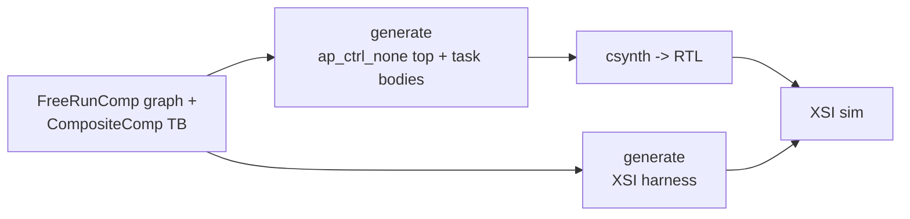

# Flow steps

<!-- WRITE ME. The step-by-step pipeline, with a Mermaid diagram, and the two targets.
     Suggested spine (verify each against the build code before asserting):
       1. Python: a FreeRunComp graph (leaves with run_iter + a composite with children/edges/boundary),
          and a CompositeComp testbench graph (DUT + BFM participants).
       2. Generate DUT (composite_kernel): composite_top_spec walks the graph -> render_top emits the
          ap_ctrl_none top (one hls::task per child, internal FIFOs); task bodies come from TaskBodyStep
          (generated from run_iter) or MemStreamStep (hand-written m_axi bodies).
       3. csynth: TCL -> RTL.
       4. Generate TB (sequential_xsi_tb): tb_top_spec + render_tb_harness -> the harness.
       5. XSI: drive the RTL cycle-by-cycle in xsim; assert bit-exactness + an exact cycle count. -->

**Targets:** `composite_kernel` (DUT), `sequential_xsi_tb` (TB) — both in `IMPLEMENTED_TARGETS`
(`waveflow/hw/codegen_targets.py`). `check(source, target)` runs the real generator for each.

**Source of truth:** `waveflow/build/composite_gen.py` (`composite_top_spec`, `render_top`,
`tb_top_spec`, `render_tb_harness`), `waveflow/build/hwcodegen_steps.py` (`TaskBodyStep`),
`waveflow/build/streamutils.py` (`MemStreamStep`).
