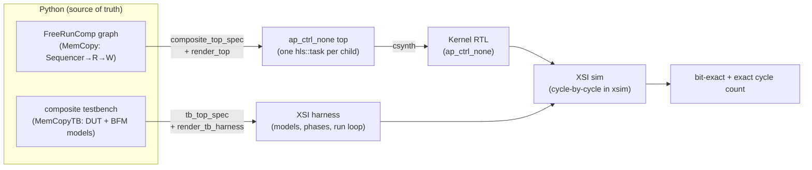

# Flow steps

The concurrent flow starts from a Python **component graph** and ends at an exact cycle count measured
by driving the real RTL. Two graphs go in — the DUT and its testbench — and the *same* graph walk
generates both the kernel and its harness. Every step below is walked with its real code in the
[mem_copy example](../../examples/memcpy/).

## The steps

**1 · The component graph.** Describe the design as a [`FreeRunComp`](./components.md) graph: standalone
components that implement `run_iter`, and a composite that `add_comp`s them, wires internal channels,
and names its boundary. For `mem_copy` that is a `Sequencer` feeding a `MemRStream` → `MemWStream` over
internal FIFOs. The **testbench** is *also* a graph — a composite `FreeRunComp` wiring the DUT to BFM
participants (a driver, a sink, a shared memory) — and the same graph runs the pysim golden.

**2 · Generate the kernel (`composite_kernel`).** `composite_top_spec` walks the graph and `render_top`
emits the `ap_ctrl_none` top: one `hls::task` per child, one internal FIFO per edge, boundary ports
from the declared boundary. The task **bodies** come two ways — `TaskBodyStep` generates a leaf's body
from its `run_iter`; `MemStreamStep` copies the hand-written bodies that own an `m_axi` port (the
dividing line is `m_axi`, not tops-vs-bodies).

**3 · C-synthesis.** The generated top is synthesized to RTL.

**4 · Generate the testbench (`sequential_xsi_tb`).** `tb_top_spec` walks the *testbench* graph and
`render_tb_harness` emits the harness — which BFM models exist, which RTL port each drives, and the
fixed-N cycle loop. The BFM model classes themselves are hand-written framework
([`xsi_bfm.h`](../../../waveflow/build/xsi/xsi_bfm.h)); the harness only wires them.

**5 · XSI simulation.** Because the kernel is `ap_ctrl_none`, Vitis co-sim refuses it — so the harness
drives the elaborated RTL directly in `xsim` through **XSI**, cycle by cycle. The gate is **exact**: a
bit-exact result *and* an exact cycle count (e.g. `mem_copy` = 2835 cycles for 16 jobs), so a count
that moves is a real behaviour change.

> The kernel and its testbench are generated from the **same** graphs that run the Python golden — one
> statement, two backends. That is what keeps the pysim model and the RTL from testing different things.

**Source of truth:** `waveflow/build/composite_gen.py` (`composite_top_spec`, `render_top`,
`tb_top_spec`, `render_tb_harness`), `waveflow/build/hwcodegen_steps.py` (`TaskBodyStep`),
`waveflow/build/streamutils.py` (`MemStreamStep`), `tests/examples/test_xsi_bfm.py` (the cycle gates).
