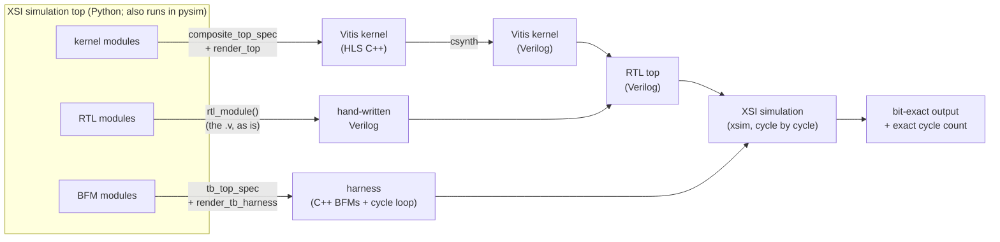

# Flow steps

The terms on this page — XSI simulation top, kernel / RTL / BFM module, RTL top, Vitis kernel,
harness — are defined
in [XSI simulation components](./concurrent_layers.md). Every step is walked with its real code in the
[mem_copy example](../../examples/memcpy/).

## One Python object, three kinds of module

The flow starts from **one** Python object: the **XSI simulation top**, a composite `FreeRunMod` whose
children are wired by interfaces exactly as in pysim — and the same object runs the pysim golden.
Each child plays one of the three [roles](./concurrent_layers.md#three-kinds-of-module) — kernel
module, RTL module, or BFM module — and each role has its own path to the XSI simulation:

```mermaid
flowchart LR
  subgraph py["XSI simulation top (Python; also runs in pysim)"]
    direction TB
    KM["kernel modules"]
    RM["RTL modules"]
    BM["BFM modules"]
  end

  KM -->|"composite_top_spec<br/>+ render_top"| HLS["Vitis kernel<br/>(HLS C++)"]
  HLS -->|"csynth"| KV["Vitis kernel<br/>(Verilog)"]
  RM -->|"rtl_module()<br/>(the .v, as is)"| HV["hand-written<br/>Verilog"]
  KV --> RT["RTL top<br/>(Verilog)"]
  HV --> RT
  BM -->|"tb_top_spec<br/>+ render_tb_harness"| HARN["harness<br/>(C++ BFMs + cycle loop)"]

  RT --> XSI["XSI simulation<br/>(xsim, cycle by cycle)"]
  HARN --> XSI
  XSI --> CHK["bit-exact output<br/>+ exact cycle count"]
```

In the [mem_copy example](../../examples/memcpy/) the XSI simulation top is `MemCopyTB`, and its
modules fall into the three roles like this:

| role | in `mem_copy` | becomes |
|---|---|---|
| kernel modules | `MemCopy` — a composite of `Sequencer` → `MemRStream` → `MemWStream` | the Vitis kernel |
| RTL modules | none | — so the RTL top *is* the Vitis kernel |
| BFM modules | a `StreamDriver`, a `StreamSink`, and one `MemoryMod` behind both `m_axi` bundles | `AxisMaster`, `AxisSlave`, and a `FlatMemory` serving `AxiMmReadSlave` / `AxiMmWriteSlave` |

The harness arrow starts from the BFM modules, but `tb_top_spec` reads the **whole** XSI simulation top:
to know which BFM goes on which pin, it has to see the kernel's ports *and* who is wired to each.

## The steps

**Describe the XSI simulation top.** A kernel module is a [`FreeRunMod`](./modules.md) — a leaf that
implements `run_iter`, or a composite that `add_comp`s children and wires internal channels with
`add_if`. The XSI simulation top is a composite `FreeRunMod` too, holding the kernel modules, any RTL
modules, and the BFM modules. In `mem_copy` the kernel side and the whole are separate classes,
`MemCopy` and `MemCopyTB`, and `MemCopyTB` declares `potential_targets = {sequential_xsi_tb}` so it is
never mistaken for a kernel.

**Generate the Vitis kernel** (target `composite_kernel`). `composite_top_spec` walks the kernel
modules and `render_top` emits the Vitis kernel's top-level function in HLS C++: `ap_ctrl_none`, one `hls::task` per child, one
internal FIFO per `add_if` edge, and a port for every child endpoint left unwired — the boundary. Task
**bodies** come two ways: generated from a leaf's `run_iter` (`TaskBodyStep`), or hand-written and
declared with [`kernel_task()`](../comp_codegen/freerunning_override.md). `mem_copy`'s three are
hand-written framework bodies, copied in by `MemStreamStep`.

**C-synthesis.** Vitis turns the top-level function into the Vitis kernel's Verilog.

**Assemble the RTL top.** For `mem_copy` there is nothing to assemble: it has no RTL modules, so the
RTL top *is* the Vitis kernel. A design with RTL modules gets a generated wrapper instead —
`wrapper_gen` joins the kernel's `bram` ports to the memories its graph declares (worked in [A memory reached three ways](../../examples/bram_access/)). A **system** — several
kernels reached over a bus, each behind a [memory-mapped adaptor](../interface/axi_mm/slave.md), with
AMD's crossbar and an on-chip memory — gets its top from
[`system_top`](../../../waveflow/build/system_top.py), which walks the pysim system: name the cut
(`system_top_spec(xbar, [kernels..., memory])`) and every crossbar slot, adaptor, stream net, credit
link writer and interrupt output follows from the graph ([XSI system simulation](../build/xsi_system.md)). [mm_fir](../../examples/mm_fir/synth.md) and
[markov](../../examples/markov/synth.md) are the worked cases; their cycle counts (618 / 611 and
1870) were unchanged when their hand-rendered tops were replaced by it.

**Generate the harness** (target `sequential_xsi_tb`). `tb_top_spec` walks the XSI simulation top,
checks that every BFM module has a C++ BFM and every port of the RTL top is covered, and
`render_tb_harness` emits the harness: which models exist, which pins each drives, and the fixed-N
cycle loop. The models themselves are pre-written ([`xsi_bfm.h`](../../../waveflow/build/xsi/xsi_bfm.h));
the harness only wires them. (The code calls the XSI simulation top the testbench — `tb_top_spec`,
`TbSpec` — so read `tb` there as "XSI simulation top".) The full walk is the
[XSI testbench](../comp_codegen/xsi_tb.md) page.

A host *program* — one that reads a status register and decides what to write next — is a BFM
module too, written as [software threads](../build/sw_threads.md): a `SwHost` whose threads are SimPy
processes in pysim, and the same threads in C++ under XSI. The C++ is written by hand -- it is the
host's **pre-written realization**, named by `cpp_model` / `cpp_header` (the
[`bfm_model()`](../custom_hooks/bfm_model.md#host) hook, derived) and kept in a header beside the
example, as a kernel's HLS body is named by `kernel_task()` -- but it is the program only: its
endpoints are a generated header, and its calls block on a fiber runtime, so it holds no BFM, no
address and no state machine. What is generated around it is the harness: `system_tb_spec` binds the
host's ports to the system top's (`s0_axi`, `irq_<view>`) and `render_system_tb` emits the harness and
the `main`; the [system_xsi](../build/xsi_system.md#system-xsi) step of a system's build DAG
(`add_system_steps(dag, sysm)`) does all of it from the system object. The two realizations run the
same scenario file, and the gate is that every host endpoint's trace is byte-identical between pysim
and RTL; [mm_fir](../../examples/mm_fir/xsi.md#the-host-program) and
[markov](../../examples/markov/xsi.md) are the worked cases.

**XSI simulation.** The harness drives the RTL top in `xsim`, cycle by cycle. The gate is **exact**: a
bit-exact result *and* an exact cycle count (`mem_copy` = 2908 cycles for 16 jobs), so a count that
moves is a real behaviour change. The example gates run through their own build; an RTL top
assembled without a Vitis project — hand-written Verilog and vendor IP, as in the adaptor gates —
runs through [`XsiWorkspace`](../../../waveflow/build/xsi_workspace.py), which writes the `xvlog`
file list and the harness and invokes the same `run.bat` / `run.sh`.

> The Vitis kernel and the harness are generated from the **same** object that runs the Python golden —
> one statement, two backends. That is what keeps the pysim model and the RTL from testing different
> things.

**Source of truth:** `waveflow/build/composite_gen.py` (`composite_top_spec`, `render_top`,
`tb_top_spec`, `render_tb_harness`), `waveflow/build/wrapper_gen.py` (the RTL top, when there is one),
`waveflow/build/system_top.py` (a system's RTL top),
`waveflow/build/hwcodegen_steps.py` (`TaskBodyStep`), `waveflow/build/streamutils.py`
(`MemStreamStep`), `tests/examples/test_xsi_bfm.py` (the cycle gates).
