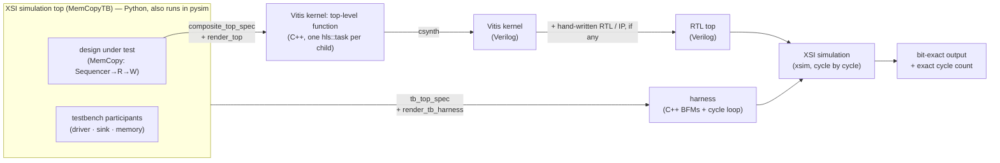

# Flow steps

The terms on this page — XSI simulation top, RTL top, Vitis kernel, testbench, harness — are defined
in [XSI simulation components](./concurrent_layers.md). Every step is walked with its real code in the
[mem_copy example](../../examples/memcpy/).

## One Python object, two branches

The flow starts from **one** Python object: the **XSI simulation top**, a composite `FreeRunMod`. Its
children are the design under test and the testbench participants, wired by interfaces. In
`mem_copy`:

| | class | becomes |
|---|---|---|
| XSI simulation top | `MemCopyTB` | the whole XSI simulation |
| design under test (a child) | `MemCopy` — itself a composite: `Sequencer` → `MemRStream` → `MemWStream` | the Vitis kernel, and here also the RTL top |
| testbench participants (children) | a stream driver, a stream sink, one `MemoryMod` behind both `m_axi` bundles | BFMs in the harness |

The same object runs the pysim golden. From it, two branches are generated, and they meet in XSI:

```mermaid
flowchart LR
  subgraph py["XSI simulation top (MemCopyTB) — Python, also runs in pysim"]
    direction TB
    DUT["design under test<br/>(MemCopy: Sequencer→R→W)"]
    PART["testbench participants<br/>(driver · sink · memory)"]
  end

  DUT -->|"composite_top_spec<br/>+ render_top"| TOP["Vitis kernel: top-level function<br/>(C++, one hls::task per child)"]
  TOP -->|"csynth"| KV["Vitis kernel<br/>(Verilog)"]
  KV -->|"+ hand-written RTL / IP, if any"| RT["RTL top<br/>(Verilog)"]
  py -->|"tb_top_spec<br/>+ render_tb_harness"| HARN["harness<br/>(C++ BFMs + cycle loop)"]

  RT --> XSI["XSI simulation<br/>(xsim, cycle by cycle)"]
  HARN --> XSI
  XSI --> CHK["bit-exact output<br/>+ exact cycle count"]
```

The harness branch starts from the **whole** XSI simulation top, not just the participants: to know
which model goes on which pin, `tb_top_spec` has to see the design under test's ports *and* who is
wired to each.

## The steps

**Describe the XSI simulation top.** The design under test is a [`FreeRunMod`](./modules.md) — a leaf
that implements `run_iter`, or a composite that `add_comp`s children and wires internal channels with
`add_if`. The XSI simulation top is a composite `FreeRunMod` too, holding the design under test and
the participants. In `mem_copy` the two are separate classes, `MemCopy` and `MemCopyTB`, and
`MemCopyTB` declares `potential_targets = {sequential_xsi_tb}` so it is never mistaken for a kernel.

**Generate the Vitis kernel** (target `composite_kernel`). `composite_top_spec` walks the design under
test and `render_top` emits its top-level function: `ap_ctrl_none`, one `hls::task` per child, one
internal FIFO per `add_if` edge, and a port for every child endpoint left unwired — the boundary. Task
**bodies** come two ways: generated from a leaf's `run_iter` (`TaskBodyStep`), or hand-written and
declared with [`kernel_task()`](../comp_codegen/freerunning_override.md). `mem_copy`'s three are
hand-written framework bodies, copied in by `MemStreamStep`.

**C-synthesis.** Vitis turns the top-level function into the Vitis kernel's Verilog.

**Assemble the RTL top.** For `mem_copy` there is nothing to assemble: nothing sits beside the kernel,
so the RTL top *is* the Vitis kernel. A design with hand-written Verilog beside its kernel gets a
generated wrapper instead — `wrapper_gen` joins the kernel's `bram` ports to the memories its graph
declares (worked in [A memory reached three ways](../../examples/bram_access/)) — and a design reached
over a bus adds a [memory-mapped adaptor](../interface/derived/mm_slave.md) and AMD's crossbar, as in
[mm_fir](../../examples/mm_fir/).

**Generate the harness** (target `sequential_xsi_tb`). `tb_top_spec` walks the XSI simulation top,
checks that every participant has a BFM and every port of the design under test is covered, and
`render_tb_harness` emits the harness: which models exist, which pins each drives, and the fixed-N
cycle loop. The models themselves are pre-written ([`xsi_bfm.h`](../../../waveflow/build/xsi/xsi_bfm.h));
the harness only wires them. Details: [Generating the XSI simulation](./concurrent_codegen.md).

**XSI simulation.** The harness drives the RTL top in `xsim`, cycle by cycle. The gate is **exact**: a
bit-exact result *and* an exact cycle count (`mem_copy` = 2908 cycles for 16 jobs), so a count that
moves is a real behaviour change.

> The Vitis kernel and the harness are generated from the **same** object that runs the Python golden —
> one statement, two backends. That is what keeps the pysim model and the RTL from testing different
> things.

**Source of truth:** `waveflow/build/composite_gen.py` (`composite_top_spec`, `render_top`,
`tb_top_spec`, `render_tb_harness`), `waveflow/build/wrapper_gen.py` (the RTL top, when there is one),
`waveflow/build/hwcodegen_steps.py` (`TaskBodyStep`), `waveflow/build/streamutils.py`
(`MemStreamStep`), `tests/examples/test_xsi_bfm.py` (the cycle gates).
