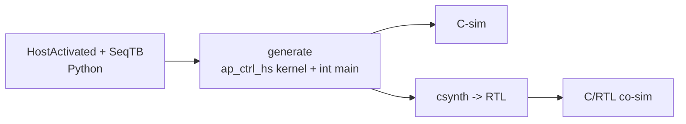

# Flow steps

<!-- WRITE ME. The step-by-step pipeline, with a Mermaid diagram.
     Suggested spine (verify each against the build code before asserting):
       1. Python: HostActivated component (on_start) + SeqTB (main, _is_testbench).
       2. Generate: kernel_files_to_str -> ap_ctrl_hs kernel; the SeqTB -> int main().
       3. C-sim: Vitis runs main() against the C++ model.
       4. csynth: TCL -> RTL.
       5. C/RTL co-sim: the same main() drives the RTL through Vitis's start/done handshake. -->

**Source of truth:** `waveflow/build/hwgen.py` (`kernel_files_to_str`), `waveflow/build/hwcodegen.py`
(`extract_kernel` / `extract_testbench`), `waveflow/hw/hw_testbench.py` (`SeqTB`). Targets in
`waveflow/hw/codegen_targets.py`.
