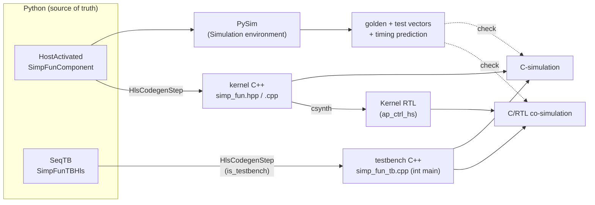

# Flow steps

The sequential flow starts from a Python **module description**, simulates and refines it entirely in
Python, then lowers the module and its testbench to C++ and lets Vitis do the rest — first functionally
(C-simulation), then against the real RTL (co-simulation). Every step below is walked with its real
code in the [register-map example](../../examples/regmap/).

## The steps

**1 · Module source.** First, describe the hardware you want as a
[`HostActivated`](./components.md) component — for the example, `SimpFunComponent`. This Python class
*is* the design: its `on_start` is the behavior and its register map is the boundary. Everything
downstream is derived from it. ([regmap example: Python model](../../examples/regmap/python.md).)

**2 · PySim.** Before generating any Vitis or RTL code, Waveflow lets you simulate the module in
Python. A `HostActivated` is an ordinary [`SimObj`](../sim/simobj.md), so you are free to construct
whatever simulation environment the application needs to evaluate and refine the design — for
`simp_fun`, a host `SimObj` drives the DUT *concurrently* over a real AXI-Lite link and checks it
computes `relu(a·x + b)`. The simulation is run by constructing a [`Simulation`](../sim/running.md) and
handing it the objects. By convention this step is called **PySim**; it is also where you generate the
artifacts the later gates check against — test vectors, the expected outputs (the *golden*), and the
predicted timing. ([regmap example: System simulation](../../examples/regmap/pysim.md).)

**3 · Testbench.** Next, write the testbench that validates the design's function and timing. It is
usually simpler than the full PySim — often it just reads PySim's test vectors, injects them into the
device, and compares the outputs. In the sequential flow the testbench is a **`SeqTB`**: a sequential
program whose one essential step is *running* the kernel (a call). The same `SeqTB.main()` has two
lives — run in Python it produces the timed golden; lowered to C++ (next step) it becomes the testbench
Vitis executes. ([regmap example: Sequential execution](../../examples/regmap/seqtb.md).)

**4 · Codegen — one step, two modes.** The same build step, **`HlsCodegenStep`**
(`waveflow/build/hwcodegen_steps.py`), lowers both:

| Input | Step | Output |
|---|---|---|
| `SimpFunComponent` | `HlsCodegenStep` | `simp_fun.hpp` + `simp_fun.cpp` (the kernel), plus a hand-written hook stub `simp_fun_compute_impl.cpp` |
| `SimpFunTBHls` | `HlsCodegenStep(is_testbench=True)` | `simp_fun_tb.cpp` — a single `int main()`, no header |

The example's `BuildDag` names these two instances `gen_kernel` and `gen_tb`. The kernel C++ is what
csynth turns into the `ap_ctrl_hs` **kernel RTL**; the testbench C++ is a straight-line program that
*calls* the kernel. ([regmap example: Code generation](../../examples/regmap/codegen.md).)

**5 · C-simulation.** Vitis compiles the testbench together with the kernel's C++ and runs `main()` —
untimed, no hardware. The kernel call is literally a C++ function call. This is the functional check:
its outputs are compared against the Python golden (**gate 1**).

**6 · C-synthesis.** The kernel C++ is synthesized to RTL. Only the kernel is synthesized — the
testbench stays C++.

**7 · C/RTL co-simulation.** Vitis re-runs the *same* `main()`, but now each kernel call drives the
synthesized RTL through the `ap_start` → wait-for-`ap_done` handshake. Because the DUT is a function,
Vitis generates that RTL harness for you. This is where the cycle count comes from, compared against
the Python timing prediction (**gate 3**).

One ordering constraint is worth noticing: **csynth consumes the C-sim result** — synthesis does not
run until C-simulation has passed. There is no point measuring the timing of a kernel that computes the
wrong answer.

> The full `BuildDag` for `simp_fun` has more nodes — building the test vectors, a synthesis-report
> gate (II ≤ 1), and rendering the timing diagram — and it splits PySim in two: a concurrent
> host-drives-DUT *system* sim (`SystemSimStep`) and the single-process `SeqTB` golden run
> (`PySimStep`). The three verification gates are walked in the
> [regmap example's C and RTL simulation](../../examples/regmap/rtlsim.md) page.

**Source of truth:** `waveflow/build/hwcodegen_steps.py` (`HlsCodegenStep`, its `produces()`),
`waveflow/build/hwgen.py` (`kernel_files_to_str`), `examples/regmap/simp_fun_build.py` (the DAG).
