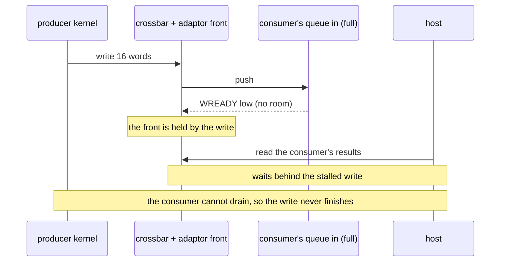
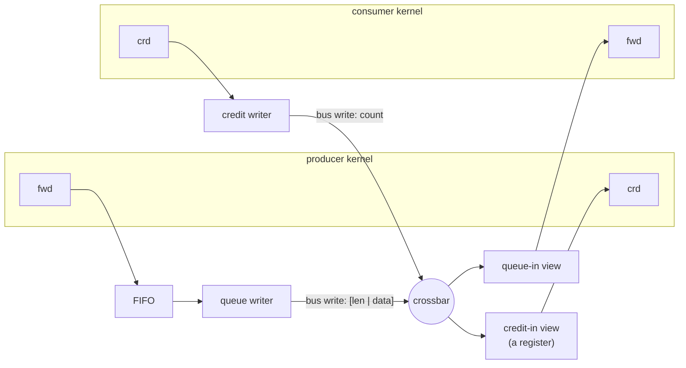

# MM-streams with credit

A [slave adaptor](./slave.md)'s **queue in** lets a bus master push a stream into a kernel. When the
bus master is itself a kernel -- one stage of a pipeline writing the next stage's queue across a shared
crossbar -- the link between them is a stream carried over memory-mapped writes: an **MM-stream**.

It looks like an ordinary stream. It does not behave like one when the consumer falls behind.

## Back-pressure does not cross a bus

On a direct AXI-Stream, a full consumer simply holds `TREADY` low and the producer waits. Nothing else
is affected: the wait is on a wire between the two of them.

Over a bus, the producer's "stream write" is a bus **write transaction** into the queue view. If the
queue is full, the view holds `WREADY` low -- and that holds far more than the producer:

- the **crossbar path** the write took;
- the target's **adaptor front**, which serves one transaction at a time for every view behind it.

So every other master's access to *any* view of that slave waits too -- including the host's read of
the consumer's output queue, which is what would let the consumer make progress. The consumer cannot
drain, the queue stays full, the write never completes: **a deadlock**, not a slowdown.



A host avoids it by waiting on the queue's room interrupt before writing
([Interrupts](./slave.md#interrupts)). A kernel needs the general form of the same rule: **never write
into a queue without knowing there is room.**

## The pattern: credit

Credit-based flow control is how buses and networks have always solved this (PCIe, on-chip networks,
InfiniBand):

- The **producer** keeps a count of how much room it may use in the consumer's queue, and writes only
  what fits. A write it starts therefore always completes.
- The **consumer** reports back what it has consumed, so the producer's count recovers.
- The report is **cumulative** -- "I have consumed 1,024 words in total", not "I freed 32 more". A
  lost or overwritten report is then harmless: the next one carries the whole truth.

Waveflow already has this as an interface: the [credit stream](../derived/credit_stream.md)
(`CreditStreamIF`), a forward stream plus a reverse stream of cumulative counts. An MM-stream with
credit is **the same interface with a different transport** -- `MmCreditStreamIF` -- and the kernels'
code does not change between the two:



| | `CreditStreamIF` (direct) | `MmCreditStreamIF` (over the bus) |
|---|---|---|
| forward | a stream into the consumer's FIFO | the producer's **queue writer** -> the consumer's **queue-in view** (`[len \| data]`) |
| reverse | a stream of cumulative counts | the consumer's **credit writer** -> the producer's **credit-in view** |
| the receiver's buffer | the stream FIFO | the queue-in view's FIFO, the same `depth` |
| the kernels' endpoints and code | `CreditStreamMasterIF` / `CreditStreamSlaveIF` | **the same** |

## Building one

The kernels declare the two views like any other memory-mapped view -- a `QueueIn` on the consumer's
credit port, a [`CreditIn`](./slave_views.md#credit-in) on the producer's -- so building each kernel's
memory-mapped device joins each view to the right half of its endpoint. The channel then builds the
two bus writers, whose `m_mem` ports go on the crossbar, and is placed once addresses are assigned:

```python
class Producer(FreeRunMod):
    mm_views = (CreditIn("u_crd", port="m_u"), ...)        # m_u: a FramedCreditStreamMasterIF

class Consumer(FreeRunMod):
    mm_views = (QueueIn("qu", port="s_u", depth=128), ...)  # s_u: a CreditStreamSlaveIF(crd_every=32)

prod_dev = build_mm_device(prod, ...)
cons_dev = build_mm_device(cons, ...)
link = MmCreditStreamIF(name="u", sim=sim, clk=clk, bitwidth=64, fwd_depth=32)
link.bind("master", prod.m_u)
link.bind("slave", cons.s_u)
masters += link.bus_masters()              # the queue writer and the credit writer
...                                        # the crossbar, assign_address_ranges
link.place(qin=cons_map["qu"], crd_in=prod_map["u_crd"])
```

The producer's endpoint is a `FramedCreditStreamMasterIF`: its forward port has a `TLAST` pin, because
the queue writer frames each producer write as one queue-in packet and only `TLAST` can tell it where a
write ends. Each writer's target -- its peer view's bus address -- is a run-time input (in RTL a wire
the system top drives), so neither kernel's RTL depends on where the other is placed.

## What makes it safe on a shared bus

- **The producer never stalls the bus.** Its credit counts every word not yet consumed -- in its FIFO,
  in its writer, on the bus and in the queue -- so the queue always has room for what arrives. The
  queue-in view counts any packet that did not fit (`nstall`); a credit-respecting producer keeps it
  zero.
- **A credit write never waits.** The credit-in view is a latest-value register, not a queue: because
  the count is cumulative, the newest value is the whole truth, so it may overwrite one the kernel has
  not taken yet. (A register bank's COMMIT, by contrast, waits for the kernel to take the previous
  config.) A one-value register also cannot saturate, which retires the credit stream's
  [fourth rule](../derived/credit_stream.md#four-rules-that-will-bite-you).
- **Batched credit stays live.** Every report is a bus write, so the consumer batches them
  (`crd_every`). It may then sit on up to `crd_every - 1` unreported words indefinitely; the producer's
  `max_write` -- the longest write it accepts -- shrinks by exactly that much, so a waiting producer
  always gets its room.

## Sizing it

Two sizes decide whether the link runs at the kernels' rate or slower. Both were found by measurement on
[Markov](../../../examples/markov/rtlsim.md#finding-the-time):

- **`fwd_depth` -- a FIFO in front of the queue writer.** The writer is store-and-forward: a queue-in
  packet starts with its length, so it gathers a whole write, then bursts it, and reads nothing while it
  bursts. Without a FIFO the producer stalls for every burst -- Markov's generator took 103 cycles per
  64-draw chunk instead of 64. Give it at least one write's words; the RTL top instantiates it at this
  depth.
- **The queue depth -- the credit window.** The producer can be at most `depth - 1` words ahead of what
  the consumer has *reported*. A word's round trip -- through the FIFO, the writer, the queue, up to
  `crd_every - 1` unreported words, and the credit path back -- must fit in that window at the link's
  rate, or credit, not compute, sets the pace. That is the **bandwidth-delay product**. Markov's
  64-word queue throttled the generator at every job start; 128 did not.

## Several writers into one kernel

Give each writer its own channel -- one queue per writer, as NVMe gives each CPU core its own
submission queue -- and let the receiving kernel round-robin over its inputs. Credits then go back
point to point, to the writer that used them: nothing is broadcast, and no two writers can race for the
same slots. A single queue shared by several writers would need its slots *allocated* (a request and a
grant, or an atomic tail pointer), which is a different problem.

## See also

- [Credit stream](../derived/credit_stream.md) -- the interface itself: its methods, `write` and
  `write_nb`, and the four rules
- [Slave adaptor views: credit in](./slave_views.md#credit-in) -- the credit-in view
- [Markov](../../../examples/markov/index.md) -- two kernels on one crossbar, the link between them an
  MM-stream with credit, measured end to end at RTL
