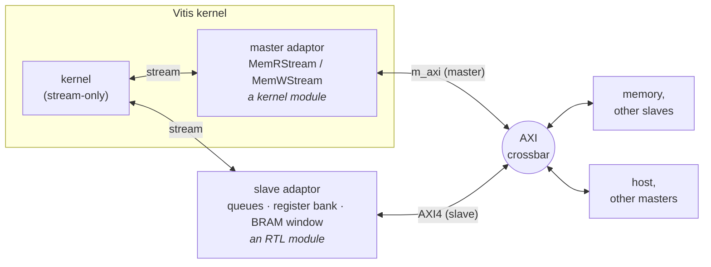

# AXI-MM

## Background: what AXI-MM is

**AXI** (Advanced eXtensible Interface) is the on-chip interconnect protocol of Arm's AMBA family, and
the standard way blocks are connected on AMD FPGAs and SoCs: processors, DMA engines, memory
controllers, peripherals, and accelerator kernels all speak it. It comes in two kinds:

- **AXI memory-mapped (AXI-MM)** — transactions carry an **address**. A *read* asks for the words at an
  address; a *write* delivers words to one. This is how a processor programs a peripheral's registers,
  how a kernel reads a buffer in DDR, and how one block fills another's memory.
- **AXI-Stream** — no addresses at all: data flows from producer to consumer in order, with a
  valid/ready handshake per word. In Waveflow that is a [`StreamIF`](../primitive/stream.md), and it is
  what free-running kernels use between themselves.

Every AXI-MM connection has two sides:

- the **master** *initiates* each transaction — it presents the address and asks to read or write;
- the **slave** *responds* — it decodes the address and returns or accepts the data.

A master may reach several slaves, and a slave may be reached by several masters, through an
**interconnect** (a *crossbar*) that routes each transaction to the slave owning its address. AXI-MM
comes in two strengths: full **AXI4**, whose transactions are *bursts* of up to 256 words, used for
memory; and **AXI4-Lite**, one word per transaction, used for control registers.

## In Waveflow, AXI-MM is an interface

Waveflow models AXI-MM as an **interface** — the same kind of object as a stream: something that
connects modules and carries transactions between them. The interface has a **master side** and a
**slave side**, and a module takes part by owning an endpoint on one of them:

- an **`MMIFMaster`** endpoint issues reads and writes — in bursts, typed or raw;
- an **`MMIFSlave`** endpoint answers them, through callbacks its module supplies;
- the interface that joins them is either a **`DirectMMIF`** (one master to one slave) or an
  **`AXIMMCrossBarIF`** (many masters to many slaves, routing each transaction by address — the
  crossbar).

There is **one** such model, and both flows use it unchanged. [Modeling memory-mapped
traffic](./modeling.md) is that model in detail — endpoints, interconnects, the latency model. The rest
of this page is about how each side becomes hardware, which is where the flows differ.

## What decides the realization: what Vitis HLS can generate

What differs between the flows is how each endpoint becomes hardware, and that comes down to what
Vitis HLS can generate for a kernel:

| | Vitis HLS can generate it? | host-activated kernel | free-running kernel |
|---|---|---|---|
| an **AXI master** (`m_axi`) | yes | the kernel's own `MMIFMaster` becomes an `m_axi` port its body reads and writes | yes, but only inside a **master adaptor** — `MemRStream` / `MemWStream` — never in the kernel's own logic |
| an **AXI-Lite register file** (`s_axilite`) | yes | the kernel's [register map](./regmap.md) | unusable: a free-running kernel cannot see a write happen |
| an **AXI4-full slave** | **no** | — | a **slave adaptor** — hand-written Verilog beside the kernel |

Everything around the kernel is the same in both flows: a memory is a `MemoryMod` (an `MMIFSlave`), a
host is a module holding an `MMIFMaster`, and the interconnect is a `DirectMMIF` or an
`AXIMMCrossBarIF`. At RTL, in an [XSI simulation](../../flows/concurrent_layers.md), the memory and the
host become C++ BFMs and the crossbar becomes AMD's `axi_crossbar` IP.

## A free-running kernel reaches the bus through adaptors

A free-running kernel's own logic sees **only streams**. Every synchronization it takes part in is a
stream message — that is what keeps the order of events in a design of concurrent tasks defined. So
whenever it touches AXI-MM, an **adaptor** sits between it and the bus, converting stream messages to
bus transactions or back:

Every link carries data both ways. Who *initiates* differs by side: on the master side the master
adaptor starts each transaction (reading from or writing to memory); on the slave side a host or
another master starts it, and the slave adaptor answers.

The two adaptors sit in different places for one reason — what HLS can generate:

- **The master adaptor is a kernel module.** HLS generates `m_axi` ports, so `MemRStream` and
  `MemWStream` are ordinary tasks inside the Vitis kernel, each owning one port and turning a command
  stream into AXI bursts. See [Master side](./master.md).
- **The slave adaptor is an RTL module.** HLS cannot generate an AXI4-full slave, so the slave side is
  hand-written Verilog in the RTL top, turning bus transactions into the stream messages the kernel
  reads. See [Slave side](./slave.md).

Either way the kernel is written the same way: it reads and writes streams, and never an address. This
is one instance of the rule every free-running design follows -- see
[Stream-only modules and adaptors](../../patterns/stream_only.md).

## Pages

- [Modeling memory-mapped traffic](./modeling.md) — `MMIFMaster` / `MMIFSlave`, `DirectMMIF`,
  `AXIMMCrossBarIF`, the latency model; the model both flows share.
- [AXI crossbar](./crossbar.md) — the interconnect in both backends: `AXIMMCrossBarIF` in pysim,
  AMD's `axi_crossbar` IP at RTL; describing, generating and instantiating it, what it costs, and how
  the pysim model is set to match.
- [Master side — streaming memory kernels](./master.md) — `MemRStream` / `MemWStream`: how a
  free-running kernel reads and writes memory.
- [Slave side — memory-mapped adaptor](./slave.md) — queues, a register bank and a BRAM window behind
  one AXI slave port: how a free-running kernel is reached, and the ordering guarantee.
- [Slave adaptor views](./slave_views.md) — each view's constructor, its kernel side and its bus side.
- [Slave adaptor — how it works](./slave_howitworks.md) — the RTL modules, the front end, and how
  closely pysim matches RTL.
- [MM-streams with credit](./credit_streams.md) — a stream between two kernels over the shared bus:
  why back-pressure cannot cross it, and the credit pattern that does.
- [Credit streams in HLS](./credit_streams_hls.md) — the two ends in a kernel body
  (`credit::Producer` / `credit::Consumer`), written in chunks.
- [Register Maps](./regmap.md) — the AXI-Lite register file of a host-activated kernel.
