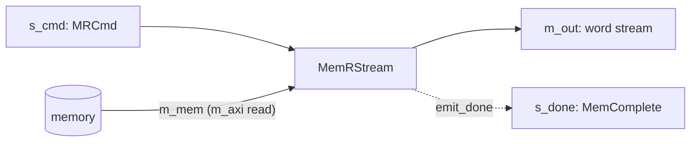
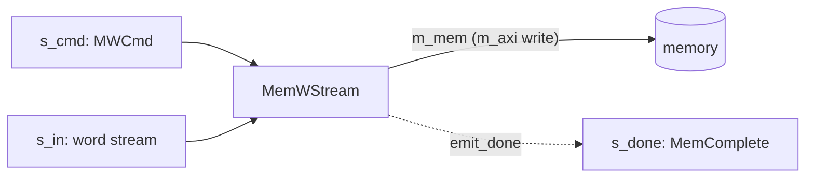

# Master side — streaming memory kernels

`MemRStream` and `MemWStream` (`waveflow/hw/mem_stream.py`) give memory a **command-based,
transactional interface**. Rather than a kernel reaching into an `m_axi` port directly, it sends a read
or write **command on a stream** and the component runs the burst: `MemRStream` turns a read command
into a word stream *out* of memory, `MemWStream` writes an incoming word stream *into* memory.

## Why a streaming interface to memory

A lone kernel could just own its `m_axi` port — the command stream earns its keep once the memory is
shared by **more than one unit**. When several producers and consumers need the same memory, a
transactional stream of commands is a simple substrate for **arbitration**: an arbiter multiplexes
commands from many requesters onto one memory port, and — because every command carries an opaque
[transfer message](#the-transfer-message) that comes back on completion — each requester matches a
completion to the request it issued without the arbiter tracking any per-requester state. Commands in,
completions out, correlation by tag: that is most of what a memory crossbar needs.

## MemRStream

Reads a run of words from memory and emits them on a stream.



**The command.** One `MRCmd` per burst — where to start, how many words, plus the transfer message:

<!-- snippet: skip -->
```python
# From waveflow/hw/mem_stream.py
class MRCmd(ParamSchema):
    elements = {
        "addr":     {"schema": Word32, "description": "element/word offset within the bound buffer"},
        "len":      {"schema": Word32, "description": "number of packed words to read"},
        "xfer_len": {"schema": Word32, "description": "active length of xfer_msg"},
        "xfer_msg": {"schema": DataArray.specialize(element_type=Word32, max_shape=(max_xfer_len,)),
                     "description": "opaque correlation cookie, echoed on completion"},
    }
```

**Addressing — element coordinates, not bytes.** `addr` and `len` are **word/element** coordinates
relative to a buffer base set once with `bind_base()` (mirroring the `offset=slave` AXI register). Every
command afterward is base-relative and unit-agnostic, and because `m_mem` is already a word pointer in
the generated C++, no byte↔word conversion happens in the kernel — unlike a byte-addressed `m_axi` port
(see [Endpoint interfaces](../../comp_codegen/interface.md)).

**Example.**

<!-- snippet: skip -->
```python
ld = MemRStream(name="ld", sim=sim, mem_dwidth=64, emit_done=True)
ld.bind_base(0x4000)                                 # physical base of this reader's buffer
# read 128 words from word offset 16, tagged with a job id:
cmd = ld.Cmd(addr=16, len=128, xfer_len=1, xfer_msg=np.array([job_id], np.uint32))
# an upstream component writes `cmd` to ld.s_cmd; ld bursts 128 words out ld.m_out, then
# (emit_done) echoes a MemComplete carrying that xfer_msg on ld.s_done.
```

## MemWStream

The mirror: drains a word stream and writes it to memory.



**The command.** An `MWCmd`, the same shape as `MRCmd` (`addr`, `len`, `xfer_len`, `xfer_msg`). `addr`
is where the first word lands; `len` words are drained off `s_in` and written contiguously.

**Addressing.** Identical element-coordinate convention and `bind_base()` — the write burst is
base-relative, no byte↔word conversion in the body.

**Example.**

<!-- snippet: skip -->
```python
st = MemWStream(name="st", sim=sim, mem_dwidth=64, emit_done=True)
st.bind_base(0x8000)
cmd = st.Cmd(addr=16, len=128, xfer_len=1, xfer_msg=np.array([job_id], np.uint32))
# an upstream component writes `cmd` to st.s_cmd and streams 128 words to st.s_in; st writes
# them from word offset 16, then echoes a MemComplete on st.s_done.
```

## The transfer message

`xfer_msg` is an opaque, fixed-capacity array (`max_xfer_len` words, default 8) carried *with* a command
and — when `emit_done=True` — echoed back **unmodified** on a `MemComplete` after the burst:

<!-- snippet: skip -->
```python
# From waveflow/hw/mem_stream.py
class MemComplete(ParamSchema):
    elements = {
        "len":      {"schema": Word32, "description": "number of words transferred"},
        "xfer_len": {"schema": Word32, "description": "valid length of the echoed xfer_msg"},
        "xfer_msg": {"schema": DataArray.specialize(element_type=Word32, max_shape=(max_xfer_len,)),
                     "description": "the command's xfer_msg, echoed back unmodified"},
    }
```

The component **never interprets it** — it only carries it through. That is the role: the *requester*
decides what the tag means (a job index, a demux route, a source id) and reads it back off the
completion to correlate. It is what makes many in-flight jobs — and the multi-unit arbitration above —
tractable without the memory stage holding any per-job state.

## Using it from a kernel

A kernel talks to a `MemRStream` over **three streams**, so it declares three endpoints of its own —
the other end of each of the reader's:

| the kernel's endpoint | type | the reader's endpoint | carries |
|---|---|---|---|
| `m_cmd` | `StreamIFMaster` (the kernel sends) | `s_cmd` | one `MRCmd` per burst |
| `s_data` | `StreamIFSlave` (the kernel receives) | `m_out` | the burst's words |
| `s_done` | `StreamIFSlave` (the kernel receives) | `s_done` | one `MemComplete` per burst, with `emit_done=True` |

Mind the last row: the reader's `s_done` is the *sending* end — a `StreamIFMaster` despite its prefix —
so the kernel's `s_done` is the receiving one. A `MemWStream` is the same with one more stream: the
kernel *writes* the burst's words to its `s_in`.

A complete, runnable example: a kernel that asks for one 16-word block per firing, sums it, and reads
the completion to learn which block it was.

```python
from dataclasses import dataclass, field

import numpy as np

from waveflow.hw.clock import Clock
from waveflow.hw.dataschema import IntField
from waveflow.hw.hw_freerun import FreeRunMod
from waveflow.hw.interface import StreamIF, StreamIFMaster, StreamIFSlave
from waveflow.hw.mem_stream import MemComplete, MemRStream, MRCmd
from waveflow.hw.memif import AXIMMCrossBarIF, assign_address_ranges
from waveflow.hw.memory import MemoryMod
from waveflow.simulation.simulation import Simulation

Cmd = MRCmd.specialize(max_xfer_len=8)          # the reader's command type ...
Done = MemComplete.specialize(max_xfer_len=8)   # ... and its completion


@dataclass
class BlockSum(FreeRunMod):
    """Each firing: ask the reader for one 16-word block, sum it, check the completion."""

    nblk: int = 4
    clk: Clock = field(default_factory=lambda: Clock(freq=100e6))

    def __post_init__(self):
        super().__post_init__()
        # The kernel's half of the three streams to a MemRStream:
        self.m_cmd = StreamIFMaster(name=f"{self.name}_m_cmd", sim=self.sim, bitwidth=64,
                                    has_tlast=False)   # commands OUT   -> reader.s_cmd
        self.s_data = StreamIFSlave(name=f"{self.name}_s_data", sim=self.sim, bitwidth=64,
                                    has_tlast=False)   # data IN        <- reader.m_out
        self.s_done = StreamIFSlave(name=f"{self.name}_s_done", sim=self.sim, bitwidth=64,
                                    has_tlast=False)   # completions IN <- reader.s_done
        for ep in (self.m_cmd, self.s_data, self.s_done):
            self.add_endpoint(ep)
        self.blk = 0
        self.sums = []

    def run_iter(self):
        if self.blk == self.nblk:                      # done: park forever
            yield self.env.event()
        cmd = Cmd(addr=16 * self.blk, len=16, xfer_len=1, xfer_msg=np.array([self.blk] + [0] * 7))
        yield from self.m_cmd.write(cmd)
        words = yield from self.s_data.get(nwords_max=16)  # the block: no TLAST, so give the count
        done = yield from self.s_done.get_schema(Done)     # tagged with this command's xfer_msg
        self.sums.append((int(done.xfer_msg[0]), int(np.sum(words))))
        self.blk += 1
```

`addr` and `len` are word offsets in the buffer the reader was bound to, and `xfer_msg` carries the
block number through the reader and back on the completion — the kernel never has to remember which
command a burst answers.

The wiring: a memory holding words 0–63, the reader bound to it, and the three streams.

```python
sim = Simulation()
clk = Clock(freq=100e6)
mem = MemoryMod(name="mem", sim=sim, inline=False, clk=clk, word_size=64, addr_size=32, nwords_tot=256)
U64 = IntField.specialize(bitwidth=64, signed=False)
base = mem.alloc_array(np.arange(64), U64)            # words 0..63; returns the byte address

rd = MemRStream(name="rd", sim=sim, mem_dwidth=64, emit_done=True, clk=clk)
rd.bind_base(base)
kern = BlockSum(name="kern", sim=sim, clk=clk)

for name, master, slave in (("cmd", kern.m_cmd, rd.s_cmd),      # kernel -> reader
                            ("data", rd.m_out, kern.s_data),     # reader -> kernel
                            ("done", rd.s_done, kern.s_done)):   # reader -> kernel
    s = StreamIF(name=name, sim=sim, clk=clk, bitwidth=64, depth=16)
    s.bind(ep_name="master", endpoint=master)
    s.bind(ep_name="slave", endpoint=slave)

xbar = AXIMMCrossBarIF(name="xbar", sim=sim, clk=clk, nports_master=1, nports_slave=1, bitwidth=64)
xbar.bind("master_0", rd.m_mem)
xbar.bind("slave_0", mem.s_mm)
assign_address_ranges([mem.s_mm], [(0, 256 * 8)])

sim.run_sim()
for blk, total in kern.sums:
    print(f"block {blk}: sum {total}")
```

```text
block 0: sum 120
block 1: sum 376
block 2: sum 632
block 3: sum 888
```

Block 0 is 0 + 1 + … + 15 = 120, and each later block adds 16 × 16 = 256. In a synthesized design the
kernel and the reader are two tasks in one Vitis kernel, and the reader's `m_mem` is the kernel's
`m_axi` port; the [MemCopy example](../../../examples/memcpy/) is that, worked end to end.

## Splitting the endpoints

The three endpoints do not have to belong to one module. The reader neither knows nor cares who sends
its commands, who takes its data, or who reads its completions — so the stage that **issues** a read
and the stage that **consumes** its data can be different modules. This is the usual shape of a
pipeline: one stage decides what to fetch, and the data flows on to whichever stage processes it,
without passing back through the one that asked.

The [MemCopy example](../../../examples/memcpy/) is the simplest case. A `Sequencer` issues the read
commands, and the reader's data goes straight to the `MemWStream` that stores it:

<!-- snippet: skip -->
```python
# From examples/mem_copy/mem_copy.py -- inside MemCopy.__post_init__
self._cmd_if.bind("master", self.seq.cmd_out)       # the Sequencer issues the reads ...
self._cmd_if.bind("slave", self.rstream.s_cmd)
self._data_if.bind("master", self.rstream.m_out)    # ... and the data goes to the writer
self._data_if.bind("slave", self.wstream.s_in)
```

The [interleaver example](../../../examples/interleaver/) is the same pattern one stage longer: a
command receiver issues the reads, and the loader that follows the reader takes the data and hands it
on to the compute stage.

In both, the reader runs in its **in-band** mode (`inband=True`): whatever the downstream stage needs
to know about a burst — what it is, where its result goes — travels on the data stream itself, ahead
of the data, rather than on a separate stream that would have to be kept in step with it. Splitting
the endpoints is what makes that worth doing: the stage receiving the data is not the one that wrote
the command, so it cannot simply remember what it asked for.

> **The other side of the bus.** `MemRStream` / `MemWStream` let a kernel *drive* the bus. To be
> *reached* over it — a queue a host writes, registers it sets, a memory it fills — a kernel gets a
> [memory-mapped slave adaptor](slave.md) in the RTL top. The two meet: a
> kernel with a `MemWStream` writes into another kernel's queue window just by pointing its base
> address there.

> **Composing these into a kernel** (a memcpy: `MemRStream` → `MemWStream`) is a separate topic — see
> the [MemCopy example](../../../examples/memcpy/), which drives the two with a sequencer and uses a
> richer *in-band framed* command protocol so a store command can never separate from the data it
> describes.
