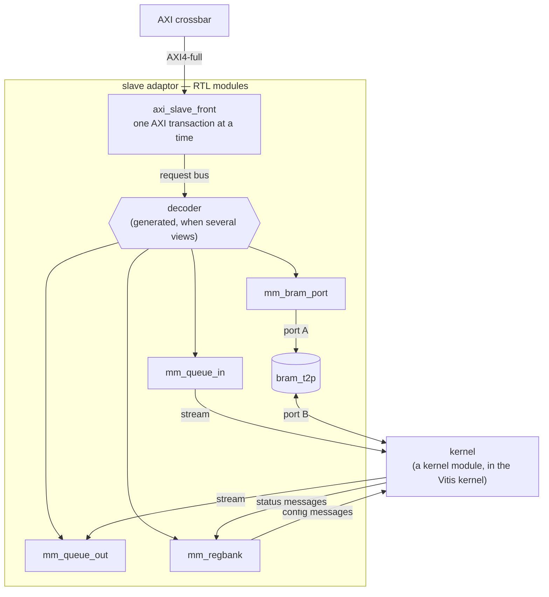

# Slave side — memory-mapped adaptor

A free-running kernel is **reached** over the bus — a host writing its registers, another kernel
filling its queue — through a **slave adaptor**: hand-written Verilog, an RTL module in the
[RTL top](../../flows/concurrent_layers.md), that takes AXI transactions on one side and produces the
stream messages the kernel reads on the other. It is RTL because Vitis HLS cannot generate an AXI4-full
slave, and `s_axilite` is no help to a kernel that cannot see a write happen — see
[AXI-MM](./index.md#what-decides-the-realization-what-vitis-hls-can-generate). The other direction, a
kernel *driving* the bus, is the [master side](./master.md). The rule that makes it composable:

> **Kernels stay stream-only. Every synchronization a kernel sees is a stream message.**

A kernel facing raw registers, a raw FIFO and a raw memory at once has no defined order between them.
A stream message has one — it arrives, in order, once — so each view below states what one bus access
becomes *as a message*.

## The structure



- **`axi_slave_front.v`** is the only module that speaks AXI. It turns each beat into one request on
  a simple **request bus** and is the source of the ordering guarantee below.
- **A leaf per view** (`mm_queue_in.v`, `mm_queue_out.v`, `mm_regbank.v`, `mm_bram_port.v`) implements
  one view's semantics on that bus. Widths, depths and sizes ride on Verilog parameters; the files are
  never rewritten.
- **The wiring** — instances, nets, and the decoder when several views share a front — is generated
  by [`mm_adaptor_gen.py`](../../../../waveflow/build/mm_adaptor_gen.py). The decoder is the only
  generated logic, and it is a table.

All of it is in [`waveflow/build/rtl/`](../../../../waveflow/build/rtl/). Each leaf has a pysim twin
with the same semantics, listed with each view.

### The front end

- Serves **one AXI transaction at a time**, reads and writes alike, in the order accepted; when an AW
  and an AR are both waiting it alternates between them.
- **Refuses** (SLVERR, the beat never reaches a leaf): an `AxSIZE` other than the bus width — a stream
  cannot carry a partial word — a WRAP burst, and any W beat whose `WSTRB` is not all ones (consumed
  and dropped, so the burst still completes).
- INCR bursts advance one word per beat; FIXED bursts repeat one address.
- Keeps at most one read outstanding at a leaf and issues the next in the cycle the previous response
  is taken, so a leaf with a one-cycle registered response sustains **one beat per cycle**.

Measured through the crossbar: both directions sustain one beat per cycle after a fixed 4–5 cycles,
and a refused burst completes at full speed with SLVERR.

## The views

| view | bus side | kernel side | RTL leaf | pysim |
|---|---|---|---|---|
| **queue in** | burst writes push words | an AXIS stream, TLAST from an in-band length header | `mm_queue_in.v` | `MemSlaveWStream` |
| **queue out** | reads pop words; a status read gives the occupancy | an AXIS stream the kernel writes | `mm_queue_out.v` | `MemSlaveRStream` |
| **register bank** | write config fields, then COMMIT; read status | one config **message** per commit; status messages the kernel pushes | `mm_regbank.v` | `MemSlaveRegBank` |
| **BRAM window** | read / write words of a memory | the memory's other port | `mm_bram_port.v` + `bram_t2p.v` | `MemSlaveBramWindow` |

Every view occupies an address **window** of at least 4 KB, not one address: HLS `m_axi` issues
only INCR bursts, so the address moves every beat, and an AXI burst may not cross a 4 KB boundary.

### Queue in

| local address | write | read |
|---|---|---|
| anywhere in the window | push (framed, below) | the **vacancy**: free slots, `0..depth`; no side effects |

- **Framing is in-band.** Each packet is `[len | data × len]`: the header's low 32 bits are the length,
  the header itself is consumed, and the leaf asserts TLAST on the last data word. Because the leaf
  counts words, a packet may span any number of bursts, and an interconnect that splits a burst cannot
  move a packet boundary. `len = 0` is an empty packet.
- **A full FIFO holds WREADY low**: the writer's burst stalls until the kernel drains. That is modelled,
  not avoided — a producer whose bus port carries other traffic reads the vacancy first, or holds
  credits ([Credit Stream](../derived/credit_stream.md)).
- **Accepted is not consumed.** The B response means the adaptor took the words.
- A kernel that already writes memory through `MemWStream` reaches another kernel's queue by pointing
  its base address at the window and prepending the length — gated at RTL with the real synthesized
  `mem_w_stream` as the producer.

### Queue out

| local address | read | write |
|---|---|---|
| lower half | **pop** one word per beat; an **empty** queue answers 0 with SLVERR | dropped |
| upper half | the **occupancy**: words available, `0..depth`; no side effects | dropped |

A read never waits for data: a slave that held RVALID until data arrived would hold the whole bus. The
reader checks the occupancy, then pops. A 4 KB window's lower half is 256 words at 64 bits — one
maximal AXI4 burst. TLAST from the kernel is not carried to the bus side.

### Register bank

| local address (W = window) | write | read |
|---|---|---|
| `[0, W/2)` | config **shadow**, word *i* at `i × bytes-per-word` | the shadow |
| `W/2` | **COMMIT**: snapshot the shadow, send it as one packet | the number of commits so far |
| `[3W/4, W)` | — | status word *i* of the latest **complete** message |

- **Shadow and commit.** Streaming each register write would let the kernel see a half-updated
  configuration. A commit is the one event at which the configuration changes — the contract
  `ap_start` gives a host-activated kernel, made explicit for a free-running one. The bank is typed:
  `MemSlaveRegBank(cfg_type=..., status_type=...)`, and the kernel reads a commit with
  `s_cfg.get_schema(cfg_type)`. A host stages a config with `regs.cfg_words(cfg)`.
- **Snapshot isolation.** The packet is sent from a copy taken at the commit, so a shadow write after
  the commit never reaches it.
- **A commit is never merged or dropped.** A second commit while the first packet is still untaken
  stalls the bus until it has gone. (Measured: 87 cycles with the kernel side held off.)
- **Status is latest-value.** The kernel pushes status messages at whatever rate it likes; a message
  becomes visible all at once when its last word (or TLAST) arrives, so a read never mixes two.

### BRAM window

The memory is `bram_t2p`, beside the kernel as for any [BRAM between modules](../primitive/bram.md):
the leaf drives port A, the kernel keeps port B.

- Word *i* at local byte `i × bytes-per-word`; beyond the memory a write is dropped and a read answers
  0 with SLVERR.
- A write is **done at its request handshake** — the word is in the memory at the next clock edge,
  before the front can decode the next transaction. That is this view's part in the ordering guarantee.
- One read in flight; the leaf's read latency is a parameter the generator reads from `bram_t2p.v`'s
  published `READ_LATENCY`, so the two have one source.

Data does not travel as messages here — that would waste the memory's random access — but
synchronization still does: the "data is ready" signal is a write to a queue or register bank in the
same adaptor. Which leads to ordering.

## Ordering

There are two statements, and the difference between them is the most important thing on this page.

**1. One front serves transactions in the order it accepts them.** A write to a BRAM window has
reached the memory before a later doorbell write — to a queue or a register bank behind the same
front — is even decoded. So *write the data, then ring the doorbell* is correct **if both views are
behind one front**.

Measured at RTL ([`test_mm_bram_order_xsi.py`](../../../../tests/build/test_mm_bram_order_xsi.py)):
host 0 writes a 256-word burst into a BRAM window, host 1 rings a doorbell two cycles later, and a
reader reads the memory highest address first once the doorbell arrives.

| | burst done | doorbell done | stale words read |
|---|---|---|---|
| both views behind **one front** | cycle 263 | cycle 267 | **0** |
| each view behind **its own front** | cycle 263 | cycle 12 | **63** of 256 |

The second row is the negative control, and it is the point: the guarantee holds behind one front and
**not across fronts**. A design that needs "data, then doorbell" puts both views in one adaptor.

**2. Order across two kernel-side streams is not preserved.** Once a config message and data words
travel on different streams, the kernel can read them in either order, whatever order they were
written in. A protocol that needs cross-stream order says so **in the messages**. In
[mm_fir](../../../examples/mm_fir/) a config carries `apply_at`, the sample index it takes effect at;
the host waits until the status shows the config *received* before sending that sample; and a config
that arrives after its sample is applied at once and counted `late` — detected, never silently
misapplied.

## One view per slot, or several behind one front

| | RTL | pysim |
|---|---|---|
| one view per crossbar slot | `render_view_slot(view, axi, ...)` — a front and a leaf | bind each view's `s_mem` to its own crossbar slave port |
| several views behind one front | `render_adaptor_slot(name, views, axi, ...)` — one front, a generated decoder, view *k* at local `k × 4 KB` | `MemSlaveAdaptor(views=[...])` — one slave port, `s_mem` |

The second shape is what ordering statement 1 needs, and it uses one crossbar slot. The decoder routes
a request by the address bits above 12, takes the read response from the view that accepted the read
(one read outstanding, so a latched select is enough), and answers an address in the span's unused
tail with SLVERR so a stray read cannot hang the bus.

In pysim the second shape is a `MemSlaveAdaptor`; [Using it from a kernel](#using-it-from-a-kernel)
builds one.

`MemSlaveAdaptor`'s port is declared both `half_duplex` and `serialize_transactions`, the second of
which needs a word of explanation.

### `serialize_transactions`

The pysim crossbar charges a burst's transfer time *before* taking the slave's channel, and holds the
channel only while the slave's callback runs. For a memory that is harmless. For the adaptor it was
wrong: a short doorbell issued after a long burst reached the views first — the opposite of the RTL.
`MMIFSlave.serialize_transactions = True` makes the crossbar hold the channel for the whole
transaction, as the front does. It is opt-in; every other slave behaves as before.

## Using it from a kernel

Each view's kernel side is a stream endpoint, and a kernel declares the other end:

| view | the view's endpoint | the kernel's endpoint | carries |
|---|---|---|---|
| queue in (`MemSlaveWStream`) | `m_out` (sends) | a `StreamIFSlave`, e.g. `s_in` | one packet per length-prefixed packet the bus wrote |
| queue out (`MemSlaveRStream`) | `s_in` (receives) | a `StreamIFMaster`, e.g. `m_out` | words for the bus to pop |
| register bank (`MemSlaveRegBank`) | `m_cfg` (sends) | a `StreamIFSlave`, e.g. `s_cfg` | one config message per COMMIT |
| | `s_status` (receives) | a `StreamIFMaster`, e.g. `m_status` | status messages; the bank keeps the latest |
| BRAM window (`MemSlaveBramWindow`) | the memory's port B | `port_b_read` / `port_b_write` in pysim | words, by address |

Here the view's prefix does tell you its direction: `m_` sends, `s_` receives.

A complete, runnable example: a kernel that waits for a gain in the register bank, then multiplies
every sample it is sent by it. First the two messages the register bank carries:

```python
from dataclasses import dataclass, field

import numpy as np

from waveflow.hw.clock import Clock
from waveflow.hw.dataschema import DataList, IntField
from waveflow.hw.hw_freerun import FreeRunMod
from waveflow.hw.interface import StreamIF, StreamIFMaster, StreamIFSlave
from waveflow.hw.memif import AXIMMCrossBarIF, MMIFMaster, assign_address_ranges
from waveflow.hw.mm_adaptor import MemSlaveAdaptor
from waveflow.hw.mm_queue import MemSlaveRStream, MemSlaveWStream
from waveflow.hw.mm_regbank import MemSlaveRegBank
from waveflow.simulation.simobj import SimObj
from waveflow.simulation.simulation import Simulation

U32 = IntField.specialize(bitwidth=32, signed=False)


class Cfg(DataList):
    elements = {"gain": U32}


class Status(DataList):
    elements = {"nsamp": U32}
```

The kernel. Its four endpoints are the other ends of the views' four streams, and it never sees an
address:

```python
@dataclass
class Scale(FreeRunMod):
    """Waits for a config, then multiplies every sample by its gain."""

    clk: Clock = field(default_factory=lambda: Clock(freq=100e6))

    def __post_init__(self):
        super().__post_init__()
        self.s_cfg = StreamIFSlave(name=f"{self.name}_s_cfg", sim=self.sim, bitwidth=64)      # <- regs.m_cfg
        self.m_status = StreamIFMaster(name=f"{self.name}_m_status", sim=self.sim, bitwidth=64)  # -> regs.s_status
        self.s_in = StreamIFSlave(name=f"{self.name}_s_in", sim=self.sim, bitwidth=64)        # <- qin.m_out
        self.m_out = StreamIFMaster(name=f"{self.name}_m_out", sim=self.sim, bitwidth=64)     # -> qout.s_in
        for ep in (self.s_cfg, self.m_status, self.s_in, self.m_out):
            self.add_endpoint(ep)
        self.gain = None
        self.nsamp = 0

    def run_iter(self):
        if self.gain is None:                          # first firing: the config
            cfg = yield from self.s_cfg.get_schema(Cfg)
            self.gain = int(cfg.gain)
            return
        pkt = yield from self.s_in.get()               # one packet of samples (TLAST = its end)
        yield from self.m_out.write(np.asarray(pkt, dtype=np.uint64) * self.gain)
        self.nsamp += len(pkt)
        yield from self.m_status.write(Status(nsamp=self.nsamp))
```

A host program, holding an `MMIFMaster`: it stages the config and commits it, pushes one packet of
four samples (the length goes first — queue in frames in-band), waits until queue out holds all four
results, pops them, and reads the status:

```python
@dataclass
class Host(SimObj):
    """Configure, push one packet, wait for the results, read them and the status."""

    def __post_init__(self):
        super().__post_init__()
        self.m = MMIFMaster(name=f"{self.name}_m", sim=self.sim, bitwidth=64)

    def run_proc(self):
        REGS, QIN, QOUT = 0x0000, 0x1000, 0x2000
        yield from self.m.write(np.asarray(Cfg(gain=3).serialize(word_bw=64)), REGS)  # the shadow
        yield from self.m.write(np.array([1], dtype=np.uint64), REGS + 0x800)        # COMMIT
        yield from self.m.write(np.array([4, 1, 2, 3, 4], dtype=np.uint64), QIN)     # [len | samples]
        while int((yield from self.m.read(1, QOUT + 0x800))[0]) < 4:                 # occupancy
            yield self.env.timeout(10e-9)
        print("results:", [int(w) for w in (yield from self.m.read(4, QOUT))])        # pop
        st = Status().deserialize((yield from self.m.read(1, REGS + 0xC00)), word_bw=64)
        print("status: nsamp =", int(st.nsamp))
```

The wiring: the three views behind one adaptor port at `0x0000`, `0x1000` and `0x2000`, their kernel
sides joined to the kernel with plain streams, and the host reaching the adaptor through a crossbar.

```python
sim = Simulation()
clk = Clock(freq=100e6)
regs = MemSlaveRegBank(name="regs", sim=sim, cfg_type=Cfg, status_type=Status, clk=clk)
qin = MemSlaveWStream(name="qin", sim=sim, depth=16, clk=clk)
qout = MemSlaveRStream(name="qout", sim=sim, depth=16, clk=clk)
adaptor = MemSlaveAdaptor(name="mm", sim=sim, views=[regs, qin, qout])   # 0x0000, 0x1000, 0x2000
kern = Scale(name="kern", sim=sim, clk=clk)
host = Host(name="host", sim=sim)

for name, master, slave, depth in (("cfg", regs.m_cfg, kern.s_cfg, regs.ncfg),
                                   ("status", kern.m_status, regs.s_status, 4),
                                   ("in", qin.m_out, kern.s_in, 16),
                                   ("out", kern.m_out, qout.s_in, 16)):
    s = StreamIF(name=name, sim=sim, clk=clk, bitwidth=64, depth=depth)
    s.bind(ep_name="master", endpoint=master)
    s.bind(ep_name="slave", endpoint=slave)

xbar = AXIMMCrossBarIF(name="xbar", sim=sim, clk=clk, nports_master=1, nports_slave=1, bitwidth=64)
xbar.bind("master_0", host.m)
xbar.bind("slave_0", adaptor.s_mem)
assign_address_ranges([adaptor.s_mem], [(0x0000, adaptor.span())])

sim.run_sim()
```

```text
results: [3, 6, 9, 12]
status: nsamp = 4
```

Two depths in the wiring are not free choices, and the views check them when the simulation starts:
a queue's stream channel **is** its FIFO, so its depth is the queue's; and the channel on `regs.m_cfg`
holds exactly one config packet (`regs.ncfg` words), because the RTL register bank has one snapshot
register.

**The views' streams need not go to one kernel module.** As on the [master
side](./master.md#splitting-the-endpoints), each view's stream is an ordinary stream, so a design can
send the configuration to one stage and the samples to another. What it cannot assume is any order
*between* those streams — that is ordering statement 2 above, and the reason
[mm_fir](../../../examples/mm_fir/) carries `apply_at` in its config.

## The crossbar

The slave ports above are reached through AMD's `axi_crossbar` IP, the same core a board design uses,
so the cycle counts measured through it transfer. `AxiXbarConfig` describes it and
`generate_axi_xbar` produces it with `create_ip` (about 30 s, cached). See
[MM Interfaces — how it lowers](modeling.md#how-it-lowers).

## pysim and RTL

With the crossbar's `latency_init` set to the measured 4 cycles, every adaptor operation in pysim lands
within **2 cycles** of RTL — except an operation that waited on a full queue or an untaken config
packet, which pysim releases up to one packet early: a pysim stream hands the kernel a whole packet in
one event, where RTL drains it a word per cycle. The tests assert that difference as a bound, so a
change to the stream model that moves it shows up.

## Gates

| | pysim | RTL (`-m xsi`) |
|---|---|---|
| queues | `tests/hw/test_mm_queue.py` | `tests/build/test_mm_queue_xsi.py`, `test_mm_queue_memw_xsi.py` |
| register bank | `tests/hw/test_mm_regbank.py` | `tests/build/test_mm_regbank_xsi.py` |
| BRAM window, ordering | `tests/hw/test_mm_bram.py` | `tests/build/test_mm_bram_order_xsi.py` |
| several views, one front | `tests/hw/test_mm_adaptor.py` | `tests/examples/test_mm_fir_xsi.py` (both shapes) |
| crossbar | — | `tests/build/test_axi_xbar_xsi.py` |

## What is not built yet

- The adaptor is assembled by example code (which views, which addresses, which kernel ports), not
  emitted by `wrapper_gen` from the module graph, the way a design's memories are.
- No host header is generated from the address map yet.
- The BRAM window's kernel side is plain `port_b_read` / `port_b_write` in pysim, not yet a `BramIF`,
  and has no ownership (lock) stream.
- Queue out does not carry packet boundaries to the bus side, and the request bus has no write-error
  path from a leaf (a write to queue out is dropped silently).
