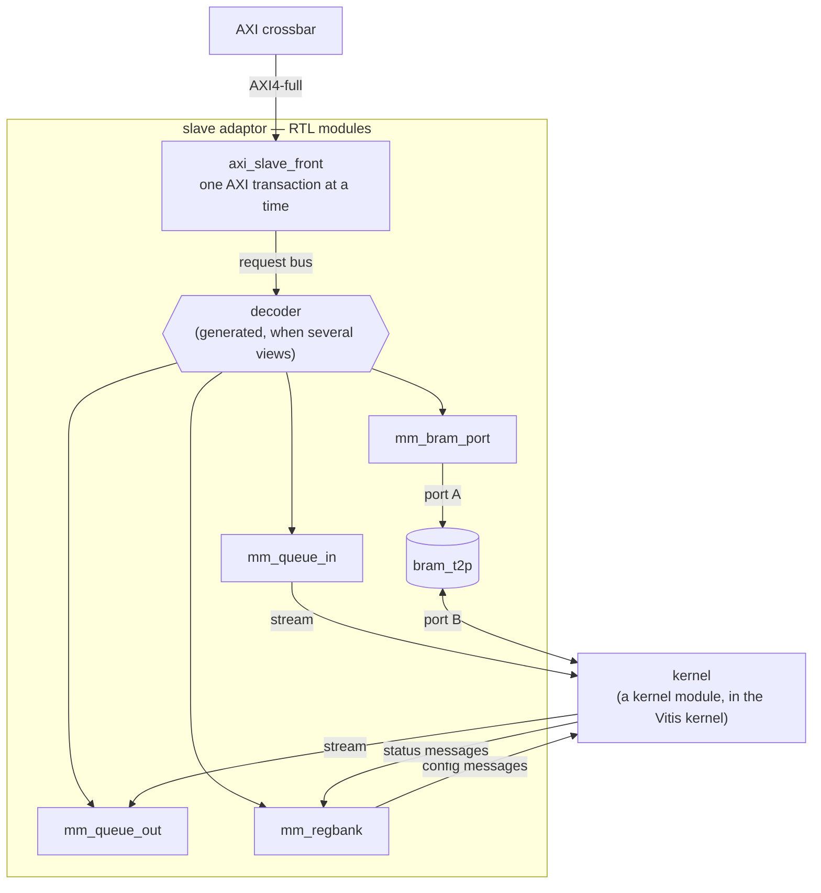

# Slave side — memory-mapped adaptor

A free-running kernel is **reached** over the bus — a host writing its registers, another kernel
filling its queue — through a **slave adaptor**: hand-written Verilog, an RTL module in the
[RTL top](../../flows/concurrent_layers.md), that takes AXI transactions on one side and produces the
stream messages the kernel reads on the other. It is RTL because Vitis HLS cannot generate an AXI4-full
slave, and `s_axilite` is no help to a kernel that cannot see a write happen — see
[AXI-MM](./index.md#what-decides-the-realization-what-vitis-hls-can-generate). The other direction, a
kernel *driving* the bus, is the [master side](./master.md). The rule that makes it composable:

> **Kernels stay stream-only. Every synchronization a kernel sees is a stream message.**

A kernel facing raw registers, a raw FIFO and a raw memory at once has no defined order between them.
A stream message has one — it arrives, in order, once — so each view states what one bus access
becomes *as a message*.

This topic has three pages. This one says what an adaptor is, how to build one, and what it
guarantees. [Slave adaptor views](./slave_views.md) describes each view: its constructor, what the
kernel does with it, and what a bus master does with it.
[Slave adaptor — how it works](./slave_howitworks.md) has the RTL and pysim internals, which you do
not need in order to use an adaptor.

## Views

An adaptor is made of **views**. A view is one way the kernel can be reached over the bus: a window of
bus addresses with defined semantics on the bus side, and a defined interface on the kernel side. There
are four kinds:

| view | what it is | the kernel side | pysim class |
|---|---|---|---|
| **queue in** | a FIFO a bus master writes packets into | a stream the kernel reads | `MemSlaveWStream` |
| **queue out** | a FIFO a bus master reads words out of | a stream the kernel writes | `MemSlaveRStream` |
| **register bank** | configuration registers a bus master writes, and status it reads | a stream of config messages, one per commit, and a stream of status messages | `MemSlaveRegBank` |
| **BRAM window** | a memory a bus master reads and writes by address | the memory's other port | `MemSlaveBramWindow` |

Each kind is one hand-written RTL module with one pysim class, and an adaptor holds one view or
several: a kernel with a register bank and two input queues has three views. Three of the four kinds
reach the kernel as streams. The BRAM window is the exception: the kernel reads and writes the memory
directly, and learns that new data is ready from a message on another view (a doorbell).

On the bus side each view occupies its own window of at least 4 KB. A window is more than one address
because HLS `m_axi` issues only INCR bursts, so the address moves every beat, and an AXI burst may not
cross a 4 KB boundary.

## The structure



A **front** (`axi_slave_front.v`) is the only module that speaks AXI. It serves one AXI transaction at
a time and passes each beat to the view whose window the address falls in. Each view is one RTL module
behind it. When several views share a front, a generated decoder picks the view by address. The
details are in [how it works](./slave_howitworks.md#the-rtl-modules).

## Building an adaptor

In pysim, build each view, then put them behind one `MemSlaveAdaptor`:

<!-- snippet: skip -->
```python
regs = MemSlaveRegBank(name="regs", sim=sim, cfg_type=Cfg, status_type=Status, clk=clk)
qin  = MemSlaveWStream(name="qin", sim=sim, depth=16, clk=clk)
qout = MemSlaveRStream(name="qout", sim=sim, depth=16, clk=clk)
bram = MemSlaveBramWindow(name="bram", sim=sim, nelem=256, clk=clk)
adaptor = MemSlaveAdaptor(name="mm", sim=sim, views=[regs, qin, qout, bram])

assign_address_ranges([adaptor.s_mem], [(0x4000_0000, adaptor.span())])
```

Each view's constructor is described with the view, in [Slave adaptor views](./slave_views.md).
`MemSlaveAdaptor` itself takes:

| parameter | meaning |
|---|---|
| `views` | the views, in address order: view *k* answers the 4 KB window at offset `k × 0x1000` from the adaptor's base. At least one; every view must use the default 4 KB `window` |
| `mem_dwidth` | the bus width in bits, default 64; every view must have the same width |

The adaptor has one bus slave port, `adaptor.s_mem`. Bind it to a crossbar slave port, then give it a
base address with `assign_address_ranges`. The size of its address range is `adaptor.span()`: the
number of views rounded up to a power of two, times 4 KB (four views need `0x4000`; three need
`0x4000` too).

**Finding a view's address.** A bus master reaches a register of a view at the adaptor's base address,
plus `adaptor.offset_of(view)`, plus the register's offset within the view. `offset_of(view)` is `k × 0x1000` for the *k*-th view. The offsets within each view — where COMMIT is,
where status is — are given with each view, and the register bank and queue out have methods that
return them (`regs.commit_offset()`, `regs.status_offset()`, `qout.status_addr()`). There is not yet a
method that returns a view's absolute bus address; see [What is not built yet](#what-is-not-built-yet).

**In RTL**, the same adaptor is generated by `render_adaptor_slot(name, views, axi, ...)` from RTL-side
view descriptions (`QueueView`, `RegBankView`, `BramView` in
[`mm_adaptor_gen.py`](../../../../waveflow/build/mm_adaptor_gen.py)); each view's page section lists
its RTL counterpart.

## One adaptor, or one per view

A view can also sit alone behind its own front, in its own crossbar slot:

| | RTL | pysim |
|---|---|---|
| one view per crossbar slot | `render_view_slot(view, axi, ...)` — a front and one view | bind each view's own `s_mem` port to its own crossbar slave port |
| several views behind one front | `render_adaptor_slot(name, views, axi, ...)` — one front, a generated decoder | `MemSlaveAdaptor(views=[...])`, one slave port `s_mem` |

The difference is concurrency. One front serves **one AXI transaction at a time**, reads and writes
alike, so views behind one front are reached one transaction after another; views behind separate
fronts can be reached at the same time. That is what makes the ordering guarantee below hold, and why
it holds only within one adaptor. Several views behind one front also use one crossbar slot instead of
several.

## Ordering

There are two statements, and the difference between them is the most important thing on this page.

**1. One front serves transactions in the order it accepts them.** A write to a BRAM window has
reached the memory before a later doorbell write — to a queue or a register bank behind the same
front — is even decoded. So *write the data, then ring the doorbell* is correct **if both views are
behind one front**.

Measured at RTL ([`test_mm_bram_order_xsi.py`](../../../../tests/build/test_mm_bram_order_xsi.py)):
host 0 writes a 256-word burst into a BRAM window, host 1 rings a doorbell two cycles later, and a
reader reads the memory highest address first once the doorbell arrives.

| | burst done | doorbell done | stale words read |
|---|---|---|---|
| both views behind **one front** | cycle 263 | cycle 267 | **0** |
| each view behind **its own front** | cycle 263 | cycle 12 | **63** of 256 |

The second row is the negative control, and it is the point: the guarantee holds behind one front and
**not across fronts**. A design that needs "data, then doorbell" puts both views in one adaptor.

**2. Order across two kernel-side streams is not preserved.** Once a config message and data words
travel on different streams, the kernel can read them in either order, whatever order they were
written in. A protocol that needs cross-stream order says so **in the messages**. In
[mm_fir](../../../examples/mm_fir/) a config carries `apply_at`, the sample index it takes effect at;
the host waits until the status shows the config *received* before sending that sample; and a config
that arrives after its sample is applied at once and counted `late` — detected, never silently
misapplied.

## Using it from a kernel

Each view's kernel side is a stream endpoint (or, for the BRAM window, a memory port), and the kernel
declares the other end:

| view | the view's endpoint | the kernel's endpoint | carries |
|---|---|---|---|
| queue in (`MemSlaveWStream`) | `m_out` (sends) | a `StreamIFSlave`, e.g. `s_in` | one packet per length-prefixed packet the bus wrote |
| queue out (`MemSlaveRStream`) | `s_in` (receives) | a `StreamIFMaster`, e.g. `m_out` | words for the bus to pop |
| register bank (`MemSlaveRegBank`) | `m_cfg` (sends) | a `StreamIFSlave`, e.g. `s_cfg` | one config message per COMMIT |
| | `s_status` (receives) | a `StreamIFMaster`, e.g. `m_status` | status messages; the bank keeps the latest |
| BRAM window (`MemSlaveBramWindow`) | the memory's port B | `port_b_read` / `port_b_write` in pysim | words, by address |

The view's prefix tells you its direction: `m_` sends, `s_` receives.

A complete, runnable example: a kernel that waits for a gain in the register bank, then multiplies
every sample it is sent by it. First the two messages the register bank carries:

```python
from dataclasses import dataclass, field

import numpy as np

from waveflow.hw.clock import Clock
from waveflow.hw.dataschema import DataList, IntField
from waveflow.hw.hw_freerun import FreeRunMod
from waveflow.hw.interface import StreamIF, StreamIFMaster, StreamIFSlave
from waveflow.hw.memif import AXIMMCrossBarIF, MMIFMaster, assign_address_ranges
from waveflow.hw.mm_adaptor import MemSlaveAdaptor
from waveflow.hw.mm_queue import MemSlaveRStream, MemSlaveWStream
from waveflow.hw.mm_regbank import MemSlaveRegBank
from waveflow.simulation.simobj import SimObj
from waveflow.simulation.simulation import Simulation

U32 = IntField.specialize(bitwidth=32, signed=False)


class Cfg(DataList):
    elements = {"gain": U32}


class Status(DataList):
    elements = {"nsamp": U32}
```

The kernel. Its four endpoints are the other ends of the views' four streams, and it never sees an
address:

```python
@dataclass
class Scale(FreeRunMod):
    """Waits for a config, then multiplies every sample by its gain."""

    clk: Clock = field(default_factory=lambda: Clock(freq=100e6))

    def __post_init__(self):
        super().__post_init__()
        self.s_cfg = StreamIFSlave(name=f"{self.name}_s_cfg", sim=self.sim, bitwidth=64)      # <- regs.m_cfg
        self.m_status = StreamIFMaster(name=f"{self.name}_m_status", sim=self.sim, bitwidth=64)  # -> regs.s_status
        self.s_in = StreamIFSlave(name=f"{self.name}_s_in", sim=self.sim, bitwidth=64)        # <- qin.m_out
        self.m_out = StreamIFMaster(name=f"{self.name}_m_out", sim=self.sim, bitwidth=64)     # -> qout.s_in
        for ep in (self.s_cfg, self.m_status, self.s_in, self.m_out):
            self.add_endpoint(ep)
        self.gain = None
        self.nsamp = 0

    def run_iter(self):
        if self.gain is None:                          # first firing: the config
            cfg = yield from self.s_cfg.get_schema(Cfg)
            self.gain = int(cfg.gain)
            return
        pkt = yield from self.s_in.get()               # one packet of samples (TLAST = its end)
        yield from self.m_out.write(np.asarray(pkt, dtype=np.uint64) * self.gain)
        self.nsamp += len(pkt)
        yield from self.m_status.write(Status(nsamp=self.nsamp))
```

A host program, holding an `MMIFMaster`: it stages the config and commits it, pushes one packet of
four samples (the length goes first — queue in frames in-band), waits until queue out holds all four
results, pops them, and reads the status:

```python
@dataclass
class Host(SimObj):
    """Configure, push one packet, wait for the results, read them and the status."""

    def __post_init__(self):
        super().__post_init__()
        self.m = MMIFMaster(name=f"{self.name}_m", sim=self.sim, bitwidth=64)

    def run_proc(self):
        REGS, QIN, QOUT = 0x0000, 0x1000, 0x2000
        yield from self.m.write(np.asarray(Cfg(gain=3).serialize(word_bw=64)), REGS)  # the shadow
        yield from self.m.write(np.array([1], dtype=np.uint64), REGS + 0x800)        # COMMIT
        yield from self.m.write(np.array([4, 1, 2, 3, 4], dtype=np.uint64), QIN)     # [len | samples]
        while int((yield from self.m.read(1, QOUT + 0x800))[0]) < 4:                 # occupancy
            yield self.env.timeout(10e-9)
        print("results:", [int(w) for w in (yield from self.m.read(4, QOUT))])        # pop
        st = Status().deserialize((yield from self.m.read(1, REGS + 0xC00)), word_bw=64)
        print("status: nsamp =", int(st.nsamp))
```

The wiring: the three views behind one adaptor port at `0x0000`, `0x1000` and `0x2000`, their kernel
sides joined to the kernel with plain streams, and the host reaching the adaptor through a crossbar.

```python
sim = Simulation()
clk = Clock(freq=100e6)
regs = MemSlaveRegBank(name="regs", sim=sim, cfg_type=Cfg, status_type=Status, clk=clk)
qin = MemSlaveWStream(name="qin", sim=sim, depth=16, clk=clk)
qout = MemSlaveRStream(name="qout", sim=sim, depth=16, clk=clk)
adaptor = MemSlaveAdaptor(name="mm", sim=sim, views=[regs, qin, qout])   # 0x0000, 0x1000, 0x2000
kern = Scale(name="kern", sim=sim, clk=clk)
host = Host(name="host", sim=sim)

for name, master, slave, depth in (("cfg", regs.m_cfg, kern.s_cfg, regs.ncfg),
                                   ("status", kern.m_status, regs.s_status, 4),
                                   ("in", qin.m_out, kern.s_in, 16),
                                   ("out", kern.m_out, qout.s_in, 16)):
    s = StreamIF(name=name, sim=sim, clk=clk, bitwidth=64, depth=depth)
    s.bind(ep_name="master", endpoint=master)
    s.bind(ep_name="slave", endpoint=slave)

xbar = AXIMMCrossBarIF(name="xbar", sim=sim, clk=clk, nports_master=1, nports_slave=1, bitwidth=64)
xbar.bind("master_0", host.m)
xbar.bind("slave_0", adaptor.s_mem)
assign_address_ranges([adaptor.s_mem], [(0x0000, adaptor.span())])

sim.run_sim()
```

```text
results: [3, 6, 9, 12]
status: nsamp = 4
```

Two depths in the wiring are not free choices, and the views check them when the simulation starts:
a queue's stream channel **is** its FIFO, so its depth is the queue's; and the channel on `regs.m_cfg`
holds exactly one config packet (`regs.ncfg` words), because the RTL register bank has one snapshot
register.

**The views' streams need not go to one kernel module.** As on the [master
side](./master.md#splitting-the-endpoints), each view's stream is an ordinary stream, so a design can
send the configuration to one stage and the samples to another. What it cannot assume is any order
*between* those streams — that is ordering statement 2 above, and the reason
[mm_fir](../../../examples/mm_fir/) carries `apply_at` in its config.

## What is not built yet

- The adaptor is assembled by example code (which views, which addresses, which kernel ports), not
  emitted by `wrapper_gen` from the module graph, the way a design's memories are.
- Each view is described twice, once for pysim (`MemSlaveRegBank`, ...) and once for RTL
  (`RegBankView`, ...), with different parameter names. One description should produce both.
- No method returns a view's absolute bus address, and no host header is generated from the address
  map, so host code (including the example above) writes the offsets as constants.
- The BRAM window's kernel side is plain `port_b_read` / `port_b_write` in pysim, not yet a `BramIF`,
  and has no ownership (lock) stream.
- Queue out does not carry packet boundaries to the bus side, and the request bus has no write-error
  path from a view (a write to queue out is dropped silently).
