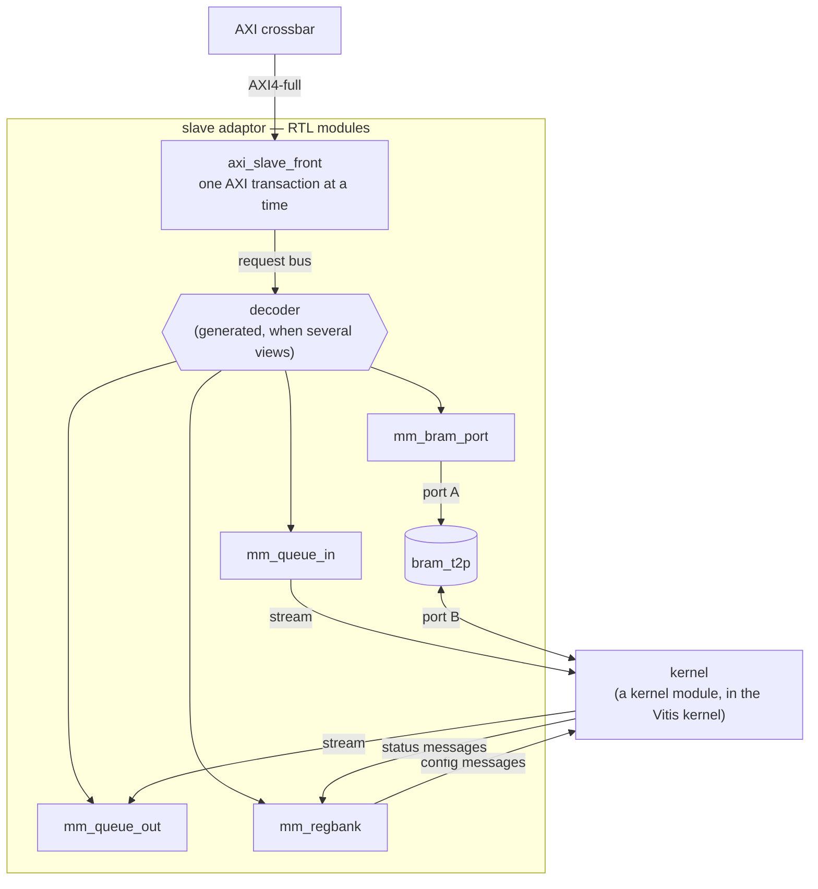

# Slave side — memory-mapped adaptor

A free-running kernel is **reached** over the bus — a host writing its registers, another kernel
filling its queue — through a **slave adaptor**: hand-written Verilog, an RTL module in the
[RTL top](../../flows/concurrent_layers.md), that takes AXI transactions on one side and produces the
stream messages the kernel reads on the other. It is RTL because Vitis HLS cannot generate an AXI4-full
slave, and `s_axilite` is no help to a kernel that cannot see a write happen — see
[AXI-MM](./index.md#what-decides-the-realization-what-vitis-hls-can-generate). The other direction, a
kernel *driving* the bus, is the [master side](./master.md). The rule that makes it composable:

> **Kernels stay stream-only. Every synchronization a kernel sees is a stream message.**

A kernel facing raw registers, a raw FIFO and a raw memory at once has no defined order between them.
A stream message has one — it arrives, in order, once — so each view states what one bus access
becomes *as a message*.

This topic has three pages. This one says what an adaptor is, how to build one, and what it
guarantees. [Slave adaptor views](./slave_views.md) describes each view: its constructor, what the
kernel does with it, and what a bus master does with it.
[Slave adaptor — how it works](./slave_howitworks.md) has the RTL and pysim internals, which you do
not need in order to use an adaptor.

## Views

An adaptor is made of **views**. A view is one way the kernel can be reached over the bus: a window of
bus addresses with defined semantics on the bus side, and a defined interface on the kernel side. There
are four kinds:

| view | what it is | the kernel side | pysim class |
|---|---|---|---|
| **queue in** | a FIFO a bus master writes packets into | a stream the kernel reads | `MemSlaveWStream` |
| **queue out** | a FIFO a bus master reads words out of | a stream the kernel writes | `MemSlaveRStream` |
| **register bank** | configuration registers a bus master writes, and status it reads | a stream of config messages, one per commit, and a stream of status messages | `MemSlaveRegBank` |
| **BRAM window** | a memory a bus master reads and writes by address | the memory's other port | `MemSlaveBramWindow` |

Each kind is one hand-written RTL module with one pysim class, and an adaptor holds one view or
several: a kernel with a register bank and two input queues has three views. Three of the four kinds
reach the kernel as streams. The BRAM window is the exception: the kernel reads and writes the memory
directly, and learns that new data is ready from a message on another view (a doorbell).

On the bus side each view occupies its own window of at least 4 KB. A window is more than one address
because HLS `m_axi` issues only INCR bursts, so the address moves every beat, and an AXI burst may not
cross a 4 KB boundary.

## The structure



A **front** (`axi_slave_front.v`) is the only module that speaks AXI. It serves one AXI transaction at
a time and passes each beat to the view whose window the address falls in. Each view is one RTL module
behind it. When several views share a front, a generated decoder picks the view by address. The
details are in [how it works](./slave_howitworks.md#the-rtl-modules).

## Building an adaptor

**A kernel type declares its views.** On its class, a kernel names which of its stream ports a bus
master reaches, and as what, in address order — [`mm_device.py`](../../../../waveflow/hw/mm_device.py):

<!-- snippet: skip -->
```python
class MmFir(FreeRunMod):
    mm_views = (
        RegBank("regs", cfg_port="s_cfg", status_port="m_status",
                cfg_type=FirCfg, status_type=FirStatus),
        QueueIn("qin", port="s_in", depth=64),
        QueueOut("qout", port="m_out", depth=64),
        QueueOut("qresp", port="m_resp", depth=16),
    )
```

| spec | the kernel's port | becomes |
|---|---|---|
| `QueueIn(name, port, depth)` | a stream slave | a queue in |
| `QueueOut(name, port, depth)` | a stream master | a queue out |
| `RegBank(name, cfg_port, status_port, cfg_type, status_type)` | a stream slave and a stream master | a register bank |
| `BramWindow(name, nelem)` | — (the memory's port B) | a BRAM window |

The kernel stays streams only; the declaration is about how it is reached.

**An instance gets its views built:**

<!-- snippet: skip -->
```python
fir = MmFir(name="fir", sim=sim, clk=clk)
dev = build_mm_device(fir, sim=sim, clk=clk, mem_dwidth=64, one_front=True)
slaves, ranges = dev.ranges(base=0x4000_0000)      # for assign_address_ranges
```

`build_mm_device` makes the views, joins each to the kernel's named port with a channel of the right
depth (a queue's channel *is* its FIFO; a register bank's config channel holds exactly one config),
and puts them behind one `MemSlaveAdaptor` (`one_front=True`) or gives each its own bus port. A
`prefix` names an instance's view modules, so two instances of one type can coexist.

The views can also be built one by one — their constructors are with each view, in
[Slave adaptor views](./slave_views.md) — and put behind a `MemSlaveAdaptor(views=[...])`, whose one bus
port `adaptor.s_mem` spans the views (view *k* at `k × 4 KB`; the span is the view count rounded up to
a power of two, times 4 KB).

## The address map: a layout per type, a base per instance

A bus master needs two numbers to reach a view: **where the slave instance is placed** and **where the
view sits inside it**. They are kept apart, as a driver stack keeps a system's base addresses apart
from each IP type's register offsets:

| | what | changes when | from |
|---|---|---|---|
| **layout**, per kernel type | each view's offset within the slave, its kind and sizes | the type's views change | `MemSlaveLayout.of(MmFir)` — the class's `mm_views`; no instance needed |
| **base**, per instance | where this instance sits on the bus | it is placed elsewhere | `assign_address_ranges` |

`layout.at(base)` combines them into the absolute map a host uses, and two instances of one type share
one layout and differ only in base:

<!-- snippet: skip -->
```python
layout = MemSlaveLayout.of(MmFir)
dev_a = BoundMemSlaveAdaptor.at(layout, 0x4000_0000, host.m)
dev_b = BoundMemSlaveAdaptor.at(layout, 0x4001_0000, host.m)
```

The same split reaches the C++ host as two generated headers — a layout header per type
(`MemSlaveLayout.to_cpp_header`, offsets only) and a bases header per system (`bases_to_cpp_header`,
bases only) — combined in C++ by `wfbfm::at(view, base)`. `bus_address_headers(xbar, system=...)`
finds both by walking a crossbar: every device bound to it, one layout header per type, and each
instance's base from where its port was placed. And the RTL crossbar is configured from the same pysim
crossbar ([AXI crossbar](crossbar.md#describing-one)), so an address is written once.

## Reaching the views from a bus master

A bus master — a host program, or a test standing in for one — does not write addresses. It asks for
a view **by name** and gets the same endpoint it would get from a direct connection to the kernel:

<!-- snippet: skip -->
```python
mm = BoundMemSlaveAdaptor(adaptor.slave_map(), master=host.m)

cfg    = mm.stream_master("regs")                   # write(cfg): one config message to the kernel
qin    = mm.stream_master("qin", irq=qin_irq)       # write(words): one packet
qout   = mm.stream_slave("qout", irq=qout_irq)      # get(nwords_max=n), get_array, get_schema
status = mm.status("regs")                          # read(): the latest status message
buf    = mm.region("bram", Sample)                  # read_slice / write_slice, in element coordinates
```

| view | the bus master gets | what a call does on the bus |
|---|---|---|
| queue in | a `StreamIFMaster` | `write` waits for the view's interrupt to say there is room, then writes the packet with its length first |
| register bank | a `StreamIFMaster` (config) | `write` writes the configuration registers, then COMMIT |
| | a `LatestValueIFSlave` (status) | `read` reads the latest status message; reading does not consume it |
| queue out | an `MmStreamIFSlave` | `get_*` waits for the view's interrupt to say the words are there, then pops them |
| BRAM window | a `Region` | `read_slice` / `write_slice` read and write the memory |

The map handed to `BoundMemSlaveAdaptor` is plain data — every view by name, at its absolute bus
address: `layout.at(base)` (see [the address map](#the-address-map-a-layout-per-type-a-base-per-instance)),
or `adaptor.slave_map()` for an adaptor already placed by `assign_address_ranges`.

Two things differ from a direct connection, and both are honest about the bus:

- **Calls block on the view's interrupt.** Each queue view drives an interrupt line (an `IrqIF`, see
  [Interrupts](#interrupts) below). Given the host's end of it (`irq=`), the endpoint sets the view's
  threshold, sleeps until the interrupt says the room (queue in) or the words (queue out) are there,
  and moves them. It never reads a count, and it never issues a transfer the view would stall — a
  stalled transfer holds the front, and with it every view behind it, so a host with one process
  writing and another reading would deadlock as soon as the kernel stopped to wait on its output.
- **Queue out is unframed.** The bus cannot see where the kernel's packets end, so a read names how
  many words it wants: `get(nwords_max=n)`, `get_array` or `get_schema`. `get(nwords_max=n)` returns
  exactly *n* words. A kernel writing to a queue out declares its output `has_tlast=False` to match.

So the host is the same code either way: [mm_fir](../../../examples/mm_fir/) runs one host class over
the bus and joined directly to the kernel, and checks the outputs agree. The addresses behind each
call are in [how it works](./slave_howitworks.md#the-address-map-behind-the-endpoints).

### Interrupts

A real host does not ask a device over and over whether it is ready; it sleeps until the device
interrupts. So each queue view drives an interrupt line, and the endpoints wait on it:

| view | the interrupt is high while | threshold |
|---|---|---|
| queue in | `vacancy >= threshold` — that much room | written at the upper half of the window |
| queue out | `occupancy >= threshold` — that many words ready | written at the upper half of the window |

The line is an `IrqIF` ([`irq.py`](../../../../waveflow/hw/irq.py)): the view's `m_irq`
(an `IrqIFSource`) on one side, the host's `IrqIFSink` on the other. It is **level-sensitive**: high
for as long as the condition holds, so a host that comes to wait late cannot miss it. At RTL it is the
view's `irq` output — a wire — and the XSI testbench's host samples it as a pin (`IrqPin`).

{F}python
line = IrqIF(name="qout_irq", sim=sim)
line.bind("source", qout.m_irq)
qout_irq = IrqIFSink(name="host_qout_irq", sim=sim)
line.bind("sink", qout_irq)
qout_ep = mm.stream_slave("qout", irq=qout_irq)
{F}

The endpoint manages the threshold itself: a read of *n* words sets it to *n* (a bus write, only when
it changes) and sleeps — the interrupt then *means* the words are there. A write keeps a lower bound
on the free space and, when that is too low, waits for room of half the queue, so one threshold write
normally serves a whole run. **Threshold 0 disables the interrupt** and is the reset value: a view no
one sets a threshold on behaves exactly as before.

Without `irq=`, the endpoints fall back to reading the count and asking again — polling. No example
uses it: waiting on the interrupt costs no bus traffic while the host waits, and wakes it the moment
the condition holds.

**In RTL**, the same adaptor is generated by `render_adaptor_slot(name, views, axi, ...)` from RTL-side
view descriptions (`QueueView`, `RegBankView`, `BramView` in
[`mm_adaptor_gen.py`](../../../../waveflow/build/mm_adaptor_gen.py)); each view's page section lists
its RTL counterpart.

## One adaptor, or one per view

A view can also sit alone behind its own front, in its own crossbar slot:

| | RTL | pysim |
|---|---|---|
| one view per crossbar slot | `render_view_slot(view, axi, ...)` — a front and one view | bind each view's own `s_mem` port to its own crossbar slave port |
| several views behind one front | `render_adaptor_slot(name, views, axi, ...)` — one front, a generated decoder | `MemSlaveAdaptor(views=[...])`, one slave port `s_mem` |

The difference is concurrency. One front serves **one AXI transaction at a time**, reads and writes
alike, so views behind one front are reached one transaction after another; views behind separate
fronts can be reached at the same time. That is what makes the ordering guarantee below hold, and why
it holds only within one adaptor. Several views behind one front also use one crossbar slot instead of
several.

## Ordering

There are two statements, and the difference between them is the most important thing on this page.

**1. One front serves transactions in the order it accepts them.** A write to a BRAM window has
reached the memory before a later doorbell write — to a queue or a register bank behind the same
front — is even decoded. So *write the data, then ring the doorbell* is correct **if both views are
behind one front**.

Measured at RTL ([`test_mm_bram_order_xsi.py`](../../../../tests/build/test_mm_bram_order_xsi.py)):
host 0 writes a 256-word burst into a BRAM window, host 1 rings a doorbell two cycles later, and a
reader reads the memory highest address first once the doorbell arrives.

| | burst done | doorbell done | stale words read |
|---|---|---|---|
| both views behind **one front** | cycle 263 | cycle 267 | **0** |
| each view behind **its own front** | cycle 263 | cycle 12 | **63** of 256 |

The second row is the negative control, and it is the point: the guarantee holds behind one front and
**not across fronts**. A design that needs "data, then doorbell" puts both views in one adaptor.

**2. Order across two kernel-side streams is not preserved.** Once a config message and data words
travel on different streams, the kernel can read them in either order, whatever order they were
written in. A protocol that needs cross-stream order says so **in the messages**.

The recipe [mm_fir](../../../examples/mm_fir/) uses is a **config id**:

- the host names every config it commits, in the config itself (`cfg_id`);
- every data packet carries, in an in-band header on the data stream, the id of the config it needs;
- the kernel, on reading a header, takes configs until the one in force has that id — waiting if it
  has not arrived — and only then reads the data.

The id is **carried, not counted**: a count of commits kept at both ends drifts the first time a host
restarts or a commit is lost, and nothing could notice; an id in the message needs nothing to be in
step.

A packet can then use neither an older config (the kernel waits for the one it names) nor a newer one
(a config nobody has asked for stays in its stream), so the host commits a config and sends the data
that needs it in either order, and never asks whether the config arrived. The wait is on the kernel's
own stream, not on the bus. mm_fir also has the kernel echo, per packet, the `cfg_id` it actually
used into a response queue, so the host can check the order end to end.

## Using it from a kernel

Each view's kernel side is a stream endpoint (or, for the BRAM window, a memory port), and the kernel
declares the other end:

| view | the view's endpoint | the kernel's endpoint | carries |
|---|---|---|---|
| queue in (`MemSlaveWStream`) | `m_out` (sends) | a `StreamIFSlave`, e.g. `s_in` | one packet per length-prefixed packet the bus wrote |
| queue out (`MemSlaveRStream`) | `s_in` (receives) | a `StreamIFMaster`, e.g. `m_out` | words for the bus to pop |
| register bank (`MemSlaveRegBank`) | `m_cfg` (sends) | a `StreamIFSlave`, e.g. `s_cfg` | one config message per COMMIT |
| | `s_status` (receives) | a `StreamIFMaster`, e.g. `m_status` | status messages; the bank keeps the latest |
| BRAM window (`MemSlaveBramWindow`) | the memory's port B | `port_b_read` / `port_b_write` in pysim | words, by address |

The view's prefix tells you its direction: `m_` sends, `s_` receives.

A complete, runnable example: a kernel that waits for a gain in the register bank, then multiplies
every sample it is sent by it. First the two messages the register bank carries:

```python
from dataclasses import dataclass, field

import numpy as np

from waveflow.hw.clock import Clock
from waveflow.hw.dataschema import DataList, IntField
from waveflow.hw.hw_freerun import FreeRunMod
from waveflow.hw.interface import StreamIF, StreamIFMaster, StreamIFSlave
from waveflow.hw.irq import IrqIF, IrqIFSink
from waveflow.hw.memif import AXIMMCrossBarIF, MMIFMaster, assign_address_ranges
from waveflow.hw.mm_adaptor import MemSlaveAdaptor
from waveflow.hw.mm_host import BoundMemSlaveAdaptor
from waveflow.hw.mm_queue import MemSlaveRStream, MemSlaveWStream
from waveflow.hw.mm_regbank import MemSlaveRegBank
from waveflow.simulation.simobj import SimObj
from waveflow.simulation.simulation import Simulation

U32 = IntField.specialize(bitwidth=32, signed=False)


class Cfg(DataList):
    elements = {"gain": U32}


class Status(DataList):
    elements = {"nsamp": U32}
```

The kernel. Its four endpoints are the other ends of the views' four streams, and it never sees an
address:

```python
@dataclass
class Scale(FreeRunMod):
    """Waits for a config, then multiplies every sample by its gain."""

    clk: Clock = field(default_factory=lambda: Clock(freq=100e6))

    def __post_init__(self):
        super().__post_init__()
        self.s_cfg = StreamIFSlave(name=f"{self.name}_s_cfg", sim=self.sim, bitwidth=64)      # <- regs.m_cfg
        self.m_status = StreamIFMaster(name=f"{self.name}_m_status", sim=self.sim, bitwidth=64)  # -> regs.s_status
        self.s_in = StreamIFSlave(name=f"{self.name}_s_in", sim=self.sim, bitwidth=64)        # <- qin.m_out
        self.m_out = StreamIFMaster(name=f"{self.name}_m_out", sim=self.sim, bitwidth=64,
                                    has_tlast=False)                                      # -> qout.s_in
        for ep in (self.s_cfg, self.m_status, self.s_in, self.m_out):
            self.add_endpoint(ep)
        self.gain = None
        self.nsamp = 0

    def run_iter(self):
        if self.gain is None:                          # first firing: the config
            cfg = yield from self.s_cfg.get_schema(Cfg)
            self.gain = int(cfg.gain)
            return
        pkt = yield from self.s_in.get()               # one packet of samples (TLAST = its end)
        self.nsamp += len(pkt)
        yield from self.m_status.write(Status(nsamp=self.nsamp))   # status first: see the host
        yield from self.m_out.write(np.asarray(pkt, dtype=np.uint64) * self.gain)
```

A host program. It holds an `MMIFMaster` for the bus, and four endpoints the wiring gives it. It
sends a config, pushes one packet of four samples, takes the four results, and reads the status —
without an address in sight, and without polling: its queue endpoints wait on the views' interrupts.
The kernel publishes its status *before* the results, so once the host has the results, one read of
the status is final:

```python
@dataclass
class Host(SimObj):
    """Configure, push one packet, take the results, read the status."""

    def __post_init__(self):
        super().__post_init__()
        self.m = MMIFMaster(name=f"{self.name}_m", sim=self.sim, bitwidth=64)
        self.cfg = self.qin = self.qout = self.status = None      # set by the wiring

    def run_proc(self):
        yield from self.cfg.write(Cfg(gain=3))                              # one config message
        yield from self.qin.write(np.array([1, 2, 3, 4], dtype=np.uint64))  # one packet
        y = yield from self.qout.get(nwords_max=4)                          # waits for all four
        print("results:", [int(w) for w in y])
        st = yield from self.status.read()
        print("status: nsamp =", int(st.nsamp))
```

The wiring: the three views behind one adaptor port at `0x0000`, `0x1000` and `0x2000`, their kernel
sides joined to the kernel with plain streams, the host reaching the adaptor through a crossbar, and
the host's endpoints taken from the adaptor's map.

```python
sim = Simulation()
clk = Clock(freq=100e6)
regs = MemSlaveRegBank(name="regs", sim=sim, cfg_type=Cfg, status_type=Status, clk=clk)
qin = MemSlaveWStream(name="qin", sim=sim, depth=16, clk=clk)
qout = MemSlaveRStream(name="qout", sim=sim, depth=16, clk=clk)
adaptor = MemSlaveAdaptor(name="mm", sim=sim, views=[regs, qin, qout])   # 0x0000, 0x1000, 0x2000
kern = Scale(name="kern", sim=sim, clk=clk)
host = Host(name="host", sim=sim)

for name, master, slave, depth in (("cfg", regs.m_cfg, kern.s_cfg, regs.ncfg),
                                   ("status", kern.m_status, regs.s_status, 4),
                                   ("in", qin.m_out, kern.s_in, 16),
                                   ("out", kern.m_out, qout.s_in, 16)):
    s = StreamIF(name=name, sim=sim, clk=clk, bitwidth=64, depth=depth)
    s.bind(ep_name="master", endpoint=master)
    s.bind(ep_name="slave", endpoint=slave)

xbar = AXIMMCrossBarIF(name="xbar", sim=sim, clk=clk, nports_master=1, nports_slave=1, bitwidth=64)
xbar.bind("master_0", host.m)
xbar.bind("slave_0", adaptor.s_mem)
assign_address_ranges([adaptor.s_mem], [(0x0000, adaptor.span())])

irq = {}                                        # the queue views' interrupt lines, to the host
for view in (qin, qout):
    line = IrqIF(name=f"{view.name}_irq", sim=sim)
    line.bind("source", view.m_irq)
    irq[view.name] = IrqIFSink(name=f"host_{view.name}_irq", sim=sim)
    line.bind("sink", irq[view.name])

mm = BoundMemSlaveAdaptor(adaptor.slave_map(), master=host.m)
host.cfg, host.status = mm.stream_master("regs"), mm.status("regs")
host.qin = mm.stream_master("qin", irq=irq["qin"])
host.qout = mm.stream_slave("qout", irq=irq["qout"])

sim.run_sim()
```

```text
results: [3, 6, 9, 12]
status: nsamp = 4
```

Two depths in the wiring are not free choices, and the views check them when the simulation starts:
a queue's stream channel **is** its FIFO, so its depth is the queue's; and the channel on `regs.m_cfg`
holds exactly one config packet (`regs.ncfg` words), because the RTL register bank has one snapshot
register.

**The views' streams need not go to one kernel module.** As on the [master
side](./master.md#splitting-the-endpoints), each view's stream is an ordinary stream, so a design can
send the configuration to one stage and the samples to another. What it cannot assume is any order
*between* those streams — that is ordering statement 2 above, and the reason
[mm_fir](../../../examples/mm_fir/) puts a config id in each packet's header.

## What is not built yet

- The views are declared by the kernel type and built by `build_mm_device`, but the RTL adaptor is
  still assembled by the example's testbench top, not emitted by `wrapper_gen` from the module graph.
- Each view is described twice, once for pysim (`MemSlaveRegBank`, ...) and once for RTL
  (`RegBankView`, ...), with different parameter names. One description should produce both.
- Interrupts are level lines with a threshold; there are no interrupt enable / status / clear
  registers like Vitis's `GIER` / `IER` / `ISR`, and a host-activated kernel's `ap_done` is not an
  `IrqIF` yet.
- The endpoints exist for pysim and for an XSI testbench (`xsi_mm_host.h`, with the layout and bases
  headers found by `bus_address_headers`), not yet for real host software or for a Vitis kernel acting
  as the bus master.
- The BRAM window's kernel side is plain `port_b_read` / `port_b_write` in pysim, not yet a `BramIF`,
  and has no ownership (lock) stream.
- Queue out does not carry packet boundaries to the bus side, and the request bus has no write-error
  path from a view (a write to queue out is dropped silently).
