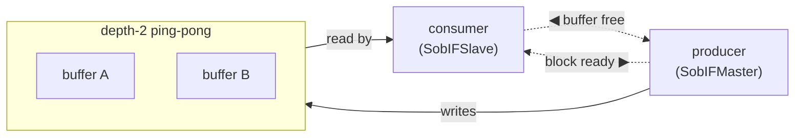

# Stream-of-Blocks Interface

`StreamOfBlocksIF` is the block counterpart to [`StreamIF`](./stream.md): instead of transferring one
word at a time, it transfers **ownership of a whole block**. Its modeling pattern (with a worked
example) is the [interleaver](../../examples/interleaver/); this page is the interface in isolation.

## What it carries

SOB transfers **ownership of a whole block** of **any DataSchema type**. Each block instance is a DataSchema;
it can be a scalar, composite, or fixed-size array:

- **Scalar**: `element_type=Float32` → each block is one float; you acquire and release one float at a time.
- **Composite**: `element_type=ComplexNumber` → each block is one complex number.
- **Array**: `element_type=DataArray[IntField(32), 16]` → each block is 16 32-bit integers; typical for gather/scatter workloads.

The endpoints are `SobIFMaster` (producer) and `SobIFSlave` (consumer).

## Block Element Types

When creating a `StreamOfBlocksIF`, you specify `element_type`: a DataSchema class that defines what
each block contains. In pysim, `acquire_write()` and `acquire_read()` return fresh instances of `element_type`.
In HLS, the element type directly specifies the BRAM shape.

**Examples:**

```python
# Scalar: one float per block
from waveflow.hw.dataschema import FloatField
SOB_scalar = StreamOfBlocksIF(element_type=FloatField(32))
block = yield from m_sob.acquire_write()  # Fresh float instance
block.val = 3.14
yield from m_sob.commit_write(block)

# Array: 8 × uint64 words per block (gather/scatter)
from waveflow.hw.dataschema import DataArray, IntField
WordBlock = DataArray.specialize(
    element_type=IntField(64, signed=False),
    max_shape=(8,),
    member_name="words"
)
SOB_words = StreamOfBlocksIF(element_type=WordBlock)
block = yield from m_sob.acquire_write()  # Fresh WordBlock instance
for i in range(8):
    block[i] = some_words[i]
yield from m_sob.commit_write(block)

# Custom composite: struct with tagged fields
MyComplex = DataSchema.define(
    _fields=[
        ("real", FloatField(32)),
        ("imag", FloatField(32)),
    ],
    member_name="complex_num"
)
SOB_complex = StreamOfBlocksIF(element_type=MyComplex)
block = yield from m_sob.acquire_write()  # Fresh MyComplex instance
block.real = x
block.imag = y
yield from m_sob.commit_write(block)
```

## Acquire / commit / release

SOB is a lock-scoped handoff using four control operations on typed instances:

- the producer **acquires** a free block (`acquire_write` → returns `T` instance) → fills it → **commits** it
  (`commit_write(block)`);
- the consumer **acquires** a committed block (`acquire_read` → returns `T` instance) → random-accesses it
  → **releases** it (`release_read`).

In HLS this is the `write_lock` / `read_lock` pattern over `hls::stream_of_blocks<T, 2>`, where `T` is the
element type (any DataSchema).

**Example: reading and writing a block:**

```python
# Producer side
block = yield from m_out.acquire_write()  # Returns fresh T instance
block[0] = data_word_0
block[1] = data_word_1
# ... fill block ...
yield from m_out.commit_write(block)

# Consumer side
block = yield from s_in.acquire_read()    # Returns committed T instance
for i in range(8):
    word = int(block[i])                  # Direct typed access, no unpacking
    yield from output.write(word)
yield from s_in.release_read()
```

No serialization to/from words — typed access throughout.

## Why four calls? — FIFO vs. ping-pong

A [FIFO](./stream.md) has **one** channel: the producer `write`s (put), the consumer `get`s (take), and
backpressure is implicit in the queue being full. A SOB separates the **data** from the **control** so a
whole block can be handed over by ownership and double-buffered — and that costs a second control path:

| | FIFO (stream) | SOB (ping-pong) |
|---|---|---|
| **producer** | `write` — put (blocks if full) | `acquire_write` — *wait* for a free buffer · `commit_write` — *signal* ready |
| **consumer** | `get` — take (blocks if empty) | `acquire_read` — *wait* for a ready block · `release_read` — *signal* free |
| **channels** | 1 data queue | `depth` data buffers + **2 control paths** |

The two control paths are symmetric — **each side waits on one channel and signals the other:**

- **block-ready** (forward): `commit_write` → `acquire_read`
- **buffer-free** (reverse): `release_read` → `acquire_write`



The producer only ever **stalls at `acquire_write`** — that is the backpressure (it can't get a free
buffer because the consumer is behind). `commit_write` never blocks (the invariant `free + ready ≤
depth` guarantees a slot), so it is a pure "ready" signal. Symmetrically the consumer stalls only at
`acquire_read`.

## In simulation, and in hardware

The Python model realizes the two control paths directly:

- **`_ready`** — a `simpy.Store`, starts empty — the **block-ready** channel.
- **`_free`** — a `simpy.Container` initialized to `depth` — the **buffer-free** channel. A counting
  semaphore initialized to `depth` *is* a FIFO pre-loaded with `depth` indistinguishable free-tokens, so
  the "semaphore" and a "free-token FIFO" are the same thing here.

The hardware realization is the **same two token channels** around `depth` shared buffer banks. One
difference worth knowing: in pysim the ready queue carries the **block payload** (convenient for a
discrete-event model), but in hardware the ready channel carries only a **token / valid** — the payload
stays in the shared buffer RAM. That is the whole point of a ping-pong: you hand over *ownership*, not a
copy, which is why the hand-off costs ~nothing in the [timing model](../timing/sob.md).
Vitis's `hls::stream_of_blocks` generates this handshake for you; whether the exact RTL uses FIFO
primitives or equivalent counters/handshake logic is an implementation detail — the behavior is this
two-way token exchange.

## Lowering snapshot

| Interface kind | Python model | HLS lowering |
|---|---|---|
| Stream | `StreamIFMaster` / `StreamIFSlave` | `hls::stream<...>` (`axis`) |
| Memory-mapped | `MMIFMaster` | `m_axi` pointer |
| Stream-of-Blocks | `SobIFMaster` / `SobIFSlave` on `StreamOfBlocksIF` | `hls::stream_of_blocks<T, 2>` with `write_lock` / `read_lock`, where T is `element_type` |

`StreamOfBlocksIF` is for internal task-network channels, not a host-boundary transport.

## Toy Example: Typed Block Gather

The `gather_toy` kernel demonstrates type-safe block processing with gather semantics:

**Python (pysim model):**

```python
from waveflow.hw.dataschema import DataArray, IntField
from waveflow.hw.interface import SobIFSlave, SobIFMaster, StreamOfBlocksIF, StreamIFMaster, StreamIFSlave
from waveflow.hw.hw_module import HwModule
from waveflow.hw.hw_freerun import FreeRunMod

# Define a block type: 8 × uint64 words
WordBlock = DataArray.specialize(
    element_type=IntField.specialize(bitwidth=64, signed=False),
    max_shape=(8,),
    member_name="words"
)

class Fill(HwModule):
    """Producer: read words from StreamIF, gather 8 at a time into blocks via SOBIF."""
    def __post_init__(self):
        super().__post_init__()
        self.s_in = StreamIFSlave(name=f"{self.name}_s_in", sim=self.sim, bitwidth=64)
        self.m_out = SobIFMaster(name=f"{self.name}_m_out", sim=self.sim, element_type=WordBlock)
        self.add_endpoint(self.s_in)
        self.add_endpoint(self.m_out)

    def run_proc(self):
        """Read 8 words, commit one typed block, repeat."""
        while True:
            block = yield from self.m_out.acquire_write()  # Fresh WordBlock instance
            for i in range(8):
                word = yield from self.s_in.get(int)
                block[i] = word  # Direct typed element access
            yield from self.m_out.commit_write(block)

class Gather(HwModule):
    """Consumer: read blocks from SOBIF, emit words in order (identity gather)."""
    def __post_init__(self):
        super().__post_init__()
        self.s_in = SobIFSlave(name=f"{self.name}_s_in", sim=self.sim, element_type=WordBlock)
        self.m_out = StreamIFMaster(name=f"{self.name}_m_out", sim=self.sim, bitwidth=64)
        self.add_endpoint(self.s_in)
        self.add_endpoint(self.m_out)

    def run_proc(self):
        """Read a block, emit words in order (no permutation)."""
        while True:
            block = yield from self.s_in.acquire_read()  # Typed block instance
            for i in range(8):
                yield from self.m_out.write(int(block[i]))  # Direct access, no unpacking
            yield from self.s_in.release_read()

class GatherToy(FreeRunMod):
    """Composite: Fill → SOBIF → Gather (proof-of-concept, no serialization overhead)."""
    def __post_init__(self):
        super().__post_init__()
        self.fill = Fill(name=f"{self.name}_fill", sim=self.sim)
        self.gather = Gather(name=f"{self.name}_gather", sim=self.sim)
        for c in (self.fill, self.gather):
            self.add_comp(c)

        # Internal SOBIF: typed blocks between Fill and Gather
        self._sob = StreamOfBlocksIF(
            name=f"{self.name}_sob", sim=self.sim, element_type=WordBlock, clk=self.clk
        )
        self._sob.bind("master", self.fill.m_out)
        self._sob.bind("slave", self.gather.s_in)
        self.add_if(self._sob)

        # Boundary
        self.s_in = self.fill.s_in
        self.m_out = self.gather.m_out
```

**Key observations:**

- **No serialization**: `WordBlock` is acquired directly from `acquire_write()`; no packing/unpacking needed.
- **Type-safe access**: `block[i]` is a `uint64` element, not a raw word.
- **Bidirectional control**: `acquire_write`/`commit_write` (producer) and `acquire_read`/`release_read`
  (consumer) manage a synchronized ping-pong buffer with depth=2 (default).
- **Hardware efficient**: In Vitis HLS, this generates `hls::stream_of_blocks<WordBlock, 2>` with
  concurrent read/write overlap — the producer fills buffer B while the consumer reads buffer A.

Compare this to the old word-granular SOBIF: `BitWidth=64, block_n=8` would force conversion to/from
numpy word arrays, adding marshaling overhead. With typed blocks, you get the hardware efficiency directly
in Python.

## See also

- [Stream Interfaces](./stream.md) — the one-channel FIFO this contrasts with.
- [Free-running kernel in HLS](../comp_codegen/composite.md) — how a SOB edge lowers, the lock scopes, and the gather/scatter throughput asymmetry.
- [Defining a component](../flows/modules.md) — where SOB endpoints are declared on components.
