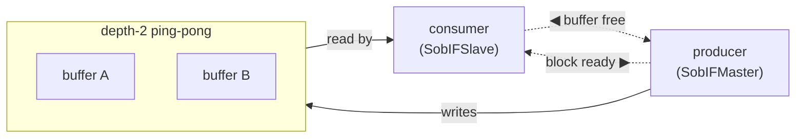

# Stream-of-Blocks Interface

`StreamOfBlocksIF` is the block counterpart to [`StreamIF`](./stream.md): instead of transferring one
word at a time, it transfers **ownership of a whole block**. Its modeling pattern (with a worked
example) is [Concurrency → SOB](../concurrency/python/sob.md); this page is the interface in isolation.

## What it carries

SOB transfers a fixed-size block whose element shape is `DataArray[T, N]`:

- `T` is the element type (`ap_uint<MEM_DW>` in the interleaver path).
- `N` is the block length (`block_n`).

The endpoints are `SobIFMaster` (producer) and `SobIFSlave` (consumer).

## Acquire / commit / release

SOB is a lock-scoped handoff:

- the producer **acquires** a free block (`acquire_write`) → fills it → **commits** it (`commit_write`);
- the consumer **acquires** a committed block (`acquire_read`) → random-accesses it → **releases** it
  (`release_read`).

In HLS this is the `write_lock` / `read_lock` pattern over `hls::stream_of_blocks<T[N], 2>`.

## Why four calls? — FIFO vs. ping-pong

A [FIFO](./stream.md) has **one** channel: the producer `write`s (put), the consumer `get`s (take), and
backpressure is implicit in the queue being full. A SOB separates the **data** from the **control** so a
whole block can be handed over by ownership and double-buffered — and that costs a second control path:

| | FIFO (stream) | SOB (ping-pong) |
|---|---|---|
| **producer** | `write` — put (blocks if full) | `acquire_write` — *wait* for a free buffer · `commit_write` — *signal* ready |
| **consumer** | `get` — take (blocks if empty) | `acquire_read` — *wait* for a ready block · `release_read` — *signal* free |
| **channels** | 1 data queue | `depth` data buffers + **2 control paths** |

The two control paths are symmetric — **each side waits on one channel and signals the other:**

- **block-ready** (forward): `commit_write` → `acquire_read`
- **buffer-free** (reverse): `release_read` → `acquire_write`

The producer only ever **stalls at `acquire_write`** — that is the backpressure (it can't get a free
buffer because the consumer is behind). `commit_write` never blocks (the invariant `free + ready ≤
depth` guarantees a slot), so it is a pure "ready" signal. Symmetrically the consumer stalls only at
`acquire_read`.

## In simulation, and in hardware

The Python model realizes the two control paths directly:

- **`_ready`** — a `simpy.Store`, starts empty — the **block-ready** channel.
- **`_free`** — a `simpy.Container` initialized to `depth` — the **buffer-free** channel. A counting
  semaphore initialized to `depth` *is* a FIFO pre-loaded with `depth` indistinguishable free-tokens, so
  the "semaphore" and a "free-token FIFO" are the same thing here.

The hardware realization is the **same two token channels** around `depth` shared buffer banks. One
difference worth knowing: in pysim the ready queue carries the **block payload** (convenient for a
discrete-event model), but in hardware the ready channel carries only a **token / valid** — the payload
stays in the shared buffer RAM. That is the whole point of a ping-pong: you hand over *ownership*, not a
copy, which is why the hand-off costs ~nothing in the [timing model](../concurrency/python/timing.md).
Vitis's `hls::stream_of_blocks` generates this handshake for you; whether the exact RTL uses FIFO
primitives or equivalent counters/handshake logic is an implementation detail — the behavior is this
two-way token exchange.

## Lowering snapshot

| Interface kind | Python model | HLS lowering |
|---|---|---|
| Stream | `StreamIFMaster` / `StreamIFSlave` | `hls::stream<...>` (`axis`) |
| Memory-mapped | `MMIFMaster` | `m_axi` pointer |
| Stream-of-Blocks | `SobIFMaster` / `SobIFSlave` on `StreamOfBlocksIF` | `hls::stream_of_blocks<T[N], 2>` with `write_lock` / `read_lock` |

`StreamOfBlocksIF` is for internal task-network channels, not a host-boundary transport.

## See also

- [Stream Interfaces](./stream.md) — the one-channel FIFO this contrasts with.
- [Concurrency → SOB](../concurrency/python/sob.md) — the modeling pattern, with the reverse-add worked example.
- [Concurrency (HLS) → SOB](../concurrency/hls/sob.md) — `stream_of_blocks` synthesis and the gather/scatter throughput asymmetry.
- [Defining a component](../components/overview.md) — where SOB endpoints are declared on components.
