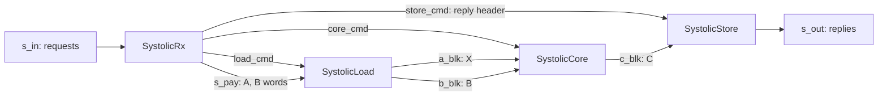

# Systolic Matrix Multiply

`SystolicCore` and `SystolicUnit` (`waveflow/linalg/systolic.py`) multiply complex fixed-point
matrices on an output-stationary array of `R × C` processing elements:

* `C = q(A·B)` (operation `MUL`), or
* `C = q(Aᴴ·B)` (operation `MUL_AH`, the conjugate transpose of `A`).

Every product and every sum is exact, and `C` is rounded and saturated **once**, to its own
format. The bit-exact model is `waveflow.linalg.matmul.matmul`. The pysim modules call it, and the
HLS body equals it in C-simulation and at RTL. For what the linear-algebra components share
(formats, lane groups, messages, the build step), see [Linear Algebra](./index.md).

## What it computes

The values are the **stored integers** of each format, as `(re, im)` pairs of `int64` arrays:

<!-- snippet: skip -->
```python
cr, ci = matmul(ar, ai, a, br, bi, b, c, adjoint=False, form=4)
```

`A` is `m × k` (`k × m` with `adjoint=True`), `B` is `k × n`, and leading dimensions broadcast as
in `numpy.matmul`. The sum of `k` products is held exactly in `acc_t`, whose width covers `Kmax`
products (`acc_format`). Integer sums are associative, so the order of the products does not
change the result.

**The conjugate transpose.** For `MUL_AH` the core holds `X = Aᵀ`, transposed but *not*
conjugated, and computes `Aᴴ·B = conj(X·conj(B))`. It negates `B`'s imaginary part as `B` enters
the array, in one more bit, and negates the exact imaginary sum before the rounding. The one bit
matters: the conjugate of `−2^(W−1)` is `+2^(W−1)`, which `W` bits cannot hold. In the unit, the
loader does the transpose; a design that drives the core directly writes `Aᵀ` into the block.

**The multiply form.** `form=4` uses four real multiplies per complex product. `form=3` uses the
three-multiply (Gauss) form of `waveflow.utils.complexutils.cmult3`: `k1 = br(ar + ai)`,
`k2 = ar(bi − br)`, `k3 = ai(br + bi)`, `re = k1 − k3`, `im = k1 + k2`. The values are identical;
the two forms differ in DSPs and LUTs ([the cost model](#the-cost-model)).

## Parameters

| Parameter | Default | Meaning | Constraint |
|---|---|---|---|
| `Mmax`, `Kmax`, `Nmax` | 8, 8, 32 | the largest `m`, `k`, `n` a job may have | `R` divides `Mmax`, `C` divides `Nmax` |
| `R`, `C` | 4, 8 | the array: `R` rows by `C` columns of processing elements | `L` divides `C` |
| `L` | 4 | lanes: complex values per group, the columns touched per cycle | a power of two |
| `form` | 4 | the complex product: 4 or 3 real multiplies | 3 or 4 |
| `a`, `b`, `c` | required | the formats of `A`, `B` and `C` | each at most `lane_bits` wide (unit) |
| `sob_depth` | 2 | blocks in each stream-of-blocks buffer | |
| `word_bits` | 64 | message word width (unit only) | 32 or 64 |
| `lane_bits` | 16 | width of each part of a memory element (unit only) | `2·lane_bits` divides `word_bits` |
| `clk` | 250 MHz | the clock of the pysim timing | |

The integer parameters are `HwParam`s. They reach the C++ bodies as template arguments, and the
formats reach them through the format id ([Linear Algebra](./index.md#formats)).

**Run-time dimensions.** Each job states its own `m`, `k` and `n`, up to the maxima:

* `1 ≤ m ≤ Mmax`, and `m` is a multiple of `R`;
* `1 ≤ n ≤ Nmax`, and `n` is a multiple of `C`;
* `1 ≤ k ≤ Kmax`, and `k` is a multiple of `L` or divides `L`.

`waveflow.linalg.systolic.cmd_status` (or `core.status(...)`) says whether a job is valid. To run
another shape, pad with zeros and discard what you added: zero rows of `A` give zero rows of `C`,
zero columns of `B` give zero columns of `C`, and zero columns of `A` with matching zero rows of
`B` add nothing to the sums.

## The core

`SystolicCore` is a `FreeRunMod` with four ports:

| Port | Kind | Carries |
|---|---|---|
| `cmd_in` | stream, 64 bits | one `SystolicCmd` per job |
| `a_blk` | stream of blocks, in | `X` (`A`, or `Aᵀ` for `MUL_AH`): `m × k` in lane groups |
| `b_blk` | stream of blocks, in | `B`: `k × n` in lane groups |
| `c_blk` | stream of blocks, out | `C`: `m × n` in lane groups |

`SystolicCmd` is one 64-bit word: `op` (8 bits), `nb` (8), and `m`, `k`, `n` (16 each); build one
with `command(op, m, k, n, nb=1)`. A job reads `X` once, then for each of its `nb` matrices `B`
writes one `C`. `X` stays in the core for the whole job. The core does **not** check the command:
a design that drives it directly validates first with `cmd_status`, and the pysim core raises on
an invalid command.

`C` is covered in `(m/R)·(n/C)` tiles. `X` values shift right along the rows of the array and `B`
values down its columns, with the usual skew. Each element accumulates its entry of `C` over `k`,
and the tile is rounded once and written out in `R·C/L` lane groups.

The body is `waveflow/build/systolic_core_task.h`, a template on the maxima, `L`, `R`, `C`,
`form`, `sob_depth` and the format id. Its traits carry the operand types and the exact types the
array needs: `ba_t` (`B` in the array, one bit wider for the negation), `p_t` (one complex
product) and `acc_t` (a sum of `Kmax` products). The example below prints them for one
configuration.

## The standalone unit

`SystolicUnit` puts the core behind three tasks and speaks the framed messages of
[Linear Algebra](./index.md#messages) on `s_in` and `s_out`:



| Task | Body | Does |
|---|---|---|
| `SystolicRx` | `systolic_rx_task.h` | reads a request header, validates it, sends the job to the loader and the core and the reply header to the store, then forwards the payload, or drains it if rejected |
| `SystolicLoad` | `systolic_load_task.h` | unpacks `A` and `B` from message words into lane groups; for `MUL_AH` it writes `Aᵀ` |
| `SystolicCore` | `systolic_core_task.h` | the array (above) |
| `SystolicStore` | `systolic_store_task.h` | writes the reply header, then `C` packed into message words |

**A request** is a header and two payload bursts:

| Part | Contents |
|---|---|
| header | `op` (`MUL` = 1 or `MUL_AH` = 2), `m`, `k`, `n`, `length` = `request_words(m, k, n)`, `nfollow` = 0, any `tag` |
| burst 1 | `A` as the job states it: `m × k`, or `k × m` for `MUL_AH`, row-major |
| burst 2 | `B`: `k × n`, row-major |

**A reply** is a header with the request's `tag`, `op`, `m`, `k` and `n`, a `status`, and
`length` = `reply_words(m, n)` if served or 0 if not. A served request's reply is followed by one
burst holding `C` (`m × n`, row-major).

The receiver checks a request in this order and replies with the first status that applies:

1. `BAD_OP`: `op` is neither `MUL` nor `MUL_AH`.
2. `BAD_SEQUENCE`: `nfollow` is not 0. Each job is self-contained, one message.
3. `BAD_DIMS`: the dimensions break a rule of [Parameters](#parameters).
4. `BAD_LENGTH`: `length` is not `request_words(m, k, n)`.

A rejected request's payload is drained by its `length`. The request that follows it is read
normally.

## A worked example

This page's Python blocks form one script, which the docs tests run; the output under each block
is what it prints. It builds the unit at the centre configuration of the calibration, sends it two
requests in pysim, checks the reply against the model, prices the unit, and generates its headers.

Formats are `Format` values. The core's traits derive the exact types from them:

```python
from waveflow.linalg.systolic import SystolicUnit
from waveflow.simulation.simulation import Simulation
from waveflow.utils.fixputils import Format, OMode, QMode


def reg(W, I):
    return Format(W, I, True, QMode.AP_RND, OMode.AP_SAT)


sim = Simulation()
unit = SystolicUnit(
    name="mm", sim=sim, Mmax=8, Kmax=8, Nmax=32, R=4, C=8, L=4, form=4,
    word_bits=64, a=reg(12, 3), b=reg(12, 4), c=reg(12, 5),
)
for name, fmt in unit.core.traits.types:
    print(f"{name:6} W={fmt.W:2} I={fmt.int_bits}")
```

```text
a_t    W=12 I=3
b_t    W=12 I=4
c_t    W=12 I=5
ba_t   W=13 I=5
p_t    W=26 I=9
acc_t  W=29 I=12
```

A request for an `8 × 8` times `8 × 32` product. With 16-bit lanes, a 64-bit word holds two
complex values, so `A` takes 32 words and `B` 128; the header takes 3:

```python
import numpy as np
from waveflow.linalg.lanes import to_words
from waveflow.linalg.message import header, header_words
from waveflow.linalg.systolic import MatmulOp

rng = np.random.default_rng(1)
m, k, n = 8, 8, 32
ar, ai = rng.integers(-2048, 2048, (2, m, k))  # stored integers of A's format
br, bi = rng.integers(-2048, 2048, (2, k, n))
a_words = to_words(ar, ai, unit.a)
b_words = to_words(br, bi, unit.b)
req = header(7, MatmulOp.MUL, m=m, k=k, n=n, length=len(a_words) + len(b_words))
print(header_words(64), len(a_words), len(b_words), unit.rx.status(req).name)
```

```text
3 32 128 OK
```

In pysim, a `StreamDriver` plays the requests onto `s_in` and a `StreamSink` collects what comes
out of `s_out`. The second request names an operation the unit does not have:

```python
import tempfile
from pathlib import Path
from waveflow.hw.interface import StreamIF
from waveflow.simulation.stream_tb import StreamDriver, StreamSink
from waveflow.utils.burst_io import write_burst_bundle

bad = header(8, 5, m=m, k=k, n=n, length=int(req.length))  # there is no operation 5
bursts = [req.serialize(word_bw=64), a_words, b_words,
          bad.serialize(word_bw=64), a_words, b_words]
drv = StreamDriver(name="drv", sim=sim, has_tlast=True, in_bundle="req")
sink = StreamSink(name="sink", sim=sim, has_tlast=True, queue_size=256)
for name, src, dst in (("in", drv.stream_ep, unit.s_in), ("out", unit.s_out, sink.stream_ep)):
    link = StreamIF(name=name, sim=sim, clk=unit.clk, bitwidth=64, framed=True)
    link.bind("master", src)
    link.bind("slave", dst)
with tempfile.TemporaryDirectory() as tmp:
    write_burst_bundle([np.asarray(b, np.uint64) for b in bursts], Path(tmp) / "req")
    drv.root = Path(tmp)
    sim.run_sim()
print([len(burst) for burst in sink.words])
```

```text
[3, 128, 3]
```

Three bursts came back: the first reply's header, its `C` (256 values in 128 words), and the
second reply's header, which has no payload because the request was refused. The headers carry the
tags and statuses, and `C` equals the model:

```python
from waveflow.linalg import matmul as mm
from waveflow.linalg.lanes import from_words
from waveflow.linalg.message import LinalgHeader, Status

h_ok, c_words, h_bad = sink.words
for words in (h_ok, h_bad):
    r = LinalgHeader().deserialize(words, word_bw=64)
    print(int(r.tag), Status(int(r.status)).name, int(r.length))
cr, ci = from_words(c_words, m * n, unit.c)
want_r, want_i = mm.matmul(ar, ai, unit.a, br, bi, unit.b, unit.c)
print(np.array_equal(cr, want_r.ravel()) and np.array_equal(ci, want_i.ravel()))
```

```text
7 OK 128
8 BAD_OP 0
True
```

The cost model prices this configuration per task, plus the unit's channels, and gives the cycles
per message for this job and for a rejected request of the same length:

```python
from waveflow.linalg import cost

for task, row in cost.predict_unit(unit).items():
    print(f"{task:22} " + " ".join(f"{key}={row[key]:5.0f}" for key in ("lut", "ff", "dsp", "bram")))
coef = cost.message_model()
feats = cost.message_features(unit, MatmulOp.MUL, m, k, n)
print(round(cost.message_interval(coef, feats)), round(cost.reject_interval(coef, feats["w_in"])))
```

```text
systolic_rx_task       lut=  874 ff=  326 dsp=    3 bram=    0
systolic_load_task     lut= 5843 ff= 2002 dsp=    2 bram=    0
systolic_core_task     lut=12956 ff= 8856 dsp=  130 bram=    0
systolic_store_task    lut= 1063 ff=  550 dsp=    1 bram=    0
systolic_unit_channels lut= 2629 ff= 2613 dsp=    0 bram=   17
total                  lut=23365 ff=14347 dsp=  136 bram=   17
724 203
```

This configuration was one of the calibration builds. Measured with Vitis HLS / Vivado xsim
2024.1 (`examples/mimo_cg/paper_data/linalg_modules.csv` and `linalg_cycles.csv`), it took
24,339 LUT, 14,543 FF, 136 DSP and 17 block RAM, and 720 cycles per `8 × 8 × 32` message. A
rejected request alone between served jobs takes far fewer cycles than 203 (see
[Limits](#limits)).

## Building and testing it

**Headers.** `collect_parts` gathers what the unit needs, and `gen_linalg_headers` writes it:

```python
from waveflow.linalg.build import collect_parts, gen_linalg_headers

parts = collect_parts(unit)
with tempfile.TemporaryDirectory() as tmp:
    inc = gen_linalg_headers(tmp, parts.traits, parts.bodies, schemas=parts.schemas)
    print(sorted(p.name for p in inc.iterdir() if p.name.startswith(("wf_", "systolic_"))))
```

```text
['systolic_core_task.h', 'systolic_load_task.h', 'systolic_rx_task.h', 'systolic_store_task.h', 'wf_cint.h', 'wf_lanes.h', 'wf_linalg_header.h', 'wf_linalg_header_tb.h', 'wf_linalg_msg.h', 'wf_linalg_traits.h', 'wf_matrix_io.h', 'wf_systolic_cmd.h', 'wf_systolic_cmd_tb.h']
```

The directory also holds `streamutils_hls.h`, `complex_utils.hpp` and the array utilities of the
three memory element types.

**The top and the RTL test.** The unit is a free-running composite, so its top and its XSI
testbench come from the framework's composite flow, like any other
([the concurrent flow](../flows/concurrent.md)). `tests/linalg/_unit_bench.py` is a complete
example. It feeds the unit from memory through an in-band `MemRStream` and lands its replies
through an in-band `MemWStream`, with two small test-only framers that turn a job list into memory
commands. It then runs csynth and an XSI simulation that checks every reply bit for bit.

**The tests** in `tests/linalg/`:

| File | Checks | Marker |
|---|---|---|
| `test_matmul_model.py` | the model against 60 golden cases frozen from an earlier, independent implementation (`data/mm_golden.npz`), and against an exact integer reference on non-square shapes, both forms, `Aᴴ` and imaginary parts at `−2^(W−1)` | none |
| `test_systolic_core.py` | pysim and C-simulation of the core against the model, two instances with different formats in one design, and csynth at 4 ns at four configurations | `vitis` for C-sim and csynth |
| `test_systolic_unit.py` | the unit in pysim and at RTL (XSI): jobs of several shapes, plain and `Aᴴ`, back to back from one build, with rejected requests between them | `xsi` for RTL |
| `test_cost.py` | the counted rules against measured builds, the fitting procedures, and the packaged models | none |

## The cost model

`waveflow/linalg/cost.py` holds the model forms. The fitted numbers live in the packaged platform
`xczu48dr_250mhz_vitis2024_1` ([Linear Algebra](./index.md#cost-data)).

### Resources

Each task declares its structure (`resource_structure()`), and the framework's
`VitisResourceModel` prices it. **DSPs and block RAM are counted**; **LUTs and flip-flops are
fitted**:

| Part | DSP (counted) | Block RAM (counted) | LUT, FF (fitted on) |
|---|---|---|---|
| core | 3 per element with `form=3`; with `form=4`, 4 per element from 12 bits, 3 at 10–11 bits, 2 at 9 bits and below (the narrower of `A` and `B`); plus 2 for run-time index products | the `B` store, by the device rule | 13 terms in the array size, the maxima, `L`, the widths, the accumulator width and the form |
| receiver | 3 (index products) | none | the word width |
| loader | 2 | none | `L·W`, `L·log₂L·W`, `W` |
| store | 1 | none | `L·W`, `L·log₂L·W`, `W`, the word width |
| channels | none | the three stream-of-blocks buffers, by the rule measured in calibration (`buffer_blocks`); plus the `m_axi` adapters: 8 with 64-bit words, 4 with 32-bit | the word width |

The rule that `form=4` packs narrow products into fewer DSPs is a binding of Vitis HLS 2024.1 on
this part, not device geometry. It is kept with the model, under the model's tool version.

Two ways to price a unit, which give the same total:

<!-- snippet: skip -->
```python
cost.predict_unit(unit)["total"]   # per task, the channels, and the sum

top.add_rm(cost.platform())        # or attach the models to a design that contains the unit ...
compose(top)                       # ... and compose it (waveflow.calib.resource_model)
```

With `add_rm`, every `SystolicRx`, `SystolicLoad`, `SystolicCore` and `SystolicStore` gets its
task model, and the `SystolicUnit` itself carries the channels. `get_rm` refuses a platform with
another part or clock.

### Cycles

The cycle model gives a message's **steady interval**: the time it adds to a stream of messages
fed from memory. It is a sum of compute and transfer terms:

<!-- snippet: skip -->
```python
interval = c0 + c · (sweep, out, b_load, tiles, w_in, w_out, ah)
```

| Term | Value |
|---|---|
| `sweep` | the tiles' skewed sweeps, `tiles·(k + R + C − 2)` |
| `out` | the tiles' outputs, `tiles·R·C/L` |
| `b_load` | loading `B` in lane groups, `k·n/L` |
| `tiles` | `(m/R)·(n/C)` |
| `w_in`, `w_out` | words in (header and payload) and words out |
| `ah` | for `MUL_AH`, the `m·k` values of the transposing load; 0 otherwise |

The terms add rather than overlap. In a design whose in-band memory reader and writer share one
generated top, their pointer FIFOs keep the memory transfers in step with the jobs. A rejected
request costs `r0 + r1·w_in`. `cost.message_features`, `cost.message_interval` and
`cost.reject_interval` evaluate it; `cost.message_model()` loads the coefficients. The latency of
the first message after reset is not modelled.

### Calibration and accuracy

The models were fitted on **61 builds** of the unit, chosen by rule in two rounds: the centre,
each parameter varied alone, the corners of the multiply forms, 16 lanes, 32-bit words, and,
in the second round, the gaps the first held-out set exposed. Each build was synthesized at 4 ns
for `xczu48dr-ffvg1517-2-e` and simulated at RTL. It ran four job shapes four times back to back
(full `A·B`, full `Aᴴ·B`, one tile, a short `k`) and, in the second round, a fifth: a rejected
request. Every reply was checked bit for bit.

The models were then frozen and scored on **12 held-out builds**. Their configurations were drawn
at random, with a fixed seed, from the parameter space minus every earlier build, and were
committed before any build of that round ran. All 12 were bit-exact at RTL. The scores (Vitis HLS
/ Vivado xsim 2024.1; `examples/mimo_cg/paper_data/linalg_validation_metrics_v2.csv`, per build in
`linalg_validation_v2.csv`):

| Quantity | Unit | Core |
|---|---|---|
| DSP exact | 100% of builds | 100% of builds |
| block RAM exact | 83.3% of builds (10 of 12) | 100% of builds |
| LUT, mean error (worst) | 6.1% (12.0%) | 8.8% (20.7%) |
| FF, mean error (worst) | 2.3% (5.0%) | 2.1% (4.0%) |
| steady interval, mean error (worst), 48 job shapes | 1.8% (5.4%) | |
| rejected requests back to back, mean error (worst) | 0.4% (1.3%) | |

Every one of the 73 builds met 4 ns in synthesis (estimated 3.352 or 3.392 ns,
`linalg_builds.csv`). The study tooling is `examples/mimo_cg/hw/linalg_cal.py`: `run` builds and
measures, `merge` writes the tables, `fit` writes the packaged models, and `validate` scores them.

## Limits

* **One tool version, one part, one clock.** The cost models describe Vitis HLS / Vivado xsim
  2024.1 on `xczu48dr-ffvg1517-2-e` at 250 MHz. The calibration used operands of one width (`A`,
  `B` and `C` all `W` bits, with 3, 4 and 5 integer bits); other combinations use each operand's
  own width in the terms, but no build tested them.
* **Block RAM of a small, wide buffer with 32-bit words.** The two block RAM misses of the
  held-out builds both have `Mmax = Kmax = 4` and 32-bit words. Their `A` buffer (768 and 640 bits
  in all) went to distributed RAM, where the rule counts 12 and 18 block RAMs. No calibration build
  had a buffer that small with 32-bit words, so the threshold there is not measured.
* **Isolated rejections.** The rejection model was fitted on rejected requests sent back to back,
  which are limited by draining their payloads. A rejected request alone between served jobs
  overlaps the job before it: in the RTL runs of `tests/linalg/test_systolic_unit.py`, every such
  reply came 39 cycles after the previous one, whatever its length
  (`examples/mimo_cg/paper_data/linalg_unit_7_4_cycles.csv`). A stream with isolated rejections
  is over-priced: one recorded run of ten jobs, four of them rejected, was predicted at 1,554
  cycles against 1,416 measured.
* **Memory-fed designs: balance the reader and the writer.** With an in-band `MemRStream` and
  `MemWStream` in one generated top, the `m_axi` pointer FIFOs couple how often the reader and the
  writer fire. A request is read in two bursts (`A`, `B`) and its reply written in one, so a
  writer that fires once per job stalls the design after eight jobs. The test bench adds an empty
  write per reply. The unit itself never touches memory.
* **The cycle model's setting.** The sum form was measured in that memory-fed setting. A unit fed
  by another unit, where transfers may overlap compute, is untested.
* **Back-pressure.** Every RTL test drains `s_out` with an always-ready sink. Behaviour under a
  stalled consumer is untested.
* **Dimensions.** `m` must be a multiple of `R`, `n` of `C`, and `k` a multiple of `L` or a divisor
  of it; anything else is refused with `BAD_DIMS`. Pad with zeros instead.
* **Simulated time.** The pysim core times a job with rough placeholder constants, not the
  calibrated model. Use `cost.message_interval` for cycle estimates.
* **Reported confidence.** `compose` reports the fitted LUT and FF of these models as
  `UNCALIBRATED`. The framework's saved Vitis models keep their coefficients but no fit summary,
  so their support region is unknown to it. The held-out scores above are the evidence for these
  numbers.
* **Where the LUT fit is weakest.** The core's LUT errors are largest at `C = 32` and at corners
  of the space with few calibration builds (worst held-out error 20.7%).
