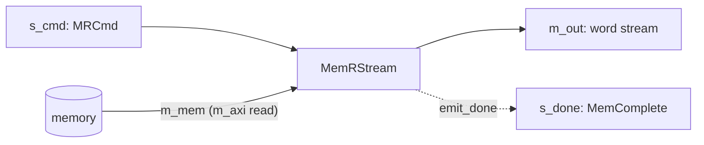
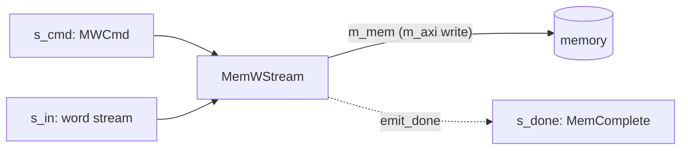

# Streaming Memory Kernels

`MemRStream` and `MemWStream` (`waveflow/hw/mem_stream.py`) give memory a **command-based,
transactional interface**. Rather than a kernel reaching into an `m_axi` port directly, it sends a read
or write **command on a stream** and the component runs the burst: `MemRStream` turns a read command
into a word stream *out* of memory, `MemWStream` writes an incoming word stream *into* memory.

## Why a streaming interface to memory

A lone kernel could just own its `m_axi` port — the command stream earns its keep once the memory is
shared by **more than one unit**. When several producers and consumers need the same memory, a
transactional stream of commands is a simple substrate for **arbitration**: an arbiter multiplexes
commands from many requesters onto one memory port, and — because every command carries an opaque
[transfer message](#the-transfer-message) that comes back on completion — each requester matches a
completion to the request it issued without the arbiter tracking any per-requester state. Commands in,
completions out, correlation by tag: that is most of what a memory crossbar needs.

## MemRStream

Reads a run of words from memory and emits them on a stream.



**The command.** One `MRCmd` per burst — where to start, how many words, plus the transfer message:

```python
# From waveflow/hw/mem_stream.py
class MRCmd(ParamSchema):
    elements = {
        "addr":     {"schema": Word32, "description": "element/word offset within the bound buffer"},
        "len":      {"schema": Word32, "description": "number of packed words to read"},
        "xfer_len": {"schema": Word32, "description": "active length of xfer_msg"},
        "xfer_msg": {"schema": DataArray.specialize(element_type=Word32, max_shape=(max_xfer_len,)),
                     "description": "opaque correlation cookie, echoed on completion"},
    }
```

**Addressing — element coordinates, not bytes.** `addr` and `len` are **word/element** coordinates
relative to a buffer base set once with `bind_base()` (mirroring the `offset=slave` AXI register). Every
command afterward is base-relative and unit-agnostic, and because `m_mem` is already a word pointer in
the generated C++, no byte↔word conversion happens in the kernel — unlike a byte-addressed `m_axi` port
(see the [Vitis page](./vitis.md)).

**Example.**

```python
ld = MemRStream(name="ld", sim=sim, mem_dwidth=64, emit_done=True)
ld.bind_base(0x4000)                                 # physical base of this reader's buffer
# read 128 words from word offset 16, tagged with a job id:
cmd = ld.Cmd(addr=16, len=128, xfer_len=1, xfer_msg=np.array([job_id], np.uint32))
# an upstream component writes `cmd` to ld.s_cmd; ld bursts 128 words out ld.m_out, then
# (emit_done) echoes a MemComplete carrying that xfer_msg on ld.s_done.
```

## MemWStream

The mirror: drains a word stream and writes it to memory.



**The command.** An `MWCmd`, the same shape as `MRCmd` (`addr`, `len`, `xfer_len`, `xfer_msg`). `addr`
is where the first word lands; `len` words are drained off `s_in` and written contiguously.

**Addressing.** Identical element-coordinate convention and `bind_base()` — the write burst is
base-relative, no byte↔word conversion in the body.

**Example.**

```python
st = MemWStream(name="st", sim=sim, mem_dwidth=64, emit_done=True)
st.bind_base(0x8000)
cmd = st.Cmd(addr=16, len=128, xfer_len=1, xfer_msg=np.array([job_id], np.uint32))
# an upstream component writes `cmd` to st.s_cmd and streams 128 words to st.s_in; st writes
# them from word offset 16, then echoes a MemComplete on st.s_done.
```

## The transfer message

`xfer_msg` is an opaque, fixed-capacity array (`max_xfer_len` words, default 8) carried *with* a command
and — when `emit_done=True` — echoed back **unmodified** on a `MemComplete` after the burst:

```python
# From waveflow/hw/mem_stream.py
class MemComplete(ParamSchema):
    elements = {
        "len":      {"schema": Word32, "description": "number of words transferred"},
        "xfer_len": {"schema": Word32, "description": "valid length of the echoed xfer_msg"},
        "xfer_msg": {"schema": DataArray.specialize(element_type=Word32, max_shape=(max_xfer_len,)),
                     "description": "the command's xfer_msg, echoed back unmodified"},
    }
```

The component **never interprets it** — it only carries it through. That is the role: the *requester*
decides what the tag means (a job index, a demux route, a source id) and reads it back off the
completion to correlate. It is what makes many in-flight jobs — and the multi-unit arbitration above —
tractable without the memory stage holding any per-job state.

> **Composing these into a kernel** (a memcpy: `MemRStream` → `MemWStream`) is a separate topic — see
> the [MemCopy example](../../examples/memcpy/), which drives the two with a sequencer and uses a
> richer *in-band framed* command protocol so a store command can never separate from the data it
> describes.
