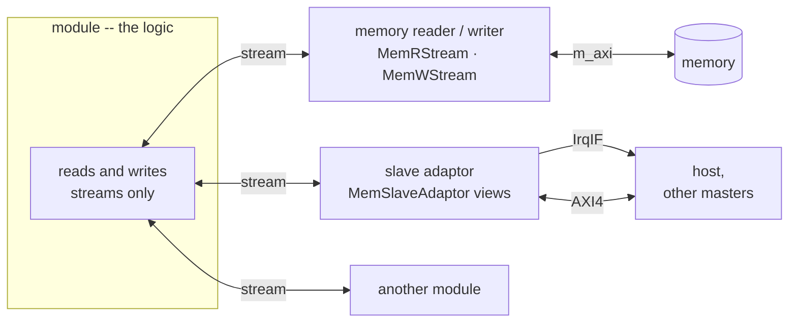

# Stream-only modules and adaptors

The patterns in this section are the *shapes* a design takes. Under every free-running one sits the
same rule about how its modules are built:

> **A module's own logic reads and writes only streams. Anything that is not a stream reaches it
> through an adaptor.**

A module that needs to read memory does not own an `m_axi` port in its body; it sends a read command
on a stream to a reader and gets the words back on another. A module a host must reach does not expose
registers; a slave adaptor turns the host's bus writes into messages on a stream the module reads. The
module is the *logic*; the adaptors are the *transport*.

## The adaptors

| what the module needs | the adaptor | where it lives | why there |
|---|---|---|---|
| to read or write memory -- it *masters* the bus | [`MemRStream` / `MemWStream`](../interface/axi_mm/master.md): a command on a stream in, a burst on `m_axi` out | a kernel module, inside the Vitis kernel | Vitis HLS generates `m_axi` |
| to *be reached* by a host or another master | a [`MemSlaveAdaptor`](../interface/axi_mm/slave.md) of views -- queue in, queue out, register bank, BRAM window | an RTL module, beside the kernel | Vitis HLS cannot generate an AXI4-full slave |
| to tell a host something is ready | an [`IrqIF`](../interface/axi_mm/slave.md#interrupts), driven by a queue view's threshold -- the adaptor raises it, not the module | a wire out of the adaptor | the host waits on it instead of polling |

At RTL, a system of modules and their adaptors is simulated as a whole -- kernels, adaptors, AMD's
crossbar and a host -- from the same pysim object: see [XSI system simulation](../build/xsi_system.md).

Where an adaptor lives is decided by what Vitis HLS can generate
([AXI-MM: what decides the realization](../interface/axi_mm/index.md#what-decides-the-realization-what-vitis-hls-can-generate)),
not by the module: from the inside, a reader and a slave adaptor look the same -- a stream.

## Why: one event model

Every event a module takes part in is a **stream message**. A message arrives once, in order, and the
module can either wait for it (a blocking read) or check for it and move on (`read_nb` / `empty()`).
That one mechanism covers both things a module does with events:

- **It responds to data.** The module's body is "read the next message, act on it" -- a
  [straight-line loop per message](../vectorization/hls/loop_optimization.md), the same shape whatever
  the message came from.
- **It decides which event comes first.** With several input streams, the order the body checks them
  *is* the priority -- explicit, in the code, and the same in Python and in HLS. The RF repeat player
  ([`rf_circ_play_task.h`](../../../waveflow/build/rf_circ_play_task.h)) checks for a replacement
  waveform first, without blocking, and only then drains a bounded number of transmit responses: a new
  waveform pre-empts the schedule, and a missing one never stalls it.

Take the rule away and the module faces a register that changed, a FIFO that filled and a memory that
was written -- three kinds of event with **no defined order between them**. The
[slave adaptor's ordering guarantee](../interface/axi_mm/slave.md#ordering) exists
precisely to turn bus accesses back into messages that have one.

Two consequences of everything being a stream:

- **Deadlock is a stream property you can reason about.** Back-pressure, request/response loops and
  pacing are all questions about streams, with one set of answers
  ([a blocking read on a request/response pair deadlocks](../rf/rfshotbuf/tx_internal.md#finding-a-two-stream-requestresponse-with-a-blocking-read-deadlocks);
  [credit when blocking would stall something shared](../interface/derived/credit_stream.md)).
- **The cut falls on streams.** A boundary between pysim and RTL, or between the kernel and an XSI
  BFM, is a stream, which is what both [simulations](../flows/concurrent_layers.md) model best.

## Why: logic decoupled from transport

An adaptor owns everything about *how* data moves and *who else* wants the same resource: the bus
protocol, bursts, address decode, arbitration of a shared port, interrupt thresholds. The module owns
none of it, so:

- **The module is reusable across transports.** The same body takes its commands from another
  module's stream, from a host's queue over AXI, or from a testbench. Changing how commands arrive --
  an internal stream versus a command queue in memory -- is changing an adaptor, not the module.
- **Contention is solved once.** Several modules sharing one memory port is an arbiter over command
  streams ([master side: why a streaming interface](../interface/axi_mm/master.md#why-a-streaming-interface-to-memory)),
  written and timed once, not re-solved in every module that touches memory.
- **Hand-written RTL stays at the edge.** The Verilog a design needs sits in the adaptors and memories
  of the RTL top; the modules stay HLS tasks inside the Vitis kernel.

## The precise rule: synchronization, not storage

The rule is about **events**, so its precise form is the one the slave adaptor page states:

> **Every synchronization a module sees is a stream message.**

Storage a module *computes against* is not synchronization. A [`BramIF`](../interface/primitive/bram.md)
port is read and written by address, and a module's own [`HwState`](../memory/hwstate.md) is plain
arrays -- neither carries an event. What tells a module that the storage is *ready* still does: in
[bram_access](../../examples/bram_access/index.md) the two tasks share one memory, but which task touches
it, and when, arrives as command messages on streams.

## Where the rule does not apply

- **The [sequential flow](../flows/sequential.md).** A host-activated kernel synchronizes through
  `ap_start` / `ap_done`, takes its arguments in an `s_axilite` register map and may own `m_axi` ports
  directly. It runs one call at a time, so there is no ordering between concurrent events to define.
- **Streams with a reverse channel are still streams.** A
  [credit stream](../interface/derived/credit_stream.md) or an
  [acked stream](../interface/derived/acked_stream.md) adds a channel the other way; both directions are
  stream messages.
