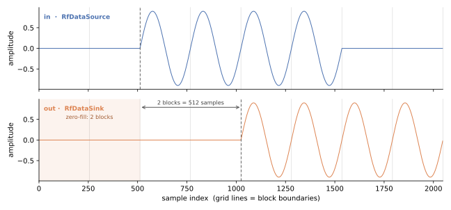

# Quickstart

A converter is best understood through an example. The simplest is the
[RF loopback](../../../examples/rf_loopback/) — a source feeds an ADC, the samples cross into the
fabric, trivial logic relays them, and a DAC turns them back into samples at a sink. The
[full walkthrough](../../../examples/rf_loopback/python.md) has every line; this page outlines the
construction so you know what you are looking at, and points out the parts that are RF-specific.

Nothing here is RTL. This is the Python model, which is where every RF design starts.

## The shape


**One `Rfdc`, used in both directions, and it belongs to neither box.** That is the point of the
picture: the converter is the boundary. On its left, blocks of **real-valued samples**; on its right,
**packed integer words**. The representation changes exactly there, once in each direction, which is
what makes a loopback a real test of it.

## What each piece is for

| piece | what it does |
|---|---|
| `Rfdc` | quantizes and packs on the way in, unpacks and dequantizes on the way out |
| `RfDataSource` / `RfDataSink` | the RF environment — file-backed, so the same bundle drives Python *and* the later RTL run |
| your logic | anything with an AXI-Stream in and out; the loopback uses a pass-through so the golden is exact |
| two `Clock`s | the sample rate and the fabric clock are genuinely different domains, so they are two objects |

The parameters that matter first are `nbits` and `samp_per_word` — together they fix the AXIS word
width your logic is built against — and `blksize`, the fidelity/speed knob: one simulation event
carries one `(n_ch, blksize)` block, so larger runs faster and resolves less.
[Instantiating the converter](../converter.md) has the full list and which kind each is.

## Only one interface is RF-specific

This is the reassurance worth having early: **`RFSampIF` is the only new thing.**

- **`RFSampIF`** — the RF-domain edge. A block-rate sample channel that exists *only in simulation*;
  it has no RTL counterpart, because the converter's RF side is analogue pins. It owns the sample
  clock, the block cadence, and the loss counters.
- **`StreamIF`** — the fabric edge. An **ordinary** Waveflow AXI-Stream, wired exactly as any other.

So your DSP block connects to a converter the same way it connects to anything else. There is no
parallel world to learn; there is one extra interface on the far side of the `Rfdc`.

You never tell the `Rfdc` its sample rate, incidentally — it *reads* it off the `RFSampIF`'s clock at
bind. Each quantity is declared once, where it physically belongs, and read by whoever needs it.

## Running it, and what you should see

```python
sim.run_sim()
```

Drive it with a windowed sinusoid and the structure becomes visible:



Three things to read off it:

1. **The output is the input, delayed.** Not approximately — the samples are bit-identical to the
   quantized input.
2. **The delay is exactly one block.** A loop through the RF grids costs at least one block *index*,
   structurally: the ADC only delivers block *k* at the instant the DAC period for it comes due, so no
   fabric speed closes it. Your logic declares that cost as `blk_latency`.
3. **The first block is flat.** That is the zero-fill the DAC emits before any samples have reached it
   — the startup transient, and what a real converter does before its buffer is primed.

## The three numbers to check before believing it

A run that finishes tells you almost nothing here.

```python
adc_if.assert_clean()                                  # nothing lost on the way in
dac_if.assert_clean(startup_blocks=dut.blk_latency)    # exactly the declared transient, and no more
assert np.array_equal(captured[k + L], to_real(from_real(sent[k])))
```

**Why the counters and not just the data.** Backpressure protects you against over-production and
**nothing** protects you against under-production — a converter that ran dry emits well-formed zeros,
and a check on the surviving samples still passes. The counters are the only evidence that nothing
went missing.

`assert_clean` checks the count *and* the position, so a steady-state fault cannot hide inside a
transient's budget, and a module that over-declares its latency fails too.

## What you have, and what you do not

You have a converter model that is **bit-exact**: quantization runs through the integer-backed
`FixedField` and packing through generated serializers, so changing `nbits` changes the answer the way
the hardware will.

You do not yet have any statement about **timing inside a block**. The Python model moves one block
per event, so it cannot see a stall shorter than a block period — and that is exactly where a design
that stalls the converter loses samples.
[What this can and cannot tell you](../fidelity.md) is the page to read before trusting a clean run,
and it is why the XSI section exists.

## Next

- [Instantiating the converter](../converter.md) — the full parameter list, and which are baked in
- [The sampling model](../sampling.md) — `blksize`, the metronome, and the sample grid
- [What this can and cannot tell you](../fidelity.md) — before you trust a clean run

Three pages this restructure still adds: connecting the RF side, connecting the fabric side, and the
design rules. See `plans/rf_guide_restructure.md`.

**Source of truth:** `examples/rf_loopback/`, `tests/examples/test_rf_loopback.py`.
