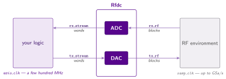

# RF converters

Waveflow's RF converter is a basic model for a DAC and ADC converter interfacing to logic via an
AXI stream.  The model follows
[AMD's RF Data Converter IP](https://www.amd.com/en/products/adaptive-socs-and-fpgas/intellectual-property/rf-data-converter.html).
The AMD RFDC provides configurable features for up- and down-converting IQ data, valuable in
communications.  Waveflow does not model that configuration capability today; over time, we will
emulate it.

## Interfaces

In Waveflow, the python class for the converter is `Rfdc` and represents  **one module carrying both directions**, with a different kind of port on each side:

| side | endpoints | carries | clock |
|---|---|---|---|
| **RF** | `rx_rf`, `tx_rf` — `RFSampIF` | **blocks** of samples | `samp_clk`, up to GSa/s |
| **fabric** | `rx_stream`, `tx_stream` — `StreamIF` | **words** on AXI-Stream | `axis_clk`, a few hundred MHz |

Two facts fall out of that picture, and they set the order of everything below.

**The two sides run at rates an order of magnitude apart.** A converter samples far faster than the
logic behind it, so it cannot hand over one sample per fabric cycle. The AXI-Stream carries several
samples **packed into each beat** — which means that before you can instantiate an `Rfdc` at all,
you have to say how many, and how they are arranged. That is what the first page is for.

**Only the stream endpoints cross the [cut](../../flows/modules.md#the-cut).** The RF endpoints have no
RTL counterpart — they are the boundary whose far side we refuse to model at RTL. That asymmetry is
why the two sides read so differently in the pages that follow.

## Outline

The order is **do → understand → limits**, which is not the order any of it was discovered in:

| | page | what it is for |
|---|---|---|
| 1 | [Quickstart](./quickstart.md) | wire one up and run it — the shortest path to samples flowing |
| 2 | [The sample word](./word.md) | why converters pack at all, and which sample lands where |
| 3 | [Instantiating the converter](./converter.md) | the parameter split, the four ports, what it refuses |
| 4 | [Connecting the RF side](./rf_side.md) | `RFSampIF`, sources and sinks, `t0` |
| 5 | [Connecting the fabric side](./axis_side.md) | the AXI-Stream wiring, and the rate check |
| 6 | [Block sampling](./sampling.md) | the model you have been using: the block, the metronome, the grid |
| 7 | [The design rules](./rules.md) | seven things that make a design wrong if you break them |
| 8 | [The fidelity boundary](./fidelity.md) | what this modelling can and cannot tell you |

Three placement decisions worth their reasons.

**The sample word comes before the converter.** `Rfdc`'s first argument *is* a word type, so the
page that explains one has to precede the page that passes one. The alternative — introduce the
argument, then send the reader forward four times to find out what it means — is what this section
used to do.

**The sampling model comes *after* the wiring pages.** A reader adding a first converter does not
need block-LT theory to get output on a sink; they need to know `blksize` is a knob, which the
quickstart says in a line. The capture buffer genuinely does need the sample grid — its four command
cases are all in sample indices — so the model sits between them.

**`rules.md` is late but you may read it early.** It is assembled from the five pages before it, so
it reads best once you have seen where each rule came from. If you are already building, read it
first anyway: 1–4 make a design correct and 5–7 make it checkable, and a rule broken at design time
costs more than one read out of order.
