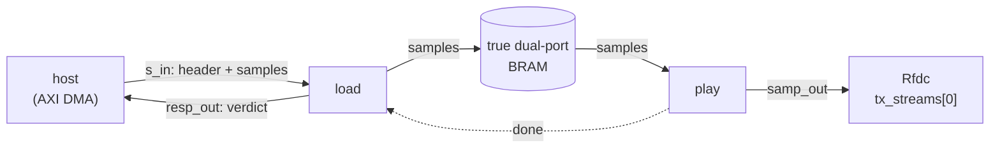
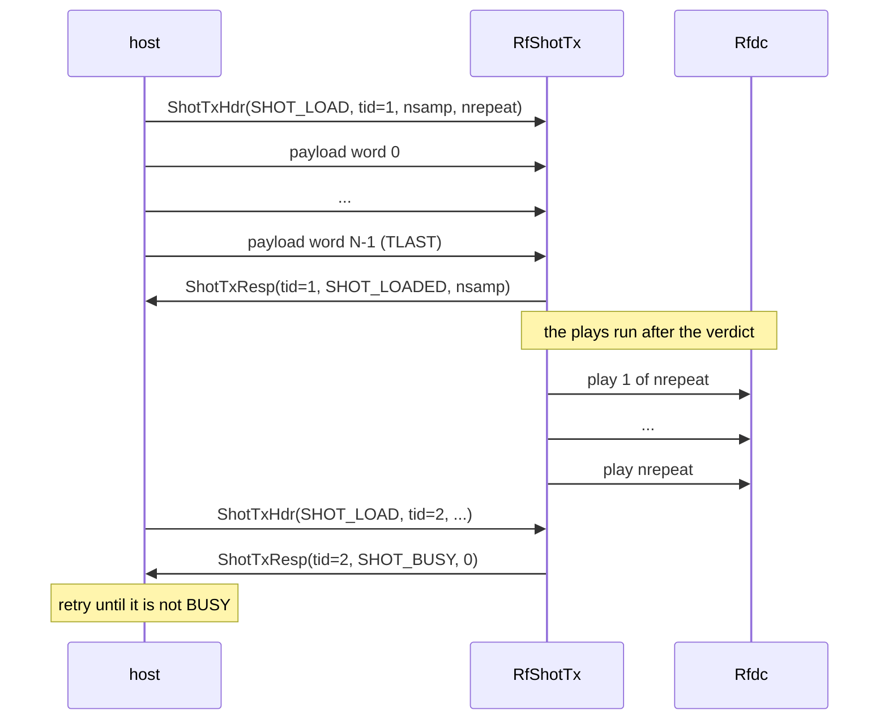

# Transmitting a shot

`RfShotTx` is the **transmit half** of the finite sample buffer. You hand it a waveform once, it
stores the waveform in on-chip memory, and it plays that waveform at the converter a fixed number of
times. When the plays are finished you may load another.

Reach for it when the waveform is **finite and known ahead of time** — a pulse, a training sequence,
a Zadoff-Chu sounding burst, a test tone. If you need to transmit indefinitely from a source that
keeps producing, this is the wrong class; see [choosing a sample buffer](../choosing.md).

This page is what you need to *use* it. The internals — the five tasks, the internal channels, the
bit layouts — are on [how the transmitter works](./tx_internal.md), and you do not need to read
that page to drive this design.

## Architecture



Everything inside the dashed box of your block diagram is one kernel. The memory is a **true
dual-port BRAM** sitting beside the kernel, and the two halves never touch it at the same time: the
loader writes it, then the player reads it. That non-overlap is the whole reason this design is
simpler than a streaming buffer — there is nothing to arbitrate, so all of the memory is payload.

The one reverse arrow is `done`, and it is not arbitration. It answers a single question — *may I
overwrite the memory yet* — which only exists because the writer and the reader are never live
together.

## Instantiating an `RfShotTx`

Build it from the **converter's word type**, never from a width. The word type is the packing
convention — how many samples ride in a beat, how wide each one is, and how it sits inside its slot —
and three of the parameters are read straight off it, so they cannot disagree with the converter you
are feeding.

```python
from waveflow.hw.rfdc_samp_word import Rfsoc4x2SampWord
from waveflow.hw.rf_shot_tx import RfShotTx

word = Rfsoc4x2SampWord.specialize(samp_per_word=4)

dut = RfShotTx.for_word(
    word,                 # bitwidth, samp_per_word and shift all come from here
    depth=1024,           # words the memory holds
    nword=256,            # words in one shot
    sim=sim,
    clk=axis_clk,
)
```

| parameter | default | set by | meaning |
|---|---|---|---|
| `bitwidth` | 64 | **the word type** | stream and memory word width, in bits |
| `samp_per_word` | 4 | **the word type** | samples carried in one word |
| `shift` | 2 | **the word type** | bits the sample sits above the bottom of its converter slot |
| `depth` | 1024 | you | memory depth in **words**; must be a power of two (the address wrap is a mask) |
| `nword` | 256 | you | words in one shot; must be ≤ `depth` |
| `clk` | 250 MHz | you | the fabric clock |
| `blk_words` | 1 | you | **modelling only** — words per pysim output burst; reaches no hardware |
| `dac_word_rate` | `None` | you | **modelling only** — words/second the pysim converter consumes |

`blk_words` and `dac_word_rate` exist because pysim's quantum at the converter edge is a *block*
while the RTL writes one word per beat. They are not `HwParam`s and change nothing about the
generated design; see [how the transmitter works](./tx_internal.md).

A shot longer than the memory is refused at construction, with the reason: *a shot longer than the
memory is not a shot, it is a stream.*

{: .note }
**`nsamp` is 16 bits, and that is a fixed constant rather than a derived one.** A shot of
`nword × samp_per_word` samples must fit it, and construction checks that it does — a verdict field
that wrapped would report a short load as a correct one. At the default geometry the ceiling is
65,535 samples, so a 16,384-word shot is the largest that fits. Deriving the width from `depth`
instead of checking against it is an open improvement, not something you can configure today.

## Interface

`RfShotTx` presents **three** ports at its boundary.

| port | direction | protocol | carries |
|---|---|---|---|
| `s_in` | slave (in) | AXI4-Stream, `bitwidth`, **with `TLAST`** | one header word, then the payload words |
| `resp_out` | master (out) | AXI4-Stream, `bitwidth`, **with `TLAST`** | one verdict word per header |
| `samp_out` | master (out) | AXI4-Stream, `bitwidth`, no `TLAST` | converter words, straight to `Rfdc.tx_streams[0]` |

All three are the same width, and it is the **converter's** word width — `bitwidth` is derived from
the word type, not chosen here. 64 bits on the RFSoC 4x2.

`s_in` and `resp_out` carry `TLAST` because a host reads them through a DMA, and an AXI DMA S2MM
channel needs a packet boundary to know a transfer has finished. `samp_out` does not, because the
converter has no packet concept — a sample stream to an RFDC never ends.

In Vivado this is **one IP and one AXI DMA**: MM2S drives `s_in`, S2MM drains `resp_out`, and
`samp_out` connects to the converter.

### The header you send

One word, ahead of the samples, on the same stream.

| field | width | meaning |
|---|---|---|
| `opcode` | 8 | `SHOT_LOAD` (0) or `SHOT_END` (1) |
| `tid` | 16 | transaction id, echoed back on the response |
| `nsamp` | 16 | samples you are about to send (0 for `SHOT_END`) |
| `nrepeat` | 16 | times to play the shot once loaded (must be ≥ 1) |

There is **no length-of-shot field**, and that is deliberate. How long a shot is, is build-time
structure fixed once on the design (`nword`). `nsamp` is what the *host believes* it is sending, and
catching that belief disagreeing with what arrived is exactly what the verdict is for.

`SHOT_END` is a fence. It takes no payload and changes nothing; its response tells you every command
ahead of it has been processed. Use it when you need to know a run is quiet — a testbench that ends
by timing out instead cannot tell a finished run from a deadlocked one.

### The verdict you get back

One word per header, exactly one, in order.

| field | width | meaning |
|---|---|---|
| `tid` | 16 | the header's transaction id |
| `status` | 16 | one of the five below |
| `nsamp_loaded` | 16 | samples **actually** written to the buffer |

`nsamp_loaded` is what landed, not what was asked for. On a good load the two agree; when they
differ, the difference *is* the diagnosis — and it is a number your DMA cannot produce, because
`sendchannel.transfer()` knows it pushed bytes, not whether they were a whole waveform.

| status | value | meaning | what to fix |
|---|---|---|---|
| `SHOT_LOADED` | 0 | the shot is in memory and playable | — |
| `SHOT_SHORT` | 1 | `TLAST` arrived before the shot was full | you sent fewer words than you declared |
| `SHOT_WRONG_LEN` | 2 | `nsamp` disagrees with the shot this build holds | your `nsamp` does not match `nword × samp_per_word` |
| `SHOT_BUSY` | 3 | a shot was still playing when the header arrived | **retry** — the only transient status |
| `SHOT_ZERO_LEN` | 4 | `nsamp == 0` on a `SHOT_LOAD` | a zero-length load can never resolve |

`SHOT_SHORT` is the one verdict that cannot be decided from the header. The other four are faults in
what you *asked for*; this one is what the stream turned out to be. It is the status this response
exists for: a short transfer completes cleanly at the DMA, so without it your host sees success while
the buffer holds a block of the right shape carrying half a signal.

## Protocol

The normal sequence, for a shot of `nsamp` samples played `nrepeat` times:



### The verdict answers the load, not the play

**`ShotTxResp` is sent as soon as the payload has landed** — before the first sample reaches the
converter, and long before the last one does. It tells you whether the *transfer* was good. It does
**not** tell you the playout has finished.

That distinction is the one thing most likely to surprise you, because it changes how you sequence a
second shot.

Five rules, and each one has bitten somebody.

**Assert `TLAST` on the last payload word.** That is how the design knows the waveform ended. Without
it a short transfer is not a verdict, it is a stall.

**A refused header still consumes its payload.** If you declare `nsamp` and get `SHOT_WRONG_LEN`,
send the payload anyway — the design drains it whatever the verdict. Words left on the wire become
the *next* header, and every command after that is garbage for reasons that look nothing like the
cause.

**`SHOT_LOADED` is not permission to load again.** The shot is still playing when that verdict
arrives. A second `SHOT_LOAD` sent immediately behind it is refused with `SHOT_BUSY`.

**`SHOT_BUSY` is the only transient status — retry it.** The other four refusals are faults in your
command and will fail identically forever; this one clears by itself when the playout ends. There is
no completion notification today, so **retrying is how a host learns the plays are done**. A
consequence worth stating plainly: **two successful loads cannot ride in one back-to-back stream.**
At most one is accepted, because a file-driven driver pushes both frames before the first play has
finished. That is what `SHOT_BUSY` *is*, not a limitation of any particular testbench.

**`nsamp` must match the build exactly.** It is checked, not truncated, because a truncated waveform
is data of the wrong duration and plays as a quieter, shorter signal.

## What it will not do

**It cannot play past the buffer.** A shot longer than the memory is not a shot, it is a stream. The
transport is not what stops you here — refilling while a consumer drains means a live reader and a
live writer at once, which is the concurrency problem the streaming buffer exists for. See
[choosing a sample buffer](../choosing.md).

**It cannot fetch.** The waveform arrives on the stream, so there is no resident library of waveforms
in DDR that you switch between by command with no host transfer. If pulse-to-pulse agility matters,
that is the capability you would be giving up.

**It has no schedule.** There is no grid, no deadline, no slot and no lateness verdict. Once a play
has started the converter back-pressures, the design stalls, and the memory holds — a BRAM read can
always supply a word per cycle, so the only reachable underruns are the ones *before* the first word
arrives. Those show up as the startup transient, and you should expect and measure it rather than
tolerate it.

## Rate

At the gated geometry — four samples per 64-bit word, 250 MHz fabric — the inner loops run at one
word per cycle, which is **1.0 GSa/s** through the play path.

The *sustained* rate is slightly lower, and the reason is worth knowing: between plays the reader
task re-fires, and a task boundary costs three cycles. For a shot of `nword` words the sustained
ceiling is therefore `nword / (nword + 3)` of the peak — about 955 MSa/s for a 64-word shot, and
closer to peak the longer the shot. A converter asking for exactly one word per cycle would underrun
at every play boundary however fast the loops are.

{: .note }
The shipped example runs its converter at 256 MSa/s, which is **25.6% occupancy** — a rate chosen so
the design's fabric load matches another example's, not a ceiling. No measurement in the repo yet
exercises the player at full rate.

## See also

- [`examples/rf_shot_play`](../../../examples/rf_shot_play/) — the worked example: pysim, RTL, and the
  measured numbers.
- [How the transmitter works](./tx_internal.md) — the internals, for developers.
- [Choosing a sample buffer](../choosing.md) — finite versus continuous, decided by concurrency.
- [Rfdc](../rfdc/) — the converter this feeds, and the word format it expects.
