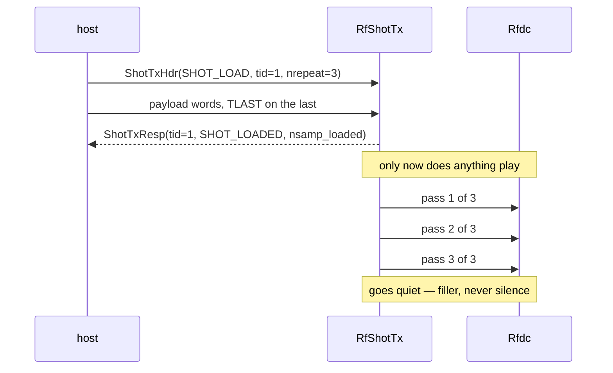
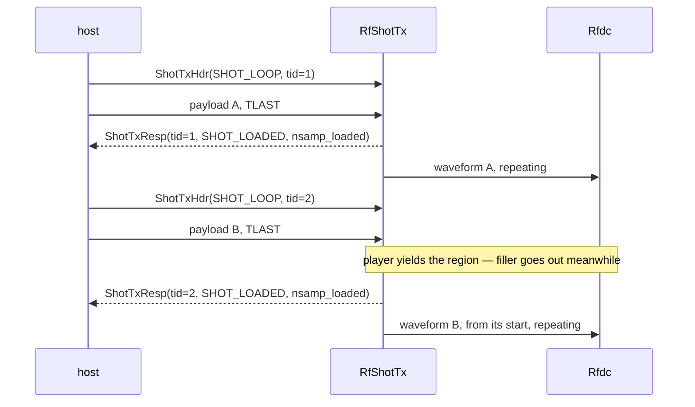
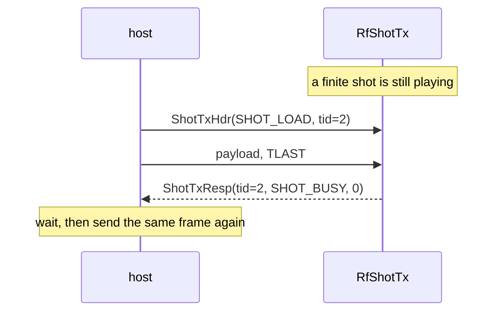

# Transmit — `RfShotTx`

`RfShotTx` is the **transmit half** of the finite sample buffer. You hand it a waveform once; it
holds it in a BRAM and plays it at the converter's own rate — a counted number of passes, or forever
until you replace it. Every command you send is answered by exactly one verdict.

It is the design to use when the waveform is decided before it is played: a repeating test signal, a
channel-sounding sequence, a pulse train. If you need to change the samples *while they are going
out*, without a gap, this is the wrong buffer — see
[choosing a sample buffer](../choosing.md).


Three tasks and one memory between them. The host sends a header and, behind it on the **same
stream**, the samples; one verdict comes back per header. `ShotTxLoader` writes the shot into the
memory, and `ShotTxPlayer` reads it out at whatever rate the converter takes it.

The two tasks never touch the memory at the same time — how they hand it over is
[internal](./tx_internal.md), and nothing you send depends on it.

## Instantiating one

A typical `RfShotTx` module is instantiated as follows:

```python
from waveflow.hw.rf_shot_tx import RfShotTx
from waveflow.hw.rfdc import Rfdc
from waveflow.hw.rfdc_samp_word import Rfsoc4x2SampWord

word = Rfsoc4x2SampWord.specialize(samp_per_word=4)
rfdc = Rfdc(name="rfdc", sim=sim, n_rx=0, n_tx=1, word=word)

dut = RfShotTx.for_word(
    word,
    depth=64,           # words in the memory, which IS the length of a shot -> 64 * 4 = 256 samples
    blk_words=16,       # words per chunk: the poll period, and the pysim block quantum
    sim=sim, name="dut", clk=axis_clk,
)
```

The parameters are:

| | unit | meaning |
|---|---|---|
| `word` | *(a type)* | the converter's [sample word class](../rfdc/word.md) — a subclass of `RfdcSampWord`, such as the `Rfsoc4x2SampWord` above. It fixes the packing, so the buffer cannot disagree with the `Rfdc` about it |
| `depth` | **words** | How big the memory is, **and therefore how long a shot is**. A power of two |
| `blk_words` | **words** | words the player moves per step; must divide `depth` |
| `absolute_index` | 0 or 1 | **0 (the default)** — a shot starts at the buffer's beginning the instant it is accepted, so the read pointer means *how far into this waveform*. **1** — the read pointer free-runs, so it means *how many words since reset*, and a playout is deferred to the next buffer boundary. See [Options](./tx_options.md#absolute-indexing--absolute_index) for what that buys and the one pass of latency it costs |

Notes:

1.  **Use the `for_word` method and not a constructor**:  a build-time `HwParam` is wrapped in `HwParamValue(int(value))`, so a **type** cannot survive as one. The packing is therefore taken from the `word` argument to a classmethod instead.  Specifically, the `for_word` method will extract the following parameters from the `word` class:


| derived from `word` | what it fixes |
|---|---|
| `bitwidth` | the AXI-Stream width of all three ports, and the memory's |
| `samp_per_word` | how many samples ride in one beat |
| `shift` | how far a sample sits above the bottom of its converter slot |

2.  **Buffer size**:  Each **shot** will be the entire buffer `= depth x samp_per_word` samples.

## Interfaces

`RfShotTx` presents **three** AXI-Stream ports. The memory is inside the design: the composite
instantiates its own BRAM and the two `buf_w` / `buf_r` wires only exist between the kernel and that
memory, joined by a generated wrapper. Nothing outside sees them.

| port | direction | carries |
|---|---|---|
| `s_in` | in | the header and, behind it, the payload — one frame, `TLAST` on the last word |
| `resp_out` | out | one `ShotTxResp` per header |
| `samp_out` | out | samples, slot-packed, straight into `Rfdc.tx_streams[0]` |

**The payload rides in-band on `s_in`.** There is no separate data port and no `m_axi` master: in
Vivado this is one AXI DMA, MM2S carrying header and samples, S2MM carrying the verdict. `TLAST` is a
real pin and it is load-bearing — without it a short transfer would *hang* rather than answer, because
a payload word and a header word are the same 64 bits.

## The messages

### `ShotTxHdr` — what you send

One 64-bit word, ahead of the samples on the same stream.

| field | bits | meaning |
|---|---|---|
| `opcode` | 2 | `SHOT_LOAD`, `SHOT_LOOP` or `SHOT_END` |
| `tid` | 16 | transaction id, echoed on the response |
| `nrepeat` | 16 | times to play the shot once loaded |

**There is no length field.** The shot is the buffer, so its length is `depth` and you do not restate
it. The remaining 30 bits are declared `_rsvd`, so the message is still exactly one 64-bit word — the
size a DMA moves — at every geometry.

### `ShotTxResp` — what comes back

One 64-bit word, one per header, in order.

| field | bits | meaning |
|---|---|---|
| `tid` | 16 | the header's transaction id |
| `status` | 8 | one of the four verdicts below |
| `nsamp_loaded` | 16 † | samples **actually** written to the buffer |

† **`nsamp_loaded` is sized from your geometry**, not fixed at 16. 16 bits is the floor and what this
configuration gets; a design whose `depth × samp_per_word` needs more gets more, and the message
stays one 64-bit word either way — the slack is a declared `_rsvd` field. See
[the on-wire layouts](./tx_internal.md#on-wire-layouts).

**`nsamp_loaded` is the only length on the wire, in either direction**, and it is the one worth
having: it is what *landed*, not what was asked for. On `SHOT_LOADED` it is a full buffer; on
`SHOT_SHORT` it *is* the diagnosis — and it is a number a DMA cannot give you, because
`sendchannel.transfer()` knows it pushed bytes, not whether they were a whole waveform. That
asymmetry is why it stayed when the header's length went: the header's could only ever be right or
refused, and this one tells you something you have no other way to learn.

## The protocol

Every exchange is the same three moves: **a header, its payload, one verdict.** What differs is what
happens to the playout while that is going on.

### The verdict answers the load, not the playout

This is the one thing most likely to surprise you. `ShotTxResp` goes out as soon as the payload has
landed and the memory has been handed back — **before the first sample reaches the converter**, and
long before the last one does. It tells you whether the *transfer* was good. It does not tell you the
waveform has finished playing.



There is no "playout finished" message. A host that needs to know a finite shot is done discovers it
by being accepted again: while it is still playing, every load is answered `SHOT_BUSY`.

### Replacing a waveform that is playing forever

A `SHOT_LOOP` never ends on its own, so a new load is the only thing that can end it. The player
yields the memory, the loader writes into it, and the player picks the new waveform up **from its
beginning**.



**The gap is real and it is filler, not silence.** The converter is fed a defined value throughout
the handover — see [the rules that bite](#the-rules-that-bite).

### The refusal you are expected to hit

`SHOT_BUSY` is not an error. It is the design protecting a finite shot from being truncated
mid-flight, and it is **the only verdict a retry repairs** — the other four are faults in the command
and will fail identically forever.



**Send the payload even when you expect a refusal.** The design drains it whatever the verdict, and a
frame left half-consumed makes its leftover words the *next* header — after which every command is
garbage for reasons that look nothing like the cause.

## Two play modes, and what a load does to each

The two opcodes differ in exactly one thing: **when the design stops.**

| | `SHOT_LOAD` | `SHOT_LOOP` |
|---|---|---|
| plays | `nrepeat` passes, then goes quiet | forever |
| `nrepeat` | how many passes | not read |
| a load arriving mid-play | **refused**, `SHOT_BUSY` | **accepted** — it preempts |

That asymmetry is deliberate and it is the design's central decision.

**Preempting a finite shot would silently truncate it.** The host said *play this three times*; a
design that stopped after two produces a perfectly good, shorter signal that every counter downstream
still adds up for. So while a finite shot is in flight, every load — of either opcode — is answered
`SHOT_BUSY` and the memory is not touched.

**Preempting an infinite shot is the only way to ever end it.** A design that answered `SHOT_BUSY`
there would refuse every load forever after the first loop. So a `SHOT_LOOP` in progress yields: the
loader takes the memory, writes the new waveform, hands it back, and the player starts the new one
**from its beginning**.

`SHOT_END` is neither. It is a **fence**: it takes no payload, changes nothing, and answers. There is
no loop to break in a free-running design, so what `END` is worth is what its *response* proves —
responses come back strictly in order, so a verdict for an `END` says everything ahead of it has been
processed. It is a quiescence probe, and it is how a testbench tells a finished run from a
deadlocked one.

## The verdicts

| status | meaning | transient? |
|---|---|---|
| `SHOT_LOADED` | the shot is in the memory and playable | — |
| `SHOT_SHORT` | `TLAST` arrived before the buffer was full | no |
| `SHOT_BAD_OPCODE` | the opcode is not one of the three | no |
| `SHOT_BUSY` | a **finite** shot is still playing | **yes — retry works** |

**Four, and it was five.** `SHOT_ZERO_LEN` (`nsamp == 0`) and the length half of `SHOT_WRONG_LEN`
(`nsamp` disagreeing with the buffer) both read a header field that no longer exists. The verdict
itself survives as `SHOT_BAD_OPCODE` — **the wire value is unchanged**, so a host decoding a status
byte needs no change; only the name moved, onto the fault it actually reports. Folding it into
`SHOT_SHORT` instead would have made a malformed command look like a truncated one, which is exactly
the confusion `SHOT_SHORT` exists to prevent.

**Malformed is decided before transient**, and for a reason: a command that is both wrong *and* badly
timed should be told the thing it can fix. A retry repairs a `SHOT_BUSY`; nothing repairs an opcode
this design does not know.

**A short shot is loaded and then never played.** It reaches the memory — you can see how much
arrived in `nsamp_loaded` — but the player is told to play zero passes, so half a waveform never
reaches the converter. `SHOT_SHORT` is the status this response exists for: a short DMA transfer
completes *cleanly*, so from the host side a half-loaded buffer is otherwise indistinguishable from a
full one.

## The rules that bite

**1. The output is never silent, and never stalls.** Between shots, during a handover, and after a
finite play-set ends, the player writes a **filler value** (zero) rather than stopping. That is not a
detail: a converter comes due on a fixed grid, and a design that stopped writing would back-pressure
it. Quiet is a *value*, not an absence. The RTL gate asserts the converter's grid never had to
zero-fill a block itself, on both play paths.

**2. A handover costs a gap.** `RfShotTx` holds **one** region and hands it back and forth, so while
the loader owns the memory the player has nothing to play and emits filler. Replacing a looping
waveform therefore produces *old waveform, gap, new waveform* — not a seamless splice. If you need
gapless, you need the streaming family or a two-region TX, and the latter is not built.

**3. A new waveform starts at its beginning.** The read pointer resets on every resume. Splicing the
tail of the old waveform's phase onto the new one would be wrong in every application and invisible
from a word count.

**4. `TLAST` is the only short-transfer detector.** Nothing on the wire declares how long a transfer
is meant to be, so a frame that ends early is caught by where `TLAST` falls and reported by
`nsamp_loaded`. Drive the stream so `TLAST` lands on the last payload word — a DMA does this for you
— and read `nsamp_loaded` on every response rather than only the status.

## Driving it from a host

[The protocol](#the-protocol) is the same whether the command stream is a file-driven bundle in
simulation or an AXI DMA on hardware. What changes is only the transport:

| | simulation | hardware |
|---|---|---|
| `s_in` | a bundle of frames on disk | AXI DMA **MM2S** |
| `resp_out` | a bundle the sink writes back | AXI DMA **S2MM** |
| `samp_out` | the `Rfdc` model's DAC process | the RFDC IP |

One DMA carries both directions, which is why the payload rides in-band on `s_in` rather than
arriving through a second port or an `m_axi` master.

**A driver that pushes every frame back to back without reading verdicts** will see `SHOT_BUSY` for
everything queued behind a finite shot — the frames are consumed and refused, not held. That is the
design working, not a limitation of the testbench, and it is why a scenario that wants two accepted
finite loads needs the verdicts read between them.

## Next

- [Receive — `RfShotRx`](./rx.md) — the other half of the family.
- [Internals](./tx_internal.md) — the tasks, the lock protocol, the on-wire layouts, and the findings.
  You do not need it to use this design.
- [Choosing a sample buffer](../choosing.md) — whether this is the right family at all.
- The worked example: `examples/rf_shot_tx/`, with its pysim golden and its RTL gate.
