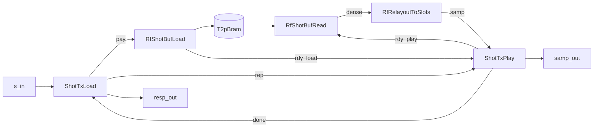

# How the transmitter works

{: .warning }
**You do not need this page to use `RfShotTx`.** Everything required to drive the design from a host
is on [transmitting a shot](./tx.md). This page is for someone changing the design, porting it, or
reasoning about why it is shaped the way it is.

## Where the code is

| what | file |
|---|---|
| the components, schemas and composite wiring | [`waveflow/hw/rf_shot_tx.py`](../../../../waveflow/hw/rf_shot_tx.py) |
| the loader's C++ body | [`waveflow/build/shot_tx_load_task.h`](../../../../waveflow/build/shot_tx_load_task.h) |
| the player's C++ body | [`waveflow/build/shot_tx_play_task.h`](../../../../waveflow/build/shot_tx_play_task.h) |
| the Stage A buffer, unmodified | [`waveflow/hw/rf_shot_buf.py`](../../../../waveflow/hw/rf_shot_buf.py) |
| the relayout stage, unmodified | [`waveflow/hw/rf_relayout.py`](../../../../waveflow/hw/rf_relayout.py) |
| the worked example and its gates | [`examples/rf_shot_play/`](../../../../examples/rf_shot_play/) |

The two `_task.h` files are **hand-written** and shipped by `RfShotBufStep`; the top that
instantiates them is generated. The Python classes and the C++ bodies are *twins* — they are
independently written to the same contract, and the gates exist to catch them diverging. When you
change one, the question is always what the other now says.

Line numbers below are current at the time of writing; the surrounding comment blocks in those files
carry more reasoning than is repeated here.

## The five tasks

`RfShotTx` is a composite of five free-running `hls::task` bodies and one memory beside them. The
user-facing diagram collapses these into "load" and "play"; here they are in full.



| task | what it owns |
|---|---|
| `ShotTxLoad` | the command layer: read a header, decide, forward or drain the payload, answer |
| `RfShotBufLoad` | **Stage A, unmodified** — a counted write of `nword` words into the memory |
| `RfShotBufRead` | **Stage A, unmodified** — a counted read of `nword` words per token |
| `RfRelayoutToSlots` | dense logic-side words → justified converter slots |
| `ShotTxPlay` | the repeat loop, the pysim rate grid, and the `done` token |

**The Stage A pair is instantiated, not nested.** `RfShotBuf` owns its `rdy` channel as an *internal*
edge, so a composite that used it whole could not put anything on that wire — and the repeat is
exactly a thing on that wire. Nothing in `rf_shot_buf.py` or `rf_relayout.py` changes, so the numbers
their gates recorded still describe the same RTL.

**Why the relayout is before the player.** The buffer holds *dense* words — the logic-side format a
host can write without knowing anything about justification. The converter wants slots. At RTL the
order is immaterial (both stages are II=1 pass-throughs), so the choice is made on the modelling
side: the last stage on the chain is the one the converter back-pressures, and therefore the one
pysim has to pace. Putting the player last lets `blk_words` shape that handover without touching
Stage A.

## Internal channels

Every depth is a statement, not a default.

| channel | from → to | depth | why |
|---|---|---|---|
| `pay` | `ShotTxLoad` → `RfShotBufLoad` | 2 | HLS default for a top argument; one beat of producer/consumer overlap is all an II=1 chain needs |
| `rep` | `ShotTxLoad` → `ShotTxPlay` | 1 | one repeat count per accepted shot, by construction |
| `rdy_load` | `RfShotBufLoad` → `ShotTxPlay` | 1 | one token in flight; a deeper queue could only hold a token for a shot already overwritten |
| `rdy_play` | `ShotTxPlay` → `RfShotBufRead` | 1 | same |
| `dense` | `RfShotBufRead` → `RfRelayoutToSlots` | 2 | word channel |
| `samp` | `RfRelayoutToSlots` → `ShotTxPlay` | 2 | word channel |
| `done` | `ShotTxPlay` → `ShotTxLoad` | 1 | `done` cannot accumulate — a second load is refused until it arrives |

All seven are wired in one loop, and the depth is the fourth column of the tuple —
[`rf_shot_tx.py:676-691`](../../../../waveflow/hw/rf_shot_tx.py). The `add_comp` order just above it
is the emit order and deliberately the data-flow order, with the player **last** because it is the
stage the converter back-pressures.

The memory is wired through `add_rtl_if`, never `add_if`. The walks that derive channels and boundary
ports read the `add_if` registry, and a `BramIF` in it would make the kernel's memory ports disappear
into a FIFO that does not exist.

The instance is named `mem`, not `buf`: the attribute name becomes the Verilog instance name, and
`buf` is a primitive gate name. The wrapper emitter refuses it by name rather than letting `xvlog`
fail on a syntax error that mentions no Python.

## On-wire layouts

The layouts are **not written by hand anywhere**. `ShotTxHdr`
([`rf_shot_tx.py:155-178`](../../../../waveflow/hw/rf_shot_tx.py)) and `ShotTxResp`
([`:181-199`](../../../../waveflow/hw/rf_shot_tx.py)) are `DataList` schemas, and the packing below is
what `DataSchemaStep` generates from them into
[`rf_shot_tx_hdr.h`](../../../../examples/rf_shot_play/include/rf_shot_tx_hdr.h) and
[`rf_shot_tx_resp.h`](../../../../examples/rf_shot_play/include/rf_shot_tx_resp.h). A body that
restated the field order would be a second source free to disagree — which is why both task bodies
say `h.read_axi4_stream<W>(s_in, tl)` and never touch a bit range.

Both messages are a single 64-bit word at the gated geometry.

**`ShotTxHdr`**

| bits | field |
|---|---|
| 7:0 | `opcode` |
| 23:8 | `tid` |
| 39:24 | `nsamp` |
| 55:40 | `nrepeat` |
| 63:56 | unused |

**`ShotTxResp`**

| bits | field |
|---|---|
| 15:0 | `tid` |
| 31:16 | `status` |
| 47:32 | `nsamp_loaded` |
| 63:48 | unused |

The 16-bit index width is checked at construction: a shot of `nword × samp_per_word` samples must fit
`nsamp`, because a verdict that wrapped would report a short load as a correct one.

## The loader body

`shot_tx_load_task.h`. Order matters, and it is the order in the source.

**1. The header is read first, and that is a safety property.**

```c
static ap_uint<1> busy = 0;
#pragma HLS reset variable=busy

ShotTxHdr h;
streamutils::tlast_status tl;
h.read_axi4_stream<W>(s_in, tl);      // BLOCKING, and FIRST
```
[`shot_tx_load_task.h:96-101`](../../../../waveflow/build/shot_tx_load_task.h)
{: .fs-2 }

An `hls::task` that **writes before it reads** advances during reset. This body's first act is a
blocking read, which is what makes the `static busy` safe to carry across firings.

**2. `busy` is harvested non-blocking, after the header.**

```c
ap_uint<W> tok;
if (done_in.read_nb(tok)) {
    busy = 0;
}
```
[`shot_tx_load_task.h:105-108`](../../../../waveflow/build/shot_tx_load_task.h)
{: .fs-2 }

Non-blocking is the whole point: a play still running is **the answer** (`SHOT_BUSY`), not a reason to
wait. Harvesting it *after* the header read means `busy` is as fresh as it can be when it is read.

**3. The decision comes from the header alone, before a payload word is taken.**

```c
if (h.nsamp == 0)                            status = SHOT_ZERO_LEN;
else if (h.nsamp != (ap_uint<16>)(NW * SPW)) status = SHOT_WRONG_LEN;
else if (busy)                               status = SHOT_BUSY;
else                                         accept = true;
```
[`shot_tx_load_task.h:128-137`](../../../../waveflow/build/shot_tx_load_task.h)
{: .fs-2 }

**4. One counted pass does all three jobs — forward, drain, pad.**

```c
bool ended = (tl == streamutils::tlast_status::tlast_at_end);
int took = 0;
take_shot:
for (int i = 0; i < NW; i++) {
#pragma HLS PIPELINE II=1
    ap_uint<W> x = 0;
    if (!ended) {
        streamutils::axi4s_word<W> fw = s_in.read();
        x = fw.data;
        took = i + 1;
        if (fw.last) ended = true;
    }
    if (accept) {
        pay_out.write(x);               // past the frame's end this is the pad
    }
}
```
[`shot_tx_load_task.h:152-168`](../../../../waveflow/build/shot_tx_load_task.h)
{: .fs-2 }

The trip count is `NW` — **constant**, so there is no data-dependent trip count for Vitis to refuse to
flatten. `ended` is a data-dependent *condition inside the body*, which is a different thing and was
measured at II=1. Only the `pay_out` write is conditional; the read side runs on every path, which is
the drain.

A separate unbounded `drain_tail:` loop ([`:171-176`](../../../../waveflow/build/shot_tx_load_task.h))
handles a frame *longer* than the shot. It is deliberately unpipelined — it runs only on a malformed
frame and sits outside every pipelined region.

**5. The verdict and the repeat count travel together.**

```c
if (accept && took < NW) status = SHOT_SHORT;
if (accept) {
    rep_out.write((status == SHOT_LOADED) ? (ap_uint<W>)h.nrepeat : (ap_uint<W>)0);
    busy = 1;
}
r.status = status;
r.nsamp_loaded = accept ? (ap_uint<16>)(took * SPW) : (ap_uint<16>)0;
r.write_axi4_stream<W>(resp_out);
```
[`shot_tx_load_task.h:178-189`](../../../../waveflow/build/shot_tx_load_task.h)
{: .fs-2 }

`SHOT_SHORT` is the only verdict that cannot be reached from the header — it is what the stream turned
out to be, and `took` is the count that came with it.

Note the last line: **the response is written here**, at the end of the load, with no wait on
`done_in`. The verdict answers the load, not the playout.

### A short shot is padded, then not played

`RfShotBufLoad`'s inner loop is counted — `nword` words, no early exit — which is exactly why it
reaches II=1 where the streaming buffer cannot, and it is not the command layer's to change. So a
short frame is **completed with zeros**: the buffer fills, emits its one token, and the design stays
live.

The zeros never reach the converter, because a short shot is handed a repeat count of **zero**. The
token still has to be consumed — nothing else will take it — but half a waveform must not be
transmitted. That is why the verdict and the repeat count travel together on separate channels.

## The player body

`shot_tx_play_task.h`. One firing is one play-set, and the whole body is short enough to read at
once:

```c
ap_uint<W> nrep = rep_in.read();
(void)rdy_in.read();                    // blocks until the loader has filled a whole shot
play_set:
for (ap_uint<W> k = 0; k < nrep; k = k + 1) {
    rdy_out.write((ap_uint<W>)1);       // arm one play; the reader takes exactly one per shot
play_one:
    for (int i = 0; i < NW; i++) {
#pragma HLS PIPELINE II=1
        samp_out.write(samp_in.read());
    }
}
done_out.write((ap_uint<W>)1);
```
[`shot_tx_play_task.h:58-78`](../../../../waveflow/build/shot_tx_play_task.h)
{: .fs-2 }

`nrep == 0` is a real answer, not an error: it is what the loader sends for a shot it refused to call
playable, and the `rdy_in` token still has to be consumed because nothing else will take it.

**Both loops are labelled, and the outer one matters as much as the inner** — see the findings below.

**No `static`, anywhere.** A play-set lives entirely inside one firing, so there is no state to carry
across firings and nothing for the reset trap to catch. The body's first act is a blocking read,
twice over.

**Nothing here is a schedule.** No grid arithmetic, no deadline, no slot. The converter
back-pressures, the relayout back-pressures, this task stalls, the memory holds. Compare
`rf_tx_stream`, which needs an absolute slot grid, an ack channel and a lateness verdict because
*its* source can genuinely fall behind.

### Why the player emits `done`, and not the buffer

The `rdy` channel is depth 1, so the write of token *k+1* returns when the reader **starts** play
*k*, not when it finishes. A loader that answered "done" there would clear busy while the last play
was still coming out of the memory, and the next load would overwrite it mid-play.

Sitting on the sample path is what makes completion **exact**: `done` is written after the last word
of the last play has been handed on, and there is nothing left to be early about.

### Two fields that are not hardware

`blk_words` and `dac_word_rate` are plain fields, deliberately not `HwParam`s — they reach no
template argument, and the RTL body writes one word per beat and knows nothing about either.

Both exist because pysim's quantum on the converter edge is a *block*. `Rfdc`'s DAC process consumes
a whole `blksize`-sample burst per event and refuses a partial one, so the twin must hand it exactly
that. And pysim has no back-pressure for a burst write, so the rate has to be handed over as a
metronome instead.

The metronome is charged **per block on an absolute grid**, never as a relative timeout. A relative
wait restarts from wherever `now` happens to be when the body finishes, so everything the body
yielded for is added to the period and never given back — the defect that made an earlier player slip
a whole block every fourth firing.

Note the ordering inside the loop: hand the block off **first**, then charge. Charging before the
write would make every block arrive one period late, so the player and the converter would serialize
rather than overlap.

## Findings worth not rediscovering

**The `TLAST` pin had to be built, and it is a subclass.** `s_in` is a `FramedStreamIFSlave` and
`resp_out` a `FramedStreamIFMaster`. Before this design, every free-running composite in the repo
lowered its boundary streams to `hls::stream<ap_uint<W>>`, which has no `TLAST` wire at all — nine
designs declared `has_tlast=True` in Python against kernels with no such pin. `has_tlast` is about
**pysim**; `boundary_tlast` is about **RTL**. They are two facts and must stay two.

It is a `ClassVar` on a subclass rather than a field because an endpoint's attribute set feeds
`structure_signature`: a per-instance flag moved every calibration key in the repo, and
`tests/calib/test_key_stability.py` caught it.

**It must be `ap_axis`, not a `{data, last}` struct.** `streamutils::framed_word` compiles fine at a
boundary and Vitis packs it into one wide `TDATA` with **no pin at all**. `axi4s_word` (an `ap_axis`)
is what emits `<port>_TLAST`. The reverse is true internally — Vitis rejects `ap_axis` on an internal
FIFO (HLS 214-208), which is why `framed_word` exists.

**Label every pipelined loop.** Vitis names an unlabelled loop `VITIS_LOOP_<line>_1` and nests that
name into its children, so a *comment edit* above a loop renames the module — and an II gate that
looks the II up by name then misses and **skips**, which reads as a pass. That happened once here.

**`SHOT_BUSY` makes two successful loads in one stream impossible.** A file-driven driver pushes
frames back to back, so at most one can be accepted. That is what `SHOT_BUSY` is, not a testbench
limitation, which is why the short-transfer case gets its own scenario and its own main against the
same generated harness.

**The `justify` shift must be non-zero to test anything.** `shift=0` makes the relayout stage the
identity, and a build that leaves it there is measuring a pair of wires. The 4x2 preset is the only
configuration in the repo where it is non-zero.

## Measured

Geometry: four 14-in-16 samples in a 64-bit beat; a 64-word (256-sample) shot in a 256-word memory;
three plays; 250 MHz fabric.

| | four-verdict run | short-transfer run |
|---|---|---|
| last verdict at cycle | 292 | 76 |
| words the DAC took | 192 = 3 × 64 | 0 |
| block periods played / zero-filled | 14 / 2 | 14 / 14 |

Achieved `PipelineII` is **1** on all six pipelined loops — both loader loops, the player's, and all
three Stage A / relayout bodies. The startup transient is **2 blocks**, measured independently by
pysim and by XSI, and pinned rather than tolerated: a change in it is a finding needing an
explanation.

`RfTxStream`'s player also reaches II=1, while additionally keeping an absolute slot grid, harvesting
an ack channel and returning a lateness verdict. The shot player reaches it with none of those. **The
simplification cost no throughput.**

{: .note }
**No transfer-time number is published.** Neither RFSoC DDR is calibrated, so how long a host takes to
push a shot is uncalibrated. Do not quote one.

## See also

- [Transmitting a shot](./tx.md) — the user-facing contract.
- [`examples/rf_shot_play`](../../../examples/rf_shot_play/) — the worked example and its gates.
- [The fidelity boundary](../rfdc/fidelity.md) — why pysim's converter edge is block-granular.
