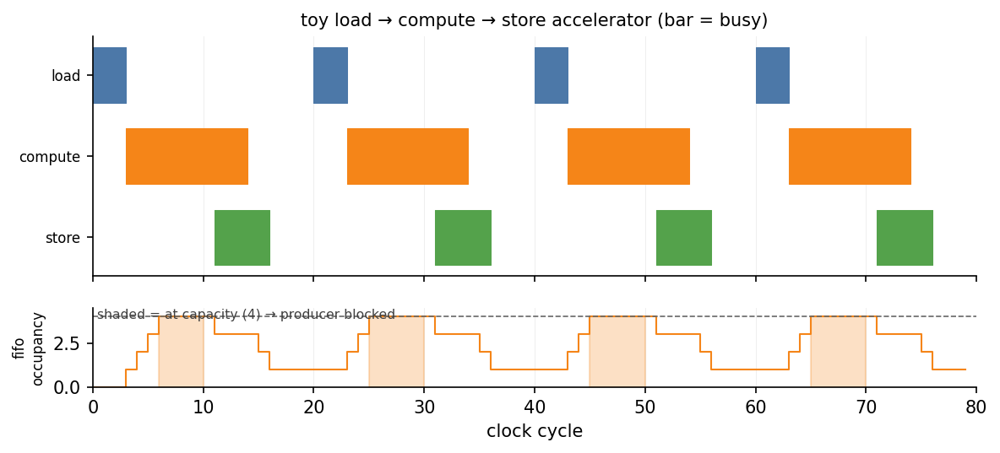

# Activity Diagrams

A [timing diagram](./timing.md) is a *waveform*: one row per signal, a value-labelled box per
transition. That view is exactly right at a ~10–50 cycle zoom, and useless at a thousand — the boxes
shrink below a pixel and their values are unreadable. When the question is not *what value did this
signal hold* but *when was this stage busy, and how do stages overlap*, you want an **activity
diagram** instead.

`ActivityDiagram` (in `waveflow.utils.timing`, a sibling of `TimingDiagram`) draws labelled
horizontal lanes on a common cycle axis, but fills each lane with **activity** rather than values:

- **bands** (`mode="band"`) — contiguous active cycles collapsed into a single bar, the whole-run
  view; or
- **beats** (`mode="beat"`) — one hairline per active cycle, the zoomed per-firing view.

Optionally it draws an **occupancy sub-panel** beneath the lanes: a FIFO's level against its
capacity, shaded wherever the level sits *at* capacity — i.e. wherever the producer was blocked.

A lane is just a `(label, event_cycles, colour)` triple, where `event_cycles` is the (sorted) list
of cycles at which the lane was active. You can build that list by hand (below) or, for a real run,
from a trace with `ActivityDiagram.from_trace(bt, spec)` — see the
[memcpy timing](../../examples/memcpy/timing.md) example.

## Example

A toy `load → compute → store` accelerator runs four jobs on a 20-cycle cadence. `compute` produces
into a small FIFO faster than `store` drains it, so the FIFO fills and pins at capacity — the
backpressure we want to *see*.

```python
import numpy as np
from waveflow.utils.timing import ActivityDiagram

# One colour per pipeline STAGE (see "Choosing colours" below).
C_LOAD, C_COMPUTE, C_STORE = "#4C78A8", "#F58518", "#54A24B"

jobs, period, n_cycles = 4, 20, 80

def busy(offset, width):
    """Cycles [offset, offset+width) within every job."""
    return np.concatenate(
        [np.arange(j * period + offset, j * period + offset + width) for j in range(jobs)])

# A lane is (label, active-cycles, colour).
lanes = [
    ("load",    busy(0, 4),   C_LOAD),     # short read burst at the top of each job
    ("compute", busy(3, 12),  C_COMPUTE),  # the long pole
    ("store",   busy(11, 6),  C_STORE),    # write burst near the end
]

# A depth-4 FIFO between compute and store: compute pushes each cycle it runs, store pops each
# cycle it runs, clamped at capacity.
cap = 4
level = np.zeros(n_cycles, dtype=int)
lvl, push, pop = 0, set(busy(3, 12).tolist()), set(busy(11, 6).tolist())
for t in range(n_cycles):
    if t in push and lvl < cap:
        lvl += 1
    if t in pop and lvl > 0:
        lvl -= 1
    level[t] = lvl

ad = ActivityDiagram(lanes, time_unit="cycle")
ad.set_occupancy(level, cap, colour=C_COMPUTE, ylabel="fifo\noccupancy")
fig, ax, ax2 = ad.plot(
    mode="band", trange=(0, n_cycles), fig_width=9, fig_height=3.6,
    title="toy load → compute → store accelerator (bar = busy)")
```

Running this produces:



The three stages overlap — `compute` of one job runs while `store` of the previous one is still
draining — and the shaded bands in the lower panel are exactly the cycles the FIFO was full and
`compute` was blocked. For a zoomed, per-beat version of a single job, pass `mode="beat"` with a
narrow `trange`; the lanes then show one hairline per active cycle instead of a band.

## Choosing colours

A lane's colour is any [Matplotlib colour spec](https://matplotlib.org/stable/users/explain/colors/colors.html):
a named colour (`"tab:blue"`, `"green"`), a hex string (`"#4C78A8"`), or an RGB(A) tuple. Two rules
of thumb make these figures readable:

1. **One colour per *stage*, reused across every lane of that stage.** In the memcpy example the
   command lanes, the read port, the copy FIFO, the write port and the done signal each get one
   colour, so a reader learns the mapping once and carries it across every figure. Colour encodes
   *which subsystem*, not *which lane*.
2. **Use a qualitative (categorical) palette** — distinct in hue, similar in lightness — rather than
   hand-picking primaries. The five hues used above and in memcpy are the Vega / Tableau-10 set:

   ```python
   C1, C2, C3, C4, C5 = "#4C78A8", "#E45756", "#F58518", "#54A24B", "#B279A2"
   ```

   Matplotlib ships the same idea as the default property cycle and as named colour sequences:

   ```python
   import matplotlib.pyplot as plt
   palette = plt.rcParams["axes.prop_cycle"].by_key()["color"]  # the default 'tab10' cycle
   # or, explicitly:
   palette = plt.color_sequences["tab10"]
   colour_for = {stage: palette[i] for i, stage in enumerate(stages)}
   ```

The occupancy panel's `colour` is conventionally the *producing* stage's colour (here `compute`), so
the panel visually belongs to the lane that fills the FIFO.

## Regenerating the figure

The PNG above is produced by the canonical example script. Run it from the repository root:

```bash
python examples/timing/basic_activity_diagram.py
```

It accepts an optional `--output` argument to write the figure to a different directory.

## Full runnable example

See
[`examples/timing/basic_activity_diagram.py`](https://github.com/sdrangan/waveflow/blob/main/examples/timing/basic_activity_diagram.py)
for the complete, annotated source. For building the lanes from a real traced run rather than by
hand, see [memcpy timing](../../examples/memcpy/timing.md), which uses `ActivityDiagram.from_trace`.
