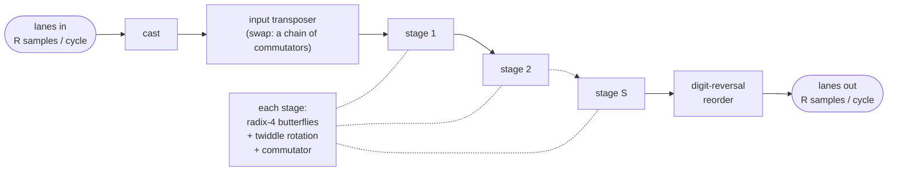

# The Vitis FFT

`VitisFft` (`waveflow.vitis_l1.hw`) wraps AMD's **SSR FFT** from the Vitis DSP Library
(`xf::dsp::fft::fft<>`): a fixed-point, forward, natural-order FFT of length `L` that takes `R`
complex samples per clock cycle.

- **`L`** is the transform length, fixed at build time (`ssr_fft_param_struct::N`); there is no
  runtime length. It must be a power of `R` (16, 64, 256, 1024, 4096, ...).
- **`R`** is the **super-sample rate**: the number of parallel lanes in and out. In this library it
  is also the butterfly radix -- the two are tied -- and the module supports `R = 4`.

Sample `n` of a frame travels on lane `n % R` at word `n // R`, so a frame enters in `L/R` cycles.

## Inside the core



With `S = log4 L` stages:

- **The input transposer** (`swap`, `InputTransposeChainStreaming`). A radix-4 butterfly needs
  samples that are a quarter-frame apart -- `x[m]`, `x[m + L/4]`, `x[m + 2L/4]`, `x[m + 3L/4]` -- but
  they arrive on the four lanes in natural order. The transposer is a chain of **commutators**:
  delay lines plus a rotating switch that move samples *between* the lanes over time, so a
  butterfly's four inputs line up in the same cycle. This is the classic element of pipelined FFTs
  (multi-path delay commutator designs).
- **The stages.** Each applies the radix-4 butterflies (multiplies by `±1, ±j` only, so exact), then
  rotates by the twiddle factors `W_L^{mq}` before the next stage -- the only lossy step -- and
  reorders through its own commutator for the next stage's butterflies.
- **The digit-reversal reorder** turns the FFT's digit-reversed output order into natural order.

### One frame at a time

Every process runs at about one word per cycle and needs only about `2.5 L/R` cycles per frame, so a
chain of them *could* overlap frames. It does not: the stages are **nested** dataflow regions
(`fftStage` holds `fftStage_1` holds `fftStage_2` ...), and a process holding a nested region is not
done until everything inside it is. One frame occupies the whole chain; the next starts when it
leaves. Measured on the RFSoC 4x2, the frame interval is 7.5 `L/R` cycles at `L = 64, 256` and 10
`L/R` from 1024 up -- a sustained 0.4-0.53 samples per cycle against a nominal 4. This is how the
library is written, not a limit of HLS: AMD's own route to more throughput is several FFTs in
parallel. Wrapping the core the way AMD's L2 kernel does (the frame loop inside one region) changes
nothing.

### Latency depends on when a frame arrives

The input transposer's commutator runs on a **free-running internal cycle** (40 cycles at
`L = 64`, about `2.5 L/R`), restarting even when no data is arriving. A frame that arrives out of
step with it waits inside the transposer for the cycle to come round; every later stage is shifted by
the same amount. So an isolated frame's latency spreads over a range set by its arrival phase -- 105
to 123 cycles of processing at `L = 64`, 1908 to 2304 at `L = 1024`. Back to back, frames stay in
step and the interval is exact. The first frame after reset is in step by construction, and is the
fastest frame there is.

## The numbers

The arithmetic is modelled bit-exactly (`waveflow.vitis_l1.fft`, one vectorized pass per stage).
Precision is lost in exactly one place: the inter-stage twiddle rotation, which truncates each
partial product into the first operand's format. Everything else grows: each stage's two adder
levels add a bit, so the output is wider than the input --

```
OUTPUT_WL = in_W + log2(L) + 1        # ap_fixed<16,2> in, L = 1024  ->  ap_fixed<27,13> out
```

`VitisFft` derives the output format by asking the model what it produced, and the C++ body
`static_assert`s the same width against the vendor's own type.

## What Waveflow adds

| | |
|---|---|
| the bits | `waveflow.vitis_l1.fft`, bit-exact against the library |
| the module | `VitisFft` -- ports, parameters, `run_iter`, `kernel_task` |
| the C++ | `waveflow/build/vitis_fft_task.h`, copied into the build, not generated |
| the timing and resources | calibrated on `waveflow/calib/platforms/rfsoc4x2_bfm_250mhz` |
| the evidence | `tests/vitis_l1/fft/`, and the XSI gates of `examples/vitis_fft` |

The pages in this section:

- [Parameters](parameters.md) -- constructing a `VitisFft`, and every parameter.
- [Interfaces](interfaces.md) -- the `R`-wide port group, the word packing, and wiring it.
- [Including it in your design](build.md) -- the build steps, and where every file goes.
- [Synthesizing a Vitis L1 block](synthesis.md) -- why the body is copied rather than generated.
- [Latency and II for a vendor block](timing.md) -- the timing model and its calibration.
