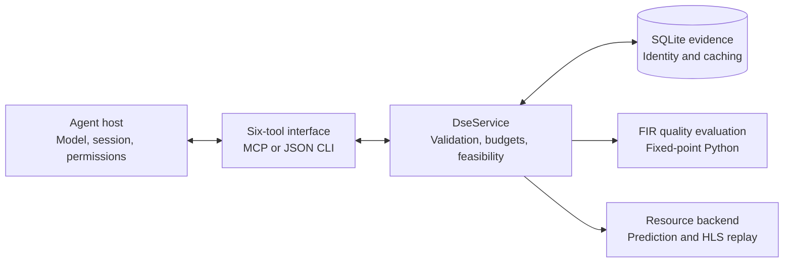
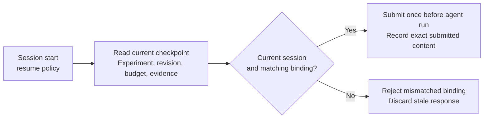

# FIR DSE architecture

The replay-first pilot from [plans/mcp_fir.md](../../plans/mcp_fir.md): expose the existing FIR design through six tools, with persistent evidence and explicit evaluation budgets.

## Domain and host boundary

Python owns domain semantics. Hosts choose how evidence enters model context; they cannot change experiment policy through tool arguments. The existing `fir_block` hardware and corpus remain unchanged.

## Modules against the plan

| Plan | Modules | Responsibility |
|---|---|---|
| M0 · Quality | `fir_quality.py`, `fir_metrics.py` | Coefficient headroom, response diagnostics, signal-domain quality and throughput |
| M1 · Evidence | `contracts.py`, `dse_store.py`, `service.py` | Frozen experiments, content-addressed observations, failure rows and budgets |
| M2 · Tools | `dse_tools.py`, `__main__.py`, `backends.py` | Six operations through MCP/CLI; resource prediction and synthesis replay |
| M3 · Agent evaluation | `run_agent.py`, `benchmark.py`, `score_trial.py` | Agent execution, reference/baselines and evidence-based recommendation scoring |
| Optional host integration | `checkpoint.py`, `pi/index.ts`, `skills/fir-dse/` | Bounded evidence context, Pi session recovery and portable procedure |

M3 has initial real-agent trials; repeated controlled comparisons remain. M4 live synthesis and RTL execution are not implemented.

## Optional Pi recovery

| Policy | Context delivery |
|---|---|
| `pull` · default | Agent requests context through the existing tool. |
| `resume` · opt-in | Pi reads current domain state at session start and supplies the checkpoint before the next agent run. |

Checkpoints travel as canonical `checkpoint_json` text to preserve numeric values and hashes across languages. Session records never override SQLite. Submission records do not prove provider receipt; the extension does not sandbox other Pi tools.

`recovery_probe.py` checks lost-response recovery through a fresh CLI process. It tests evidence and cache accounting, not model performance.

## Evidence boundary

Quality is evaluated in fixed-point Python. Synthesis evidence is replayed from the committed HLS corpus; RTL evidence is unavailable. Predictions remain distinct from replayed estimates. Model-dependent gains from recovery require separate controlled trials.

[Usage](README.md) · [Design decisions](DESIGN.md) · [Verification](VERIFICATION.md)
