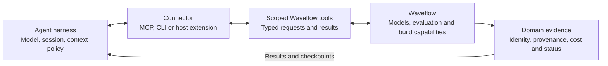
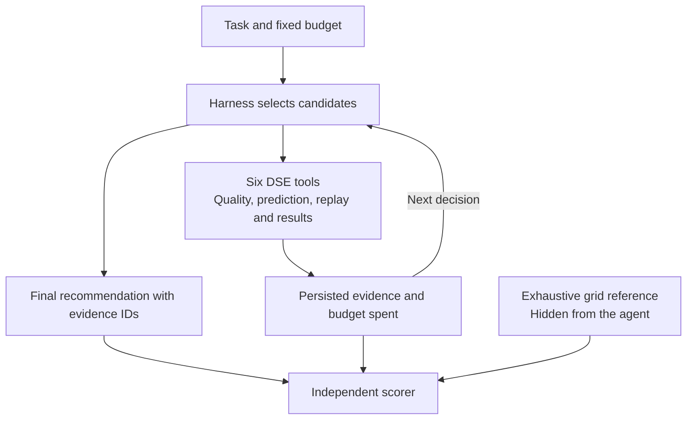
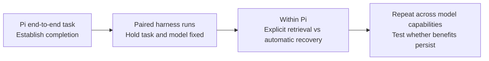

# Agent harness benchmark and connector direction

**Purpose:** test whether a harness can use Waveflow to complete a hardware-design task correctly and efficiently, then improve the interface between domain evidence and agent decisions. FIR is the first bounded task, following [M3 of the prescribed plan](../../plans/mcp_fir.md#phases).

## Harness-neutral architecture

Waveflow owns domain correctness and evidence. The harness owns reasoning and session behavior. Connectors expose capabilities without duplicating their implementation. Context delivery, recovery and tool descriptions are benchmark variables, not merely transport details.

**Pi is the intended connector for benchmarking within this repository.** It is not the exclusive connector for using Waveflow. MCP/CLI and portable skills remain available to other harnesses.

## First task: constrained FIR search

Choose taps, precision and serial/parallel execution to maximize signal-domain stopband rejection. Keep passband SNDR, throughput and resource use within declared limits.

| Setup | Definition |
|---|---|
| Search space | 24 combinations: taps `{8,16,32}`, sample width `{8,12,16,24}`, serial/parallel; fixed integer width `2`, memory width `32` |
| Constraints | Passband SNDR ≥ 20 dB; throughput ≥ 1 sample/cycle; DSP ≤ 48; LUT ≤ 53,200 |
| Evaluation budget | 64 Python evaluations, 64 predictions, 8 synthesis-replay queries, 2 RTL-query units; RTL evidence is unavailable |
| Evidence | Real fixed-point Python quality; existing resource models; committed HLS estimates, explicitly replayed |
| Scoring | Final recommendation validity, feasibility, citations, regret against the grid optimum and budget spent |
| Baselines | Full-grid reference; budget-matched random/grid-prefix search; cheap quality/resource screening |

Full grid is an oracle, not an equal-budget competitor. Report cheap evaluations and model cost separately from expensive-query allowances.

## Executed versus intended

- **Executed:** an end-to-end run used the Hermes harness with DeepSeek Flash. It selected the grid optimum: 32 taps, 16-bit, serial; 55.32 dB rejection, 32 DSP and 8,674 LUT. It completed in 22.20 seconds using 8 replay queries. [Recorded result](evidence/final_trial.json).
- **Integrated:** the [Pi extension](pi/index.ts) exposes the six tools and optional checkpoint recovery. Registration and session restoration have been exercised without model inference.
- **Next:** run the same task through Pi as the repository benchmark connector. No real-model Pi optimization result is claimed yet.

## Proposed comparison

Hold model/version, task, tool permissions, budgets and evidence access fixed; start each trial with a fresh store. For recovery, inject the same restart or lost-response event at the same evaluation boundary. Match skill guidance and initial context; change only the declared policy. Freeze repetitions and stopping rules before paid runs; retain failures in the denominator.

**Success:** a higher rate of valid, high-quality recommendations, or lower cost at matched quality, without relaxing evidence requirements. Measure optimum-found rate/regret, queries, tokens, latency and redundant calls. One passing run establishes end-to-end functionality, not harness superiority. The small public FIR grid limits claims about exploration and generalization.

## Extension across Waveflow

The direction is a shared connector and benchmark approach across Waveflow's agent-facing work, grounded in its [Python-first design substrate](../../docs/overview/aiharness.md).

| Existing foundation | Intended extension |
|---|---|
| Workspace/headless registry: component vocabulary, schema guidance, example retrieval and validation | Score authoring tasks against explicit schema/build acceptance criteria |
| FIR DSE profile: bounded evaluation, evidence and budgets | Reuse the task/evidence/scoring pattern for further designs, including [CG](../../plans/paper_cg_dse_vision.md) |
| Python simulation, resource models and deterministic build/validation flows | Expose additional capabilities through scoped tools with declared cost and provenance; add live-backend benchmarks when available |

Reuse the canonical registry and domain implementations. Extend task-specific tools rather than forcing every workflow into FIR's six operations. Keep authoring permissions separate from bounded DSE; do not expose all capabilities to every benchmark. Broader connector coverage and live hardware execution are intentions, not delivered features of this PR.

[Architecture](ARCHITECTURE.md) · [Usage](README.md) · [Verification](VERIFICATION.md)
