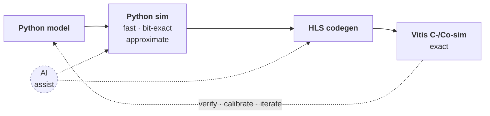
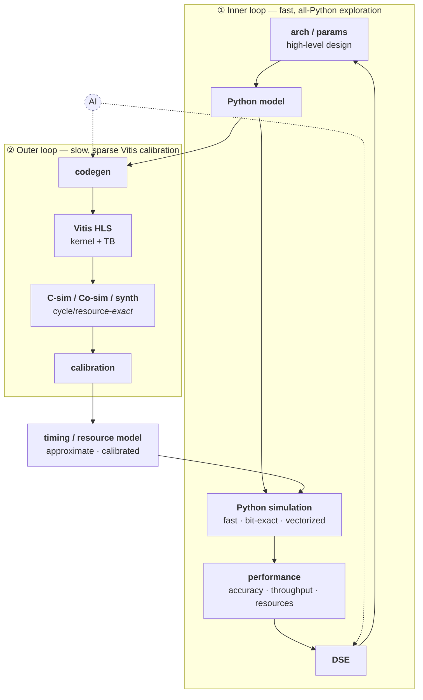

# Overview + front-page docs restructure

**Status: plan, not yet executed.** Apply when no CLI/branch effort is in flight on the
working tree (after the ComplexField PR merges). Tracked-doc edits across `docs/index.md`,
`docs/overview/`, and `_config.yml`. Pairs with `plans/basic_vec_docs.md`.

## Current direction (2026-06-11) — Ericsson-ready refinements

This refines the structure below for a **disciplined industrial reader** (Ericsson is interested, asked for
more info), and **supersedes the page map where they differ.** Current `docs/overview/` is
`index / motivation / aiharness / flow` (the `aiharness.md` reframe below is done). Next pass:

**Nav:** `index → motivation → pymodel → flow → aiharness → salsa` (salsa = the concrete capstone).

**`motivation.md` reframe — meta-principle:** rewrite every claim from *"the industry can't do X"* → *"X is
painful / manual / fragmented / timing-blind."* (respects their rigor; harder to dismiss). **Synthesized
opener:** concede the chips (Qualcomm/Intel/Ericsson) → **enormous labor** → **reconfigurability** (fixed
chains → shared programmable compute → dynamic, data-dependent timing → must *simulate*) → **AI** (needs a
substrate) — three independent reasons to care. The five problems, reframed:
1. AI doesn't scale — keep.
2. Performance exploration falls into a *gap* — fast models are bit-exact but *functional* (no timing, often
   single-block); the timing model (RTL) is too slow to sweep. *(NOT "fast gives up bit-exactness" — the one
   most likely to offend.)*
3. Fragmentation — keep; sharpen: algorithm + HW teams keep separate sims, **exchange test vectors by hand.**
4. Iteration is hard to *trace* (esp. with AI) — builds *are* reproducible; tracing a number to a design
   choice across fragmented models isn't. *(NOT "builds aren't reproducible.")*
5. Verification is rigorous but *manual + fragmented* — bit-exact checking is standard, just per-module, by
   hand, golden + HW not from one source. *(NOT "asserted, not demonstrated.")*

Parallel "approach" tweaks: *fast bit-exact sim* → "+ timing/resource, at system scale"; *verification* →
"automatic + co-located, one source"; *deterministic builds* → traceability.

**`salsa.md` (NEW — replaces `wireless.md`; drafted at `docs/overview/salsa.md`):** the **concrete**
motivating system instead of a general wireless survey. **SALSA** (Spectrally Agile Large-Scale Arrays) —
NTIA NOFO-2, NYU, 1000+ elements, FR3 (6–24 GHz), massive-MIMO + spectral agility — a **tile-based,
runtime-programmable dataflow machine** (FFT / systolic / vector / filter tiles, a message-passing fabric,
dynamic flow graphs). The reconfigurability pillar made real: static analysis fails → must simulate.
**VMAC is the first SALSA tile** (bit-exact + throughput-characterized). Sections: the system, why it's hard
(arch exploration + concurrency + unified firmware), the architecture, and *Building SALSA with Waveflow*
(tiles = `HwComponent`s, fabric = interfaces + concurrency, fast/honest DSE, firmware from one source,
end-to-end bit-exact). Source draft in `plans/salsa.md`. **Diagram TODO** (tiles around a fabric + a
runtime-selected flow graph). *(The reconfigurability principle stays one sentence in `motivation.md`; the
concrete instantiation lives here, as the capstone.)*

**`pymodel.md` (NEW):** kill "write a kernel, we transpile it to HLS" — the Python is a *specification*
(schemas + interface + `bw` params + a compute **hook**), shown via a `PolyAccel` skeleton at altitude. The
"isn't that a lot of boilerplate for a 3-line fn?" answer: (1) **you compare the tip, the cost is the
iceberg** (generate the deployable stack from one decl → less total work past a toy); (2) **the boilerplate
is the spec you were writing anyway**; (3) **what HLS alone can't give** (fast bit-exact sim, DSE,
composition, a verifiable golden); (4) **the substrate AI needs**. Honest meta: *Waveflow optimizes the
lifecycle and the system, not the one-off.* Line: *"the typed-library-vs-throwaway-script tradeoff, brought
to hardware — where the 'library' also generates its own simulation, RTL inputs, tests, and docs."*
`pymodel` = what a component *is*; `flow` = how you iterate on it.

*(Still useful below: the two Mermaid graphics; the AI-harness `keyfeatures` framing → fold into `aiharness.md`
/ the index. The motivation reframe above supersedes the older `motivation.md` bullet.)*

---

## Goals

1. Restructure `docs/overview/` into a clean **why → what → how** (delete `example.md`;
   `index.md` landing; `motivation`; `keyfeatures`; `flow`).
2. Add **two flow graphics** (Mermaid): a simple 4-block hero on the **root top page**
   (`docs/index.md`), and a detailed **two-loop methodology** figure in `flow.md`.
3. **Enable Mermaid** in `_config.yml`.
4. **Reframe AI positively** — "Waveflow is the harness that makes AI effective for
   hardware" — in `keyfeatures.md` and the index, with AI shown as the assist (codegen +
   DSE) in both graphics.

## Page map

| Page | Role | Graphic |
|---|---|---|
| `docs/index.md` (root landing) | tagline + hero + 3-sentence "what" + links | **Graphic 1** (simple 4-block) |
| `overview/index.md` | short section landing → links to the three pages | — |
| `overview/motivation.md` | **why** — fragmentation problem + single-source approach (+ users) | — |
| `overview/keyfeatures.md` *(new)* | **what** — differentiators + the AI-harness framing | — |
| `overview/flow.md` *(new)* | **how** — the Waveflow flow + DSE methodology | **Graphic 2** (two-loop) |
| ~~`overview/example.md`~~ | **DELETE** (thin poly stub; full poly at `examples/stream_inband/`) | — |

The current `overview/index.md` is a 150-line wall that overlaps `motivation.md`; its
content is **redistributed** into the three pages (below), not duplicated.

## AI positioning (the reframe — applies to prose + both graphics)

Lead with the **positive** story, not the defensive "not an LLM wrapper". AI needs the
*whole substrate* — fast simulation, structured/contract-guided codegen, reproducible
builds, and bit-exact validation — and Waveflow provides all four.

**Lead page (`docs/index.md`, under the tagline) — the one-liner:**

> *Waveflow is the substrate that makes AI effective for hardware — fast to simulate,
> structured so generation stays local and contract-guided, reproducible to build, and
> bit-exact to verify.*

**`keyfeatures.md` — the full version (the "harness for AI" feature):**

> **Waveflow is the harness that makes AI effective for hardware design.** AI agents can
> generate HLS and drive design-space exploration — but they're only as good as the
> substrate they work on, and raw HDL/HLS gives them none of what they need. Waveflow gives
> them four:
> - **Fast simulation** — vectorized, orders of magnitude faster than RTL, so an agent can
>   try many designs *inside its loop* instead of waiting on one toolchain run.
> - **Structured architecture** — typed schemas and well-defined interfaces make code
>   generation **local**: an agent fills in one component against an explicit interface
>   *contract*, not a monolithic kernel it has to get entirely right at once.
> - **Deterministic, reproducible builds** — the build graph runs the same way every time,
>   so a generated design can be rebuilt, compared, and trusted.
> - **Built-in, bit-exact validation** — every result is checkable against the real
>   toolchain, so the output is **verified**, not just plausible.
>
> Waveflow is that substrate.

So AI is a **first-class downstream consumer** (a fundable strength), grounded by the
substrate — not the central mechanism. In both graphics AI appears as a *dashed assist* at
**codegen** and **DSE**. Replace the old "What it's not" section's defensive tone with
this; keep one honest line that Waveflow itself is deterministic (the codegen pipeline is
structured `hwgen`, not an LLM) so the *substrate* is trustworthy.

## The two graphics (Mermaid — drop-in)

### Graphic 1 — `docs/index.md` hero (simple, catchy, 4-block)



### Graphic 2 — `overview/flow.md` (detailed two-loop = the CG-DSE methodology)



Key point Graphic 2 makes: the **`timing / resource model` is the bridge** — the inner
loop *consumes* it, the outer loop *calibrates* it (`CAL → TRM → SIM`). That's the
active-calibration methodology of `plans/paper_cg_dse_vision.md` in one figure; it can seed
the paper figure too.

## Content map (where the current `index.md` wall goes)

- **→ `docs/index.md` (root):** tagline (already "From waveform to silicon"), **Graphic 1**
  hero, 3-sentence "what Waveflow is" + the AI-harness one-liner, links to the guide/examples.
- **→ `overview/index.md` (landing):** 2–3 sentences + links to motivation/keyfeatures/flow.
- **→ `motivation.md`:** the fragmentation problem (index "Overview"/"core thesis"),
  "Why Python"; merge with existing `motivation.md`; fold "Intended users" here as a short
  list. Dedup.
- **→ `keyfeatures.md` (new):** tight differentiator list — single source of truth · fast
  bit-exact vectorized sim · cycle/resource-approximate calibrated models · typed
  schemas/interfaces · HLS codegen · deterministic `BuildDag` builds · **the harness for AI**
  (the reframe above).
- **→ `flow.md` (new):** Graphic 2 + the narrative below.

## `flow.md` narrative (under Graphic 2)

```markdown
# The Waveflow flow

Waveflow runs two coupled loops, joined by a calibrated timing/resource model.

## Inner loop — fast, all-Python (design-space exploration)
From a high-level design (architecture + parameters), the Python model runs a fast,
**bit-exact, vectorized** simulation that uses **approximate** (calibrated) timing/resource
models. The resulting performance — accuracy, throughput, resources — drives
design-space exploration, which adjusts the parameters and iterates. This loop is cheap
enough to sweep bit widths, queue sizes, memory organization, and iteration counts.

## Outer loop — slow, sparse (Vitis calibration)
The same Python model generates Vitis HLS (kernel + testbench). C-sim, co-sim, and
synthesis give cycle/resource-**exact** ground truth, which **calibrates** the approximate
timing/resource model the inner loop relies on — so the fast models stay trustworthy with
only a few full toolchain runs.

## Where AI fits
AI agents assist at **codegen** (generate the HLS) and **DSE** (search the design space).
Their output is grounded and verified by the bit-exact substrate — Waveflow is the harness
that makes AI useful here.
```

## Mechanics

1. **Enable Mermaid** in `_config.yml` — add under the Just-the-Docs config:
   ```yaml
   mermaid:
     version: "10.9.1"   # or current; Just-the-Docs loads it from a CDN
   ```
   Verify a ```` ```mermaid ```` block renders (locally `bundle exec jekyll serve`, or just
   trust the config + the GH Pages build).
2. `git rm docs/overview/example.md`; fix the index "Start here" list (drop `./example.md`,
   add `./keyfeatures.md` + `./flow.md`).
3. Trim `overview/index.md`; refine `motivation.md`; write `keyfeatures.md` + `flow.md`
   (with Graphic 2); add Graphic 1 + the AI-harness line to `docs/index.md`.
4. **Inbound links:** grep for links to `overview/example.md` and fix (Grep tool / `grep -a`,
   NOT `grep -I`/`git grep` — unreliable here).
5. Full-docs link check resolves (0 dangling).
6. One docs PR (can bundle with `plans/basic_vec_docs.md`).

## Notes
- Site already reflows paragraphs (`hard_wrap: false` merged).
- Mermaid now for maintainability; a polished drawio/SVG hero for `docs/index.md` Graphic 1
  is an optional later upgrade (keep AI as the dashed assist, the four blocks, one loop).
- Keep overview pages scannable — not walls.
