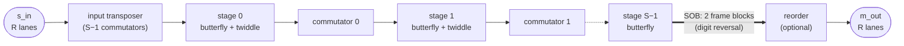

# A full-rate SSR FFT in Waveflow — the plan

**Status:** draft, 2026-10-05.  Nothing built.  F0 (the evidence) is in hand; F1 onward is open.
**Relation to [`vitis_l1_hwmodule.md`](vitis_l1_hwmodule.md):** that plan wraps AMD's SSR FFT as
`VitisFft`, a vendor block with a calibrated timing model.  This one builds our own FFT, taking what
we like from AMD's code, so that it reaches the throughput a pipelined FFT is supposed to have.
`VitisFft` stays as it is: it is the reference that this one is checked against, bit for bit.

---

## Why

A streaming SSR FFT with `R` lanes should accept a new frame every `L/R` cycles indefinitely.  That
is what the architecture is for: delay-line commutators shuffle samples *between* frames as well as
within them, so frame `k+1` enters while frame `k` is still inside.  The latency is several `L/R`;
the interval is `L/R`.  AMD's L1 guide (2020.1) states exactly that: II = 257 at `L = 1024, R = 4`.

The Vitis 2025.1 library does not get there.  Measured in cosim at `L = 1024`, RFSoC 4x2, 250 MHz,
16 frames back to back:

| construction | steady interval | × `L/R` |
|---|---|---|
| `fft<>`, the "non-streaming connection" (what `VitisFft` ships) | 2,556 | 10 |
| `innerFFT` in a DATAFLOW region, the "streaming connection" | ~1,420 | 5.5 |
| + streaming FIFOs `L/R` deep, + `ap_ctrl_chain` | ~1,420 | 5.5 |
| + commutators patched to drain into the next frame (bit-exact) | 878 | 3.4 |
| + stage loops flattened, reorder ping-ponged | **deadlocks** in RTL (0/16 frames; csim passes) | |

Each step removed a place where the library does per-frame work as a **function call** that must
return:

1. **The commutators** (`hls_ssr_fft_streaming_data_commutor.hpp:232`) run a fixed
   `L/R + 2(R−1)·PF` iterations per call -- the frame plus a fill-and-drain window.  The drain is
   paid every frame instead of overlapping the next one.  csynth: interval 640 = 2.5 `L/R`.
2. **The stage kernels** (`fftStageKernelS2S`, `hls_ssr_fft.hpp:149`) nest a sub-FFT loop around a
   pipelined butterfly loop, so the pipeline refills once per sub-FFT: 64 times per frame in the
   third stage at `L = 1024`, for 4 butterflies each.  A `k--` on an empty FIFO blocks flattening.
3. **The digit-reversal reorder** (`hls_ssr_fft_data_reorder.hpp:388`) caches a frame and then
   writes it back, sequentially: 2 `L/R` per frame.

None of the three is a limit of the FFT, or of HLS.  They are the "accelerate a function call"
idiom applied to an architecture whose whole point is that nothing ever stops.  The fix is to write
it the way an RTL designer would: **every block a free-running process, frames separated only by a
counter.**  That is exactly what Waveflow's `FreeRunMod` composite produces.

### What we take from AMD

The arithmetic, unchanged, because that is what fixes the bits and it is good:

- the radix-4 butterfly (`±1, ±j` only, two exact adder levels per stage),
- the twiddle rotation (`complexMultiply`, truncated into the first operand's format) and the
  quarter-wave twiddle ROM with its axis substitutions (`twiddle.quarter_twiddles`),
- the per-stage width rules for all three scaling modes, and the rounding modes,
- the type traits that derive every stage's format from the input format.

What we replace is only the data movement: the commutators, the loop structure, the reorder, and
the frame-at-a-time control around them.  Since the bits depend only on the per-sample arithmetic
and the stage decomposition -- not on when a sample moves -- **the output stays bit-exact with the
vendor library**, and `waveflow.vitis_l1.fft` is the reference with no new golden needed.

---

## The pipelining: S stages as free-running `hls::task`s over streams

### The top

One `ap_ctrl_none` top, generated by `composite_top_spec` / `render_top` exactly as for `mem_copy`:
`hls_thread_local` streams between `hls_thread_local hls::task`s, no DATAFLOW region, no function
that returns.



Every thin arrow is an `hls::stream` of one **super-sample word**: `R` complex samples, one per lane.
The thick arrow is the one `stream_of_blocks`, where the digit reversal happens (see below).
Every box is a task whose body is a single `while(1)` iteration at **II = 1, one word in and one
word out**.

```cpp
void ssr_stage_task(hls::stream<word_in_t>& in, hls::stream<word_out_t>& out) {
    static ap_uint<LOG2_LR> n = 0;              // word position in the frame: the only control
    word_in_t x = in.read();                     // blocking: a gap in the input stalls the stage
    word_out_t y = butterfly_then_twiddle(x, twiddle_rom[addr(n)]);
    out.write(y);
    n++;                                         // wraps at L/R -- frames are back to back
}
```

### Why the interval is `L/R`

Each task moves one word per cycle and has no per-frame overhead: there is no loop bound to reach,
no function to return from, no window to drain.  A frame is `L/R` words, so frames follow each other
every `L/R` cycles through every task, and the chain as a whole does the same.  The frame structure
lives only in the position counter `n`, which addresses the twiddle ROM and drives the commutator
switch.  This is the standard structure of pipelined FFT hardware (multi-path delay commutator and
its feedforward relatives), written in HLS.

### Why compute and commutator are separate tasks

- **The compute task** (butterfly, twiddle multiply) is a pure function of one word and the counter:
  stateless apart from `n`, trivially II = 1.  Its pipeline depth (adder tree plus multiplier) is
  HLS's concern, not ours.
- **The commutator task** holds all the state: delay lines plus a lane switch.  Keeping it separate
  keeps the long memories (`L/R`-scale at the first stage) away from the arithmetic's timing paths,
  and lets us choose its realization per stage.

The full count, for `L = R^S` (checked against the csynth hierarchy at `L = 1024`, `S = 5`):

| block | count | at `L = 1024` |
|---|---|---|
| input transposer: a chain of commutators | `S − 1` | 4, block sizes `D = 1, 4, 16, 64` |
| butterfly stages (all but the last also rotate by the twiddles) | `S` | 5 |
| inter-stage commutators, after every stage but the last | `S − 1` | 4, `D = 64, 16, 4, 1` |
| digit-reversal reorder (omitted for digit-reversed output) | 1 | 1 |

That is `3S − 1` tasks (14 at `L = 1024`).  Merging each compute task with the commutator after it
(`2S` tasks, as the user sketched) is a valid variant; separate first is easier to debug, and HLS
gives the same hardware either way.  Each commutator is the same block transpose with a different
block size `D` (below), so it is **one** task body templated on `D`, not `2(S − 1)` bodies.

### What a commutator is

A butterfly at stage `s` needs four samples `L/4^(s+1)` apart, but they arrive on different words.
A commutator regroups them at one word per cycle: viewing the stream as `R` lanes by time, cut into
blocks of `D` words, it **transposes an `R × R` grid of blocks** (lane `i`, slot `j` → lane `j`,
slot `i`).  Three parts, with no memory addressing:

1. an input triangle: lane `c` delayed `c·D` words;
2. a switch rotating the lanes by `k`, with `k` advancing every `D` words;
3. an output triangle: lane `c` delayed `(R − 1 − c)·D`.

Every sample is delayed `(R − 1)·D` in total.  Cost: about `R(R − 1)·D` samples of shift register.
In AMD's code these are `TriangleDelay<…, false, R>`, `MuxChain::genChain` (driven by
`control_count`, which ticks every `PF = D` words) and `TriangleDelay<…, true, R>`.  The input
transposer needs `S − 1` of them because a full lane-by-time transpose of `L/R = R^(S−1)` words takes
`S − 1` block transposes.

### The commutator, and draining the last frame

A delay commutator's output word `t` holds samples that entered up to `D` words earlier, so the last
`D` words of frame `k` are still inside when frame `k`'s input ends.  With frames back to back,
frame `k+1` pushes them out: the steady state needs nothing special.  Two realizations handle the
end of a burst:

1. **Delay lines with valid tags and drain on idle** (AMD's own commutator logic, minus the per-call
   window).  Each lane carries a valid bit; when the input FIFO is empty *between* frames, the task
   advances with an invalid bubble so the tail drains; only valid samples are written.  This is
   timing-safe in a `while(1)` task because there is no loop exit to compute.  It also respects
   [the `hls::task` reset trap](../docs/guide/comp_codegen/freerunning.md): a task never writes data
   it did not read, so after reset nothing is emitted.
2. **Memory permutation with ping-pong**: write a block, read it back permuted.  No drain needed,
   but up to twice the memory and one block more latency.  Stage `s` only permutes within blocks of
   `L/R^s` samples, so this is cheap for every stage but the first.

**Start with (1) everywhere**: it is the vendor's tested switching logic, so the bits come for free.
Fall back to (2) for a stage only if (1) fails timing.

### The reorder: a stream-of-blocks edge

Natural order needs a full-frame permutation at the end: the digit reversal.  It is the one place
where the pipeline genuinely needs a whole frame before it can emit, so the edge from the last stage
to the reorder task is a **`stream_of_blocks<word_t[L/R], 2>`** (a `SobEdge` in the composite): a
ping-pong pair of frame buffers.

- The last stage acquires a block, writes its `L/R` words **at their digit-reversed addresses**
  (random access inside a locked block is the point of a SOB), and releases it.
- The reorder task acquires the filled block and streams it out in natural order, while the last
  stage is already filling the other block with the next frame.
- Interval: `L/R` per frame on both sides.  Latency: one frame (`L/R`).  Memory: two frames.

Doing the permutation on the *write* side keeps the reorder task a plain sequential reader, and puts
the address arithmetic in the stage that already holds the position counter.  (The alternative, one
buffer whose read and write address patterns alternate frame by frame, halves the memory but is a
hand-rolled ping-pong.  Keep it as an optimization for `L = 4096` if the BRAM matters.)

`output_order = digit_reversed` omits the SOB and the reorder task: the last stage then writes a
plain stream.  A matched filter that multiplies in the frequency domain and inverse-transforms back
can skip it, if the inverse accepts that order.

### Back-pressure and burst gaps

All reads and writes are blocking, so a stalled consumer stalls the whole chain in place, and an input
gap inside a frame stalls it too.  Gaps *between* frames are absorbed by drain on idle (realization
1).  FIFO depth 2 is enough between II = 1 tasks; deeper FIFOs buy nothing for throughput.

### The deadlock law: the reorder SOB is the one place it could bite

[`reference-freerun-pipeline-token-pacing`]: an un-paced free-running pipeline of N tasks deadlocked
at `done = N+1` jobs, and the back-edge that made the cycle possible was the `stream_of_blocks`
recycling (a producer cannot acquire a block until the consumer releases one).  Everything up to the
last stage here is pure feedforward streams, with no back-edges.  The reorder SOB is the exception:
it is the same construct.

Two reasons to expect it to be safe, neither a proof:

- There is **one** SOB, at the end, between a producer and a consumer that both run at one word per
  cycle; nothing upstream waits on the reorder except through ordinary FIFO back-pressure.
- The interleaver that deadlocked mixed SOBs with `m_axi` owners; here there is no memory port.

So gate it: the F3 XSI run pushes hundreds of frames, back to back and with random gaps.  If it does
deadlock, the recorded fix applies: a per-frame token forwarded through every stage, which
`tx_id` (the command-response pattern) would carry anyway.

---

## The Waveflow structure

### Where it lives

`waveflow/dsp/ssr_fft/` (**decided 2026-10-05**; it must not move later): `structure_signature`
keys on `__module__`, so moving a module later stales every RTL that instantiates it.

```
waveflow/dsp/ssr_fft/
  types.py      RadixWord, and the per-edge format derivation
  model.py      per-stage bit functions (refactored out of vitis_l1/fft.py) + per-edge wire orders
  hw.py         SsrFft (composite FreeRunMod) and its children
  src/          the HLS task bodies (hand-written, copied into the build, as vitis_fft_task.h is)
```

`waveflow.vitis_l1.fft` keeps its API and becomes a thin user of `model.py`, so `VitisFft` and
`SsrFft` share one source of bits.

### The types: `RadixWord`, the stream unit

Every edge carries one **`RadixWord`**: a `DataArray` of `R` elements of
`ComplexField[FixedField(W, I)]`, i.e. `R` lanes, one complex sample each.

- **It is the AMD super-sample.**  `ComplexField` serializes as interleaved I/Q, the layout of
  `std::complex<ap_fixed<W,I>>`, so an unpacked `RadixWord` is `SuperSampleContainer<R, T>`, and
  the vendor arithmetic can be called on its lanes directly in the C++ bodies.
- **The format changes per edge.**  Widths grow through the stages (`stage_formats`: `+3` per stage,
  `−1` at each rotation after the first), so there is one `RadixWord` specialization **per edge**,
  derived from the module's parameters, never declared by hand: `RadixWord.specialize(R, fmt_s)`.
  The composite's port and edge widths follow from these types.
- **The channel stays `ap_uint<W>`, by Waveflow convention**: a `StreamIF` carries raw words, and
  the type lives at the endpoints.  Each edge's `StreamIF` gets `bitwidth = RadixWord.bitwidth`,
  so one `RadixWord` is exactly one stream word (`2·W_fixed·R` bits: 128 at the 16-bit input,
  216 at `L = 1024`'s 27-bit output).  Note that a plain `DataArray` reports `bitwidth = None`
  today (`nwords_per_inst(128) == 1` is what says it fits), so `types.py` gives `RadixWord` its
  `bitwidth` explicitly.
- **Ports and pysim use the typed transfers** on that word: `get_array(RadixWord, L // R)` for a
  frame, `put_array` back.  In C++ each task reads an `ap_uint<W>` and unpacks it to `R`
  `std::complex<ap_fixed>` lanes with the generated `<elem>_array_utils`; never by hand.  This
  replaces `VitisFft`'s `R` separate `ap_uint<…>` lane ports with one stream; the `R`-port boundary
  can stay as an adaptor if a design needs separate AXI-Stream lanes.
- **The SOB edge holds `RadixWord[L/R]`** blocks; the reorder writes them at digit-reversed word and
  lane positions.
- **A frame on the Python side** is a `DataArray[RadixWord]` of `L/R` words, whose `.val` is a
  structured `(re, im)` integer array of shape `(L/R, R)`.  That is exactly the shape the vectorized
  model wants: each stage is a few numpy operations over the whole frame.

**The arithmetic stays in the model functions, not in `ComplexField`'s operators.**  `ComplexField`'s
`*` is a full-precision `cmult` followed by an explicit quantize; AMD's `complexMultiply` truncates
every partial product into the *first operand's* format before combining (three quantization points
per component).  That recipe was measured wrong in 18/24 real and 23/24 imaginary parts
(`waveflow/vitis_l1/cxquant.py`).  So the stage functions keep using `cxquant.complex_multiply` and
the adder-tree rules on `.val["re"]` / `.val["im"]`, and the types carry the data between them.  A
named `ComplexField` operation for the library's multiply (`cmult_trunc_op1`, say) would let the
stage read more naturally; add it only if a second user appears.

### The modules

| class | role | pysim `run_iter` | HLS body |
|---|---|---|---|
| `SsrFft` | composite `FreeRunMod`: wires the children, owns `L, R, widths, scaling, direction, output_order` | none (structure only) | generated top |
| `SsrTransposer` | the input transposer: a composite of `S − 1` `SsrCommutator`s | none (structure only) | its children's tasks |
| `SsrStage` | butterfly + twiddle for stage `s` | frame in → `model.stage(s, …)` → frame out | compute task |
| `SsrCommutator` | inter-stage reorder for stage `s` | frame in → permute → frame out | delay commutator task |
| `SsrReorder` | reads the reorder SOB in natural order (omitted for digit-reversed output) | block in → frame out | SOB reader task |

The last `SsrStage` writes the SOB at digit-reversed addresses, so the edge between it and
`SsrReorder` is a `SobIF` (`SobEdge` in the generated top), and every other internal edge a
`StreamIF`.

### The pysim: per frame, not per cycle

Each child's `run_iter` handles **one frame per firing**: read `L/R` words, compute or permute with
vectorized numpy, `call_after(stage_latency, store, …)`, return to accept the next frame.  This is
the `VitisFft` pattern, per stage.  Events per frame = number of tasks, not number of cycles, so the
composite pysim stays fast.

Since all the arithmetic happens in `SsrStage`, the **wire order** of every edge -- which sample
sits on which lane at which word -- has to be defined in `model.py` and shared by the pysim and the
C++.  That is the one genuinely new piece of the model: `fft_general` today works on a flat array
indexed by output position and never commits to a stream layout.  Defining the edge layouts also
lets an XSI run check every *internal* stream against the pysim, not just the output port, which is
how a commutator bug gets localized to one stage.

For system simulation where stage-level detail is not wanted, `SsrFft` also offers a **fused** pysim
(one `run_iter` over the whole transform, as `VitisFft` has).  Same bits, same port timing.

### The timing model is almost analytic

Every task is II = 1, so **the interval is `L/R`, by construction**, at every L, with no lookup and
no refusal of unmeasured lengths.  Latency is the sum of the commutator delays (fixed by `L` and the
stage index) plus the pipeline depth of each task (fixed by HLS for a given width and clock).  The
plan is a closed form with one calibrated residual per configuration, checked by the existing
calibration machinery (`TimingModel`, fixture, platform `rfsoc4x2_bfm_250mhz`) rather than a
per-L lookup table.  If the closed form fails its holdout, that is a finding about our hardware,
not a reason to fall back to a table.

---

## Stages

### F0 — the evidence  ✅ (the table above)

Cosim of AMD's library, unpatched and patched: [`plans/witness/vitis_fft_streaming/`](witness/vitis_fft_streaming/)
(`types.hpp`, `top.cpp`, `tb.cpp`, one Tcl per variant, the patches as scripts, so the experiment can
be rerun on a new Vitis release).

**Outcome (2026-10-05):** the commutator patch alone is bit-exact and takes the interval from ~1,420
to 878.  Adding the flattened stage loop and the DATAFLOW reorder **deadlocks in RTL** (csim passes;
Vitis warns that rewind pipelines inside an `ap_ctrl_none`-style dataflow region can deadlock).  So
patching the vendor's nested-dataflow structure stops here: each fix exposes the next interaction of
per-call processes.  That is the argument for F1 onward, not for more patches.

### F1 — the model, per stage  ✅ DONE (2026-10-05)

> **As built** (`waveflow/dsp/ssr_fft/{model,types,cycle_ref}.py`, `tests/dsp/ssr_fft/test_model.py`,
> 30 tests): `fft_general` was **not** split; `model.stage` calls its internals (`_dft4`,
> `complex_multiply`, `stage_formats`) on the wire-ordered frame, so the arithmetic has one source
> and the vendor-reference module is untouched.  Stages take `(L/R, R)` stored-integer `re, im`
> arrays rather than `DataArray` frames: the typed form belongs at the ports (F3), the numpy form is
> what the stage computes on.  Bit-exact with `fft_general` at `L = 16 … 4096` on the first run,
> extremes included (L=1024: ~11 ms a frame).  Block sizes and edge formats equal the vendor's csynth
> hierarchy at L=1024.  The commutator task's algorithm (`cycle_ref.CommutatorTask`) settled one
> design question: **ticks come in whole groups** (data, bubble or idle, decided at each group
> boundary), because the switch slot is a function of the tick count -- bubbles inserted anywhere
> else would put samples from two groups on the switch at once.  Back to back it moves one word a
> tick; the last frame drains in `(R − 1)·D` ticks.
>
> Not done in F1: the inverse transform (needs a library golden first, as the scaling modes did).

- Split `fft_general` into `stage(s, frame, …)`, plus the inter-stage rotation, plus the wire order
  of each edge.
- `RadixWord` and the per-edge format derivation; the stage functions take and return
  `DataArray[RadixWord]` frames.
- **Commutators and the reorder are pure re-indexing**: `xout = x[I]` on the frame's `(L/R, R)`
  array, plus a delay.  A block-transpose group spans `R·D ≤ L/R` words, so output frame `k` comes
  entirely from input frame `k`, delayed `(R − 1)·D`; no state crosses frames in the model.  `I_D` is
  a closed form (reshape/transpose), cached per `(L, D)`, and the composite pysim costs one fancy-index
  per commutator per frame.
- **Gate on the index:** the closed form equals a slow cycle-by-cycle Python simulation of the two
  delay triangles and the switch (the C++ structure, line for line), for every `(L, D)` used, in a
  test.  That ties the index to the hardware rather than to a reading of it.
- **Gate:** composing the stages reproduces `fft_general` and every existing golden, bit for bit, at
  `L = 16 … 4096`; the existing `tests/vitis_l1/fft/` suite still passes unchanged.

### F2 — one stage in HLS  ✅ DONE (2026-10-05)

> **As built**: `waveflow/dsp/ssr_fft/src/ssr_fft_tasks.h` (generic bodies), `hls.py` (per-config
> header: edge adaptors over the generated `<elem>_array_utils`, stage formats, twiddle ROMs, and
> one plain-named wrapper per task so each RTL instance is `<wrapper>_U0`).  Gate
> `tests/dsp/ssr_fft/test_hls_chain.py` (`-m vitis`): the whole chain, not one stage, bit-exact
> frame after frame in csim at L = 16, 64, 1024; L = 64 csynth: every loop II = 1, worst slack
> +0.06 ns at 250 MHz, 24 DSPs (the vendor's 12·(S−1)).
>
> Findings: (1) **the digit reversal is not a word permutation** -- a word's R lanes land on the
> same lane of R different words -- so the reorder is a whole-frame commutator (`D = L/R²`) then a
> word permutation (keep the top base-R digit, reverse the rest; identity at L = 16, 64).
> (2) The commutator's count of samples inside put the output path in the group decision's timing
> path (−1.29 ns); a one-bit "last group was data" flag replaces it (one bubble group always
> suffices), +0.24 ns.  (3) **csim of the SOB reorder is unreliable**: frames corrupt only when a
> commutator back-pressures into the SOB writer, though each part is exact alone -- judged at RTL.
> (4) csynth puts the SOB reader at L/R + 3 cycles a frame (single-firing re-entry); a single-task
> ping-pong (`ssr_fft_reorder_pingpong_task`) is written as the fallback.

- `SsrStage` and `SsrCommutator` task bodies.  Unit csim against `model.stage` on wire-ordered words.
- **Gate:** bit-exact per stage; csynth II = 1 and timing met at 250 MHz on the RFSoC part.

### F3 — the composite at one length, through XSI  ✅ DONE (2026-10-06)

> **As built**: `waveflow/dsp/ssr_fft/{hw,testbench,rtl}.py`.  `SsrFft` is a `FreeRunMod` composite,
> one child per `hls::task` (lane adaptors, commutators, stages, reorder), with `VitisFft`'s port
> group -- the R-lane boundary is forced anyway: the XSI BFMs move 64-bit words, the internal
> `RadixWord` streams are 128-232 bits.  The generated top instantiates one plain-named wrapper per
> task.  Gate `tests/dsp/ssr_fft/test_xsi.py` (`-m xsi`, builds itself in `work/ssr_fft/`).
>
> **Measured, RFSoC 4x2 at 250 MHz, 8 frames back to back, every frame bit-exact:**
>
> | | interval | first frame done | DSP | BRAM | LUT | FF |
> |---|---|---|---|---|---|---|
> | L = 64, ping-pong reorder | **16 = L/R** | 113 | 24 | 6 | 10.6K | 8.6K |
> | L = 64, SOB reorder | 20 | 115 | 24 | 11 | 10.5K | 8.6K |
> | L = 64, `VitisFft` (for scale) | 120 | -- | 24 | 0 | 13.0K | 8.5K |
> | L = 1024, ping-pong reorder | **256 = L/R** | 1280 | 48 | 50 | 21.6K | 25.0K |
> | L = 1024, `VitisFft` | 2556 | -- | 48 | 40 | 23.1K | 19.2K |
>
> Ten times the vendor's throughput at L = 1024 for the same DSPs and comparable logic.
>
> Findings: (1) **a blocking read at a `while(1)` head strands a burst's tail**: the stall-style
> pipeline freezes the iterations in flight when the read waits, so the last words of the last
> frame never leave (8 frames in, 5 out; `st0` read 128, wrote 125).  `style=flp` is refused ("more
> than one exit branch"); every loop head now tests `empty()` instead.  (2) **The SOB reorder costs
> 4 cycles a frame**: its reader is a single-firing body, re-entered (and its lock re-acquired) once
> a frame.  Both reorders are kept (`SsrFft(reorder="sob" | "pingpong")`); ping-pong is the one
> that reaches L/R.  csim's SOB corruption (F2) did not reproduce in RTL.
>
> Stress, L = 64, both reorders (`work/ssr_fft/L64_*`): 64 frames with random 0-120-cycle gaps
> between them -- all out, all bit-exact (the bubble/idle drain works); **500 frames back to back --
> all out, all bit-exact, interval constant** (16 / 20).  No deadlock: the reorder SOB, the one
> construct the deadlock law covers, holds at 500 frames.

- `SsrFft` at `L = 64`: the generated top, the XSI harness (`ap_ctrl_none` cannot cosim, so XSI is
  the RTL rung), back-to-back frames.
- **Gates:**
  - bits equal `VitisFft`'s golden on every frame;
  - interval exactly `L/R` in steady state;
  - every internal stream equals the pysim's wire order;
  - 500 frames, back to back and with random inter-frame gaps, with no deadlock (the reorder SOB is
    the one construct the deadlock law covers);
  - the last frame of a burst drains completely.

### F4 — all lengths, timing, resources  ✅ DONE (2026-10-06, ping-pong reorder)

> XSI + csynth, RFSoC 4x2 at 250 MHz, 8 frames back to back, every frame bit-exact, timing met at
> every length (worst slack 0.00 ns at L = 4096 -- no margin there):
>
> | L | interval | `VitisFft` interval | DSP | BRAM | LUT | FF | `VitisFft` BRAM / LUT / FF |
> |---|---|---|---|---|---|---|---|
> | 16 | **4** | 41 | 12 | 5 | 5.9K | 4.9K | 0 / 8.0K / 4.7K |
> | 64 | **16** | 120 | 24 | 6 | 10.6K | 8.6K | 0 / 13.0K / 8.5K |
> | 256 | **64** | 480 | 36 | 14 | 15.2K | 13.6K | 28 / 19.3K / 13.0K |
> | 1024 | **256** | 2556 | 48 | 50 | 21.6K | 25.0K | 40 / 23.1K / 19.2K |
> | 4096 | **1024** | 10240 | 60 | 122 | 34.6K | 55.2K | 55 / 28.4K / 25.4K |
>
> The interval is `L/R` at every length -- 7.5 to 10 times the vendor core's -- with the same DSPs
> (`12·(S−1)`).  What the throughput costs is memory at large `L`: at 4096 about twice the BRAM and
> FF (the commutators' delay lines and the two-frame reorder buffer).  Builds were scratch
> (`C:/Users/sdran/sxL*`); only L = 64 has a committed gate.  Remeasured with
> `examples/ssr_fft/ssr_fft_measure.py` into `examples/ssr_fft/measured.json` (the BRAM column of the
> first version of this table was misread from the text report; the JSON reads csynth's XML).

- `L = 16 … 4096`.
- **Gates:**
  - timing met at 250 MHz everywhere;
  - interval `L/R` everywhere;
  - resources recorded on the platform and compared with `VitisFft`'s (expect more memory for the
    reorder ping-pong, the same DSPs).

### F5 — timing model and docs

- The closed-form latency plus a residual, calibrated with the existing fixture pattern.
- Docs: a guide page on writing a full-rate pipelined FFT, side by side with the vendor's
  function-call structure.  It is the teaching example: same arithmetic, same bits, the measured
  throughput difference, and why.

### Then: the matched filter

It needs the inverse transform (`direction` is a template parameter in AMD's arithmetic: conjugated
twiddles; F1 must model it), and it is the first user of digit-reversed order.

---

## Future: auto-scaling (block floating point)

A fixed-point FFT without data-dependent scaling forces a bad choice.  Either carry `log2(L)` extra
bits through every stage (`NO_SCALING`), or shift a fixed amount per stage (`SCALE`), which throws
away the resolution of a weak signal to protect against a strong one.  Block floating point removes
the choice: the block watches the data, shifts only when the data needs it, and reports a per-frame
**block exponent** alongside the mantissas.  AMD's LogiCORE FFT IP offers it; the SSR FFT library
does not (its three modes are all data-independent).  Owning the code is what lets us add it.

Two designs, in order:

1. **Normalize at the output.**  Run the stages lossless (`NO_SCALING`: growth, and truncation only at
   the twiddle), track the frame's peak magnitude as it passes the last stage, and normalize the
   whole frame once in the reorder task, which already holds a full frame in its SOB block (the last
   stage records the peak as it writes the block; the reorder shifts as it reads it out).  The output is the
   requested width plus an exponent.  This costs internal width but no extra buffering or latency,
   and every bit before the normalization is unchanged, so F1's bit model only gains one final step.
2. **Per-stage block floating point.**  Only if internal width becomes the cost that matters (large
   `L`, wide inputs).  A stage's shift depends on the peak of the *whole* frame at its output, which
   is not known until the frame has passed, so either the following stage is delayed a frame
   (buffering) or the shift is applied one stage late.  Design this when there is a design that
   needs it.

**The exponent travels with its frame** as a per-frame side word: a header on the output stream, or
the response half of the command-response pattern (`docs/guide/patterns/`), echoing the frame's
`tx_id`.  The bit model computes the same exponent, so pysim and RTL agree on it.  A matched filter is
the first consumer: correlation peaks are only comparable across frames once the block exponents are
applied.

## Other futures

- **R = 2 and R = 8.**  The structure is the same; the butterfly and the commutator's switch change.
- **Runtime length** (`L` as a `DynParam` up to a maximum): the counter's wrap point and the twiddle
  stride become registers.  Wanted for SALSA; not before the fixed-length design is done.
- **Contributing the fixes back.**  The three patches in F0 are small and bit-exact, so they could be
  offered to AMD's open-source Vitis Libraries independently of this plan.

## Scope, stated so it does not drift

- Forward and inverse, `R = 4`, `L = 4^S`, the three AMD scaling modes, natural or digit-reversed
  order.  Lengths that are not a power of `R` (AMD's "forking" stages) are out of scope.
- `VitisFft` is not replaced or deprecated: it remains the vendor reference, and the honest record
  of what the library does as shipped.
